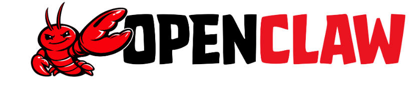

# OpenClaw的前世与今生🦞

## OpenClaw的开源地址🦞

OpenClaw 的开源地址是：**https://github.com/openclaw/openclaw**

问：OpenClaw是完全开源的吗？

答：

1. 从许可证层面：是的，代码完全开源且免费。
2. 从实际运营层面：软件虽免费，但运行有成本。

## OpenClaw前世🦞

OpenClaw的两次更名确实发生在2026年1月下旬的几天之内，整个过程充满了戏剧性。具体的时间线如下：

- **🗓️ 2025年11月 / 12月**：项目最初以 **“Clawdbot”** 的名称由开发者彼得·斯坦伯格（Peter Steinberger）创建，并在12月28日左右首次公布了相关进展。
- **🗓️ 2026年1月27日**：由于AI公司Anthropic指控“Clawdbot”与其AI模型“Claude”的商标过于相似，开发者被迫将项目更名为 **“Moltbot”** （寓意龙虾蜕壳成长）。当天，由于技术失误，旧的社交媒体账号在更名后的极短时间内（约10秒）被加密货币骗子抢注，引发了后续的诈骗和骚扰事件。
- **🗓️ 2026年1月29日**：由于“Moltbot”这个名称的发音不够顺滑，不利于品牌传播，且开发者本人也从未喜欢过这个仓促之下的命名，团队决定再次更名。
- **🗓️ 2026年1月30日**：项目最终确定并宣布改名为 **“OpenClaw”** 。开发者表示，这个名字结合了“Open”（开源精神）与“Claw”（保留原有品牌识别），寓意着“开源赋能、精准高效”，并称其为项目的“最终形态”

## OpenClaw今生🦞

最终在**2026年1月30日**确定为“OpenClaw”，寓意“开源的龙虾”并完成了商标注册，开发者称其为“最终形态”

