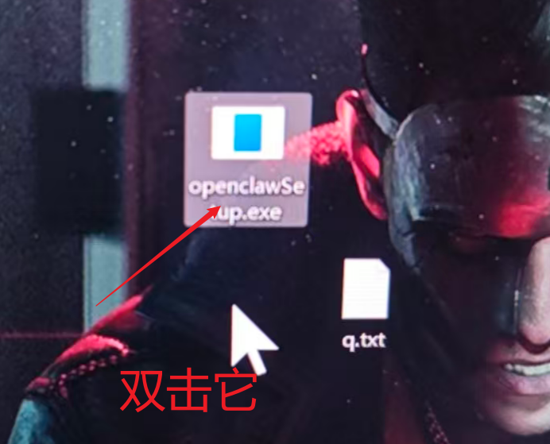

# openClaw怎么启动

对于普通用户安装openClaw怎么启动问题。

普通用户可能面临的问题：

- 怎么输入命令？
- 怎么打开终端控制台？
- 是输入哪一个命令先？
- 输入完之后什么样的效果算是启动成功？

## 官方文档启动

官方说：第一步启动本地服务的网关服务。

```shell
openclaw gateway
```

通过如下命令打开web UI控制台。

```shell
openclaw dashboard
```

## 一键启动openClaw服务

**windows端**




