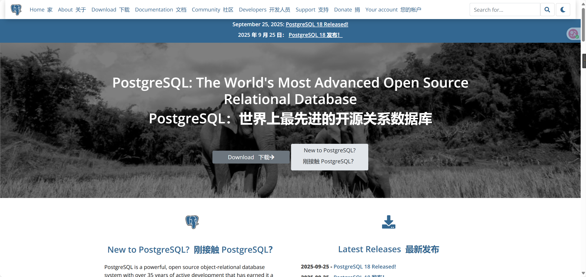

# postgresql官网解析

PostgreSQL is a powerful, open source object-relational database system with over 35 years of active development that has earned it a strong reputation for reliability, feature robustness, and performance.
PostgreSQL 是一个功能强大的开源对象关系数据库系统，经过 35 多年的积极开发，在可靠性、功能稳健性和性能方面赢得了良好的声誉。

There is a wealth of information to be found describing how to [install](https://www.postgresql.org/download/) and [use](https://www.postgresql.org/docs/) PostgreSQL through the [official documentation](https://www.postgresql.org/docs/). The [open source community](https://www.postgresql.org/community/) provides many helpful places to become familiar with PostgreSQL, discover how it works, and find career opportunities. Learn more on how to [engage with the community](https://www.postgresql.org/community/).
[官方文档](https://www.postgresql.org/docs/)中提供了大量关于如何[安装](https://www.postgresql.org/download/)和[使用 ](https://www.postgresql.org/docs/)PostgreSQL 的信息。[ 开源社区](https://www.postgresql.org/community/)提供了许多有用的资源，帮助您熟悉 PostgreSQL、了解其工作原理并寻找职业机会。了解更多关于如何[参与社区的](https://www.postgresql.org/community/)信息。

