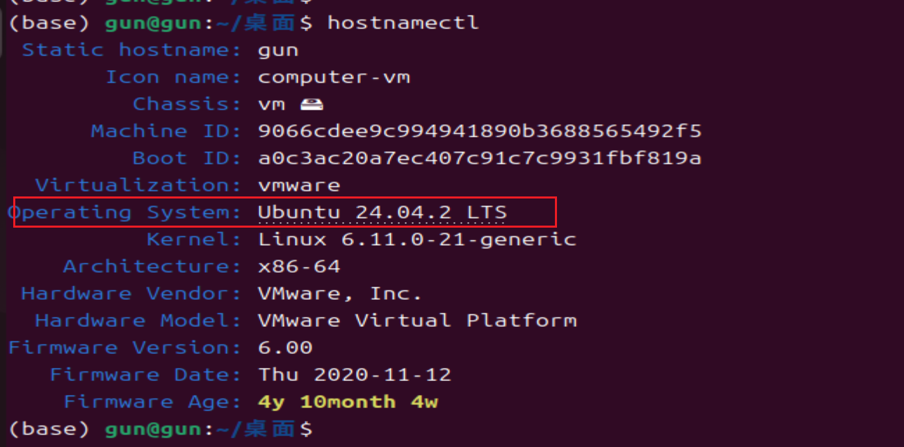
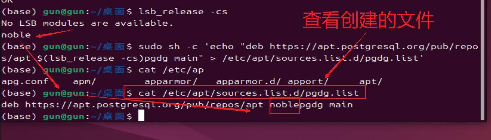
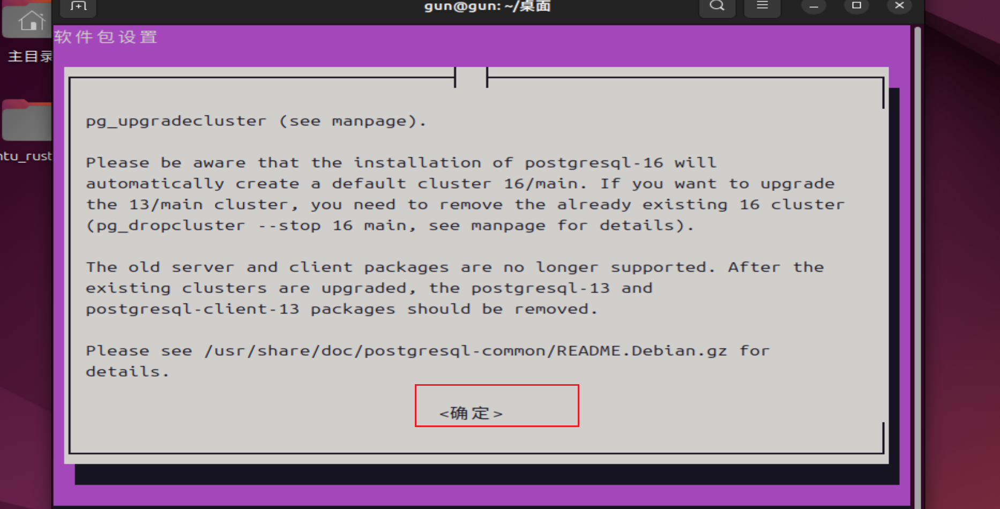
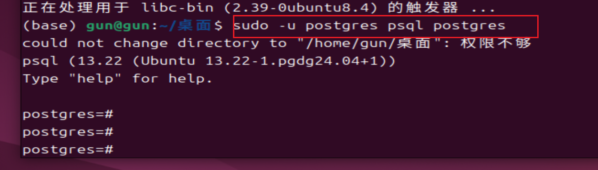
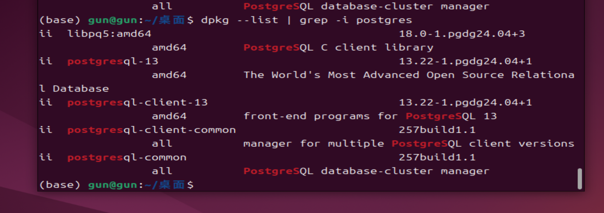
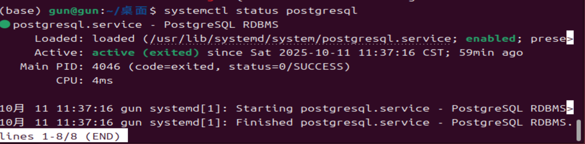
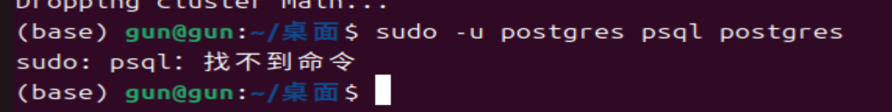

# ubuntu安装postgre13

社区地址：[PostgreSQL - Community Help Wiki](https://help.ubuntu.com/community/PostgreSQL/)

## ubuntu的系统环境

Ubuntu 24.04.2 LTS



::: tip 建议

在选用系统环境版本号时不必要纠结选那个版本。可以和我保持一致。也可以直接用最新稳定版本。但是尽量减少去使用ubuntu的老版本系统。因为这样会花很多时间去解决其它问题。

:::

## 失败的安装流程

```shell
sudo apt-get install curl ca-certificates gnupg 
```

正常情况下输出的日志信息：

```
(base) gun@gun:~/桌面$ sudo apt-get install curl ca-certificates gnupg
[sudo] gun 的密码： 
正在读取软件包列表... 完成
正在分析软件包的依赖关系树... 完成
正在读取状态信息... 完成                 
curl 已经是最新版 (8.5.0-2ubuntu10.6)。
ca-certificates 已经是最新版 (20240203)。
ca-certificates 已设置为手动安装。
gnupg 已经是最新版 (2.4.4-2ubuntu17.2)。
gnupg 已设置为手动安装。
升级了 0 个软件包，新安装了 0 个软件包，要卸载 0 个软件包，有 76 个软件包未被升级
```


```shell
curl https://www.postgresql.org/media/keys/ACCC4CF8.asc | sudo apt-key add
```

https://www.postgresql.org/media/keys/ACCC4CF8.asc 这个表示PostgreSQL APT 仓库的密钥地址。


```
(base) gun@gun:~/桌面$ curl https://www.postgresql.org/media/keys/ACCC4CF8.asc | sudo apt-key add
  % Total    % Received % Xferd  Average Speed   Time    Time     Time  Current
                                 Dload  Upload   Total   Spent    Left  Speed
  0     0    0     0    0     0      0      0 --:--:-- --:--:-- --:--:--     0Warning: apt-key is deprecated. Manage keyring files in trusted.gpg.d instead (see apt-key(8)).
100  4812  100  4812    0     0    906      0  0:00:05  0:00:05 --:--:--  1123
OK
(base) gun@gun:~/桌面$ 
```


创建文件/etc/apt/sources.list.d/pgdg.list。

```shell
sudo sh -c 'echo "deb https://apt.postgresql.org/pub/repos/apt $(lsb_release -cs)pgdg main" > /etc/apt/sources.list.d/pgdg.list'
```

$(lsb_release -cs) 表示什么意思？


查看自己创建的文件：




```shell
sudo apt-get update 
sudo apt-get install postgresql-13
```


## 快速安装PostgreSQL 13

这个官方网站给出的安装流程：

```shell
sudo apt install -y postgresql-common ca-certificates
sudo /usr/share/postgresql-common/pgdg/apt.postgresql.org.sh
```


```
(base) gun@gun:~/桌面$ sudo apt install -y postgresql-common ca-certificates
正在读取软件包列表... 完成
正在分析软件包的依赖关系树... 完成
正在读取状态信息... 完成                 
ca-certificates 已经是最新版 (20240203)。
将会同时安装下列软件：
  libcommon-sense-perl libjson-perl libjson-xs-perl libperl5.38t64
  libtypes-serialiser-perl perl perl-base perl-modules-5.38
  postgresql-client-common
建议安装：
  perl-doc libterm-readline-gnu-perl | libterm-readline-perl-perl
  libtap-harness-archive-perl
下列【新】软件包将被安装：
  libcommon-sense-perl libjson-perl libjson-xs-perl libtypes-serialiser-perl
  postgresql-client-common postgresql-common
下列软件包将被升级：
  libperl5.38t64 perl perl-base perl-modules-5.38
升级了 4 个软件包，新安装了 6 个软件包，要卸载 0 个软件包，有 371 个软件包未被升级。
需要下载 395 kB/10.4 MB 的归档。
解压缩后会消耗 1,332 kB 的额外空间。
获取:1 http://mirrors.tuna.tsinghua.edu.cn/ubuntu noble/main amd64 libjson-perl all 4.10000-1 [81.9 kB]
获取:2 http://mirrors.tuna.tsinghua.edu.cn/ubuntu noble-updates/main amd64 postgresql-client-common all 257build1.1 [36.4 kB]
获取:3 http://mirrors.tuna.tsinghua.edu.cn/ubuntu noble-updates/main amd64 postgresql-common all 257build1.1 [161 kB]
获取:4 http://mirrors.tuna.tsinghua.edu.cn/ubuntu noble/main amd64 libcommon-sense-perl amd64 3.75-3build3 [20.4 kB]
获取:5 http://mirrors.tuna.tsinghua.edu.cn/ubuntu noble/main amd64 libtypes-serialiser-perl all 1.01-1 [11.6 kB]
获取:6 http://mirrors.tuna.tsinghua.edu.cn/ubuntu noble-updates/main amd64 libjson-xs-perl amd64 4.040-0ubuntu0.24.04.1 [83.7 kB]
已下载 395 kB，耗时 1秒 (345 kB/s)                   
正在预设定软件包 ...
(正在读取数据库 ... 系统当前共安装有 193555 个文件和目录。)
准备解压 .../libperl5.38t64_5.38.2-3.2ubuntu0.2_amd64.deb  ...
正在解压 libperl5.38t64:amd64 (5.38.2-3.2ubuntu0.2) 并覆盖 (5.38.2-3.2build2.1) 
...
准备解压 .../perl_5.38.2-3.2ubuntu0.2_amd64.deb  ...
正在解压 perl (5.38.2-3.2ubuntu0.2) 并覆盖 (5.38.2-3.2build2.1) ...
准备解压 .../perl-base_5.38.2-3.2ubuntu0.2_amd64.deb  ...
正在解压 perl-base (5.38.2-3.2ubuntu0.2) 并覆盖 (5.38.2-3.2build2.1) ...
正在设置 perl-base (5.38.2-3.2ubuntu0.2) ...
(正在读取数据库 ... 系统当前共安装有 193555 个文件和目录。)
准备解压 .../0-perl-modules-5.38_5.38.2-3.2ubuntu0.2_all.deb  ...
正在解压 perl-modules-5.38 (5.38.2-3.2ubuntu0.2) 并覆盖 (5.38.2-3.2build2.1) ...
正在选中未选择的软件包 libjson-perl。
准备解压 .../1-libjson-perl_4.10000-1_all.deb  ...
正在解压 libjson-perl (4.10000-1) ...
正在选中未选择的软件包 postgresql-client-common。
准备解压 .../2-postgresql-client-common_257build1.1_all.deb  ...
正在解压 postgresql-client-common (257build1.1) ...
正在选中未选择的软件包 postgresql-common。
准备解压 .../3-postgresql-common_257build1.1_all.deb  ...
正在添加 通过 postgresql-common 从 /usr/bin/pg_config 到 /usr/bin/pg_config.libp
q-dev 的转移
正在解压 postgresql-common (257build1.1) ...
正在选中未选择的软件包 libcommon-sense-perl:amd64。
准备解压 .../4-libcommon-sense-perl_3.75-3build3_amd64.deb  ...
正在解压 libcommon-sense-perl:amd64 (3.75-3build3) ...
正在选中未选择的软件包 libtypes-serialiser-perl。
准备解压 .../5-libtypes-serialiser-perl_1.01-1_all.deb  ...
正在解压 libtypes-serialiser-perl (1.01-1) ...
正在选中未选择的软件包 libjson-xs-perl。
准备解压 .../6-libjson-xs-perl_4.040-0ubuntu0.24.04.1_amd64.deb  ...
正在解压 libjson-xs-perl (4.040-0ubuntu0.24.04.1) ...
正在设置 perl-modules-5.38 (5.38.2-3.2ubuntu0.2) ...
正在设置 libperl5.38t64:amd64 (5.38.2-3.2ubuntu0.2) ...
正在设置 perl (5.38.2-3.2ubuntu0.2) ...
正在设置 libjson-perl (4.10000-1) ...
正在设置 postgresql-client-common (257build1.1) ...
正在设置 libcommon-sense-perl:amd64 (3.75-3build3) ...
正在设置 postgresql-common (257build1.1) ...

Creating config file /etc/postgresql-common/createcluster.conf with new version
Building PostgreSQL dictionaries from installed myspell/hunspell packages...
  en_us
Removing obsolete dictionary files:
'/etc/apt/trusted.gpg.d/apt.postgresql.org.gpg' -> '/usr/share/postgresql-common
/pgdg/apt.postgresql.org.gpg'
Created symlink /etc/systemd/system/multi-user.target.wants/postgresql.service →
 /usr/lib/systemd/system/postgresql.service.
正在设置 libtypes-serialiser-perl (1.01-1) ...
正在设置 libjson-xs-perl (4.040-0ubuntu0.24.04.1) ...
正在处理用于 man-db (2.12.0-4build2) 的触发器 ...
正在处理用于 libc-bin (2.39-0ubuntu8.4) 的触发器 ...
(base) gun@gun:~/桌面$ 
```

非常明显ca-certificates系统上原来就是有的。

```shell
(base) gun@gun:~/桌面$ sudo /usr/share/postgresql-common/pgdg/apt.postgresql.org.sh
// 此脚本将在APT.PostgreSQL.org上启用PostgreSQL APT存储库你的系统。使用的发行代号将是noble pgdg。
This script will enable the PostgreSQL APT repository on apt.postgresql.org on
your system. The distribution codename used will be noble-pgdg.

// 按Enter继续，或按Ctrl-C中止。
Press Enter to continue, or Ctrl-C to abort.

// 我点击了继续安装...

// 使用密钥环/usr/share/postgresql-common/pgdg/apt.postgresql.org.pgg
Using keyring /usr/share/postgresql-common/pgdg/apt.postgresql.org.gpg
// 写中....
Writing /etc/apt/sources.list.d/pgdg.sources ...
已删除 '/etc/apt/sources.list.d/pgdg.list'
已删除 '/etc/apt/trusted.gpg.d/apt.postgresql.org.gpg'

Running apt-get update ...
命中:1 http://mirrors.tuna.tsinghua.edu.cn/ubuntu noble InRelease              
命中:4 http://security.ubuntu.com/ubuntu noble-security InRelease              
命中:2 http://mirrors.tuna.tsinghua.edu.cn/ubuntu noble-updates InRelease
命中:3 http://mirrors.tuna.tsinghua.edu.cn/ubuntu noble-backports InRelease
获取:5 https://apt.postgresql.org/pub/repos/apt noble-pgdg InRelease [107 kB]
获取:6 https://apt.postgresql.org/pub/repos/apt noble-pgdg/main amd64 Packages [350 kB]
已下载 456 kB，耗时 8秒 (56.1 kB/s)                                            
正在读取软件包列表... 完成

// 现在，您可以从apt.postgresql.org开始安装软件包。
You can now start installing packages from apt.postgresql.org.

Have a look at https://wiki.postgresql.org/wiki/Apt for more information;
most notably the FAQ at https://wiki.postgresql.org/wiki/Apt/FAQ
(base) gun@gun:~/桌面$ 
```


执行安装指定版本命令：

```shell
sudo apt install postgresql-13
```


```shell
(base) gun@gun:~/桌面$ sudo apt install postgresql-13
正在读取软件包列表... 完成
正在分析软件包的依赖关系树... 完成
正在读取状态信息... 完成                 
将会同时安装下列软件：
  libpq5 postgresql-client-13
建议安装：
  libpq-oauth postgresql-doc-13
下列【新】软件包将被安装：
  libpq5 postgresql-13 postgresql-client-13
升级了 0 个软件包，新安装了 3 个软件包，要卸载 0 个软件包，有 373 个软件包未被升级。
需要下载 16.0 MB 的归档。
解压缩后会消耗 55.5 MB 的额外空间。
您希望继续执行吗？ [Y/n] y
获取:1 https://apt.postgresql.org/pub/repos/apt noble-pgdg/main amd64 libpq5 amd64 18.0-1.pgdg24.04+3 [248 kB]
获取:2 https://apt.postgresql.org/pub/repos/apt noble-pgdg/main amd64 postgresql-client-13 amd64 13.22-1.pgdg24.04+1 [1,536 kB]
获取:3 https://apt.postgresql.org/pub/repos/apt noble-pgdg/main amd64 postgresql-13 amd64 13.22-1.pgdg24.04+1 [14.2 MB]
已下载 16.0 MB，耗时 4分 28秒 (59.5 kB/s)                                      
正在预设定软件包 ...
正在选中未选择的软件包 libpq5:amd64。
(正在读取数据库 ... 系统当前共安装有 193776 个文件和目录。)
准备解压 .../libpq5_18.0-1.pgdg24.04+3_amd64.deb  ...
正在解压 libpq5:amd64 (18.0-1.pgdg24.04+3) ...
正在选中未选择的软件包 postgresql-client-13。
准备解压 .../postgresql-client-13_13.22-1.pgdg24.04+1_amd64.deb  ...
正在解压 postgresql-client-13 (13.22-1.pgdg24.04+1) ...
正在选中未选择的软件包 postgresql-13。
准备解压 .../postgresql-13_13.22-1.pgdg24.04+1_amd64.deb  ...
正在解压 postgresql-13 (13.22-1.pgdg24.04+1) ...
正在设置 libpq5:amd64 (18.0-1.pgdg24.04+3) ...
正在设置 postgresql-client-13 (13.22-1.pgdg24.04+1) ...
update-alternatives: 使用 /usr/share/postgresql/13/man/man1/psql.1.gz 来在自动模
式中提供 /usr/share/man/man1/psql.1.gz (psql.1.gz)
正在设置 postgresql-13 (13.22-1.pgdg24.04+1) ...
Creating new PostgreSQL cluster 13/main ...
/usr/lib/postgresql/13/bin/initdb -D /var/lib/postgresql/13/main --auth-local pe
er --auth-host md5
属于此数据库系统的文件宿主为用户 "postgres".
此用户也必须为服务器进程的宿主.
数据库簇将使用本地化语言 "zh_CN.UTF-8"进行初始化.
默认的数据库编码已经相应的设置为 "UTF8".
initdb: could not find suitable text search configuration for locale "zh_CN.UTF-
8"
缺省的文本搜索配置将会被设置到"simple"

禁止为数据页生成校验和.

修复已存在目录 /var/lib/postgresql/13/main 的权限 ... 成功
正在创建子目录 ... 成功
选择动态共享内存实现 ......posix
选择默认最大联接数 (max_connections) ... 100
选择默认共享缓冲区大小 (shared_buffers) ... 128MB
selecting default time zone ... Asia/Shanghai
创建配置文件 ... 成功
正在运行自举脚本 ...成功
正在执行自举后初始化 ...成功
同步数据到磁盘...成功

成功。您现在可以用下面的命令开启数据库服务器：

    pg_ctlcluster 13 main start

正在处理用于 postgresql-common (257build1.1) 的触发器 ...
Building PostgreSQL dictionaries from installed myspell/hunspell packages...
  en_us
Removing obsolete dictionary files:
正在处理用于 libc-bin (2.39-0ubuntu8.4) 的触发器 ...

```


安装过程中出现这样的弹框。我们点击确认就行。

```shell
Obsolete major version 13
过时的主要版本13
 │ 
 PostgreSQL版本13已经过时，但服务器或客户端包仍然安装。
 │ The PostgreSQL version 13 is obsolete, but the server or client packages    
 │ are still installed. 
 
 请安装最新的包（postgresql-16和postgresql-client-16），并使用pg_upgradecluster升级现有集群（请参阅手册页）
 Please install the latest packages (postgresql-16      
 │ and postgresql-client-16) and upgrade the existing  clusters with           
 │ pg_upgradecluster (see manpage).                                            
 │                                                                             
 │ Please be aware that the installation of postgresql-16 will                 
 │ automatically create a default cluster 16/main.
 
 If you want to upgrade      
 │ the 13/main cluster, you need to remove the already existing 16 cluster     
 │ (pg_dropcluster --stop 16 main, see manpage for details).                   

不再支持旧的服务器和客户端软件包。
 │ The old server and client packages are no longer supported. 

升级现有集群后，应删除postgresql-13和postgresql-client-13包。       
 After the existing clusters are upgraded, the postgresql-13 and                       
 │ postgresql-client-13 packages should be removed.                            

请参阅/usr/share/doc/postgresql-common/README。Debian.gz了解详情。   
 │ Please see /usr/share/doc/postgresql-common/README.Debian.gz for            
 │ details.   
```




## 手动存储库配置安装

Manual Repository Configuration 

配置流程在官方网站：[Apt - PostgreSQL 维基 --- Apt - PostgreSQL wiki](https://wiki.postgresql.org/wiki/Apt)

## 默认身份登入

安装好postgre后，我们可以使用默认身份进行命令行登入。

```shell
sudo -u postgres psql postgres
# sudo -u 指定系统用户名 psql 数据名字
```



验证安装成功：

版本号是13.22


指定系统用户使用psql登入postgreSQL。没有指定使用那个数据库。

```shell
sudo -u postgres psql
```

1. **`sudo`** - 超级用户权限

- 作用：以其他用户身份执行命令
- 相当于："请用管理员权限运行"

2. **`-u postgres`** - 指定用户

- 作用：以 `postgres` 用户身份执行
- PostgreSQL 在安装时会自动创建专门的 `postgres` 系统用户来管理数据库

3. **`psql`** - PostgreSQL 客户端工具

- 作用：PostgreSQL 的交互式命令行客户端
- 功能：可以执行 SQL 命令、管理数据库

4. **`postgres`** - 数据库名称

- 作用：指定要连接的数据库名
- `postgres` 是 PostgreSQL 安装后创建的默认数据库

## 解析版本号

安装成功后输入select version()就可以查看安装的版本。

```shell
postgres=# select version();
```

输出的版本信息如下：

PostgreSQL 13.22 (Ubuntu 13.22-1.pgdg24.04+1) on x86_64-pc-linux-gnu, compiled by gcc (Ubuntu 13.3.0-6ubuntu2~24.04) 13.3.0, 64-bit

上面的信息都是表示什么意思一个都看不懂？详细解释下。

1. **PostgreSQL 13.22** - 数据库主版本

- **`13`**: 主版本号
  - 这是 PostgreSQL 的第13个大版本
  - 每个主版本都有显著的功能改进
- **`.22`**: 小版本号（补丁版本）
  - 这是第13个大版本的第22次更新
  - 包含安全修复、bug修复，但不引入新功能
  - ✅ **说明你的数据库保持得很好，经常更新**

2. **(Ubuntu 13.22-1.pgdg24.04+1)** - 打包信息

- **`Ubuntu`**: 包管理系统
  - 这是为 Ubuntu 系统特别打包的版本
- **`13.22-1`**: 包版本号
  - `13.22`: PostgreSQL 版本
  - `-1`: 包的第一次构建
- **`pgdg24.04+1`**: 打包来源
  - `pgdg`: PostgreSQL Global Development Group（官方开发组）
  - `24.04`: 针对 Ubuntu 24.04 系统优化
  - `+1`: 包的修订版本

3. **on x86_64-pc-linux-gnu** - 运行平台

- **`x86_64`**: CPU 架构
  - 64位 Intel/AMD 处理器
  - 支持更多内存和更好性能
- **`pc`**: 机器类型
  - 个人计算机架构
- **`linux-gnu`**: 操作系统
  - GNU/Linux 系统

4. **compiled by gcc (Ubuntu 13.3.0-6ubuntu2~24.04) 13.3.0** - 编译信息

- **`gcc`**: 编译器
  - GNU Compiler Collection，用于编译 PostgreSQL
- **`Ubuntu 13.3.0-6ubuntu2~24.04`**: 编译器版本信息
  - Ubuntu 系统自带的 GCC 13.3.0 编译器
- **`13.3.0`**: 编译器主版本
  - GCC 版本 13.3.0

5. **64-bit** - 架构位数

- **`64-bit`**: 64位版本
  - 可以处理更大内存（超过4GB）
  - 更好的性能

**通俗易懂的解释**

想象成**汽车**的规格说明：

```
PostgreSQL 13.22 (Ubuntu 13.22-1.pgdg24.04+1) on x86_64-pc-linux-gnu, compiled by gcc (Ubuntu 13.3.0-6ubuntu2~24.04) 13.3.0, 64-bit
```

- **🚗 PostgreSQL 13.22** = 丰田卡罗拉 2023款（车型+年份）
- **🔧 (Ubuntu...)** = 由丰田4S店专门为本地道路调校的版本
- **🏭 x86_64-pc-linux-gnu** = 在标准汽车生产线上制造
- **🔩 compiled by gcc...** = 使用德国博世的专业工具制造
- **💪 64-bit** = 2.0L排量发动机，动力强劲

这对你意味着什么？

 **好消息：**

1. **版本较新** - 13.22 是稳定版本
2. **安全更新** - 小版本22说明安全漏洞已修复
3. **64位性能** - 可以获得更好的性能
4. **官方支持** - 来自 PostgreSQL 官方团队的打包

::: tip 注意：

PostgreSQL 13 已经接近生命周期结束，建议考虑升级到更新版本：

:::

```shell
# 查看升级选项
sudo apt-cache search postgresql-15
sudo apt-cache search postgresql-16
```

::: tip 总结

你的 PostgreSQL 安装是：

- **版本**：13.22（稳定但较老）
- **平台**：64位 Ubuntu 系统
- **来源**：官方维护的包
- **状态**：安全更新良好，性能正常

这是一个完全可用的生产环境配置！

:::


## 检查是否安装PostgreSQL 13

话说：安装容易，卸载难。

经过上面的安装成功后的环境。

检查安装包：

```shell
# 查看所有已安装的 PostgreSQL 相关包
dpkg -l | grep postgresql

# 或者更精确地查看 postgresql-13 相关包
dpkg -l | grep postgresql-13

# 查看具体的包名
dpkg --list | grep -i postgres
```



| 包命                     | 描述                                                      | 中文描述                           |
| :----------------------- | --------------------------------------------------------- | ---------------------------------- |
| libpq5:amd64             | PostgreSQL C client library                               | PostgreSQL C客户端库。             |
| postgresql-13            | The World's Most Advanced Open Source Relational Database | 世界上最先进的开源关系数据库。     |
| postgresql-client-13     | front-end programs for PostgreSQL 13                      | PostgreSQL 13的前端程序。          |
| postgresql-client-common | manager for multiple PostgreSQL client versions           | 多个PostgreSQL客户端版本的管理器。 |
| postgresql-common        | PostgreSQL database-cluster manager                       | PostgreSQL数据库集群管理器。       |

1. **libpq5:amd64** - PostgreSQL 客户端库

**作用**：这是 PostgreSQL 的 C 语言客户端库

- 📚 **功能**：允许其他程序连接到 PostgreSQL 数据库
- 🔗 **依赖关系**：很多应用程序（如 pgAdmin、其他数据库工具）都需要这个库来连接 PostgreSQL
- 💡 **特点**：即使卸载 PostgreSQL 服务器，这个库也可能被其他软件依赖，所以可以保留

2. **postgresql-13** - PostgreSQL 13 服务器

**作用**：PostgreSQL 数据库服务器主程序

- 🗄️ **功能**：数据库引擎核心，负责数据存储、查询处理、事务管理等
- 📁 **包含**：数据库服务器进程、存储引擎、查询优化器等
- 🏠 **安装位置**：`/usr/lib/postgresql/13/`

3. **postgresql-client-13** - PostgreSQL 13 客户端工具

**作用**：用于连接和管理 PostgreSQL 13 服务器的客户端程序

- 🔧 **包含工具**：
  - `psql` - 命令行客户端
  - `pg_dump` - 数据库备份工具
  - `pg_restore` - 数据库恢复工具
  - `createdb` / `dropdb` - 数据库创建/删除工具
- 💻 **用途**：在本地或远程管理 PostgreSQL 数据库

4. **postgresql-client-common** - 客户端通用管理工具

**作用**：管理多个 PostgreSQL 客户端版本

- 🔄 **功能**：
  - 管理不同版本的客户端工具
  - 处理客户端版本的切换
  - 提供版本无关的客户端命令
- 🌐 **特点**：即使安装了多个 PostgreSQL 版本，这个包也能协调它们

5. **postgresql-common** - PostgreSQL 通用管理工具

**作用**：管理多个 PostgreSQL 服务器实例

- 🛠️ **功能**：
  - 管理数据库集群（cluster）
  - 处理多版本 PostgreSQL 共存
  - 提供 `pg_lsclusters`、`pg_createcluster` 等管理命令
  - 管理服务启动/停止脚本
- 📊 **包含命令**：
  - `pg_lsclusters` - 列出所有数据库集群
  - `pg_createcluster` - 创建新集群
  - `pg_dropcluster` - 删除集群
  - `pg_ctlcluster` - 控制集群状态

查看服务是否在运行：

```shell
systemctl status postgresql
```




## 完全卸载PostgreSQL 13

```shell
# 卸载服务器和客户端
sudo apt-get remove --purge postgresql-13 postgresql-client-13

# 但保留通用工具（可能被其他软件依赖）
sudo apt-get remove --purge postgresql-13 postgresql-client-13

# 如果你想保留客户端工具连接其他服务器，只卸载服务器
sudo apt-get remove --purge postgresql-13

# 完全清理（包括通用工具）
sudo apt-get remove --purge postgresql-13 postgresql-client-13 postgresql-client-common postgresql-common
```

libpq5 通常保留，因为其他软件可能依赖它

卸载执行日志：

```shell
(base) gun@gun:~/桌面$ sudo apt-get remove --purge postgresql-13 postgresql-client-13 postgresql-client-common postgresql-common
[sudo] gun 的密码： 
正在读取软件包列表... 完成
正在分析软件包的依赖关系树... 完成
正在读取状态信息... 完成                 
下列软件包是自动安装的并且现在不需要了：
  libcommon-sense-perl libjson-perl libjson-xs-perl libpq5
  libtypes-serialiser-perl
使用'sudo apt autoremove'来卸载它(它们)。
下列软件包将被【卸载】：
  postgresql-13* postgresql-client-13* postgresql-client-common*
  postgresql-common*
升级了 0 个软件包，新安装了 0 个软件包，要卸载 4 个软件包，有 371 个软件包未被升级。
解压缩后将会空出 55.1 MB 的空间。
您希望继续执行吗？ [Y/n] y
(正在读取数据库 ... 系统当前共安装有 195628 个文件和目录。)
正在卸载 postgresql-13 (13.22-1.pgdg24.04+1) ...
update-alternatives: 警告: 链接组 psql.1.gz 已损坏，故强制重新安装候选项 /usr/share/postgresql/13/man/man1/psql.1.gz
正在卸载 postgresql-client-13 (13.22-1.pgdg24.04+1) ...
正在卸载 postgresql-common (257build1.1) ...
正在删除 通过 postgresql-common 从 /usr/bin/pg_config 到 /usr/bin/pg_config.libpq-dev 的转移
正在卸载 postgresql-client-common (257build1.1) ...
正在处理用于 man-db (2.12.0-4build2) 的触发器 ...
(正在读取数据库 ... 系统当前共安装有 193641 个文件和目录。)
正在清除 postgresql-client-common (257build1.1) 的配置文件 ...
正在清除 postgresql-common (257build1.1) 的配置文件 ...
dpkg: 警告: 卸载 postgresql-common 时，目录 /var/log/postgresql 非空，因而不会删除该目录
dpkg: 警告: 卸载 postgresql-common 时，目录 /var/lib/postgresql 非空，因而不会删除该目录
dpkg: 警告: 卸载 postgresql-common 时，目录 /etc/postgresql 非空，因而不会删除该目录
正在清除 postgresql-13 (13.22-1.pgdg24.04+1) 的配置文件 ...
Dropping cluster main...
(base) gun@gun:~/桌面$ 
```

卸载完成后再次登入无效：




## 创建新用户

```shell
postgres=# CREATE USER anthony SUPERUSER;
```

将您看到的 anthony 替换为您的 Ubuntu 用户名。

```shell
# 创建新用户的语法格式。
CREATE USER 指定用户名字 SUPERUSER;
```

使用新创建的用户进行登入。

```shell
psql -U gun -d postgres
# 命令语法格式
psql -U 自己新创建的用户名 -d postgres
# 这个命令是错误的
psql -U postgres -d postgres
```

显示当前登入的是那个用户？

SELECT current_user;

```shell
postgres=# SELECT current_user;
 current_user 
--------------
 gun
(1 行记录)
```


