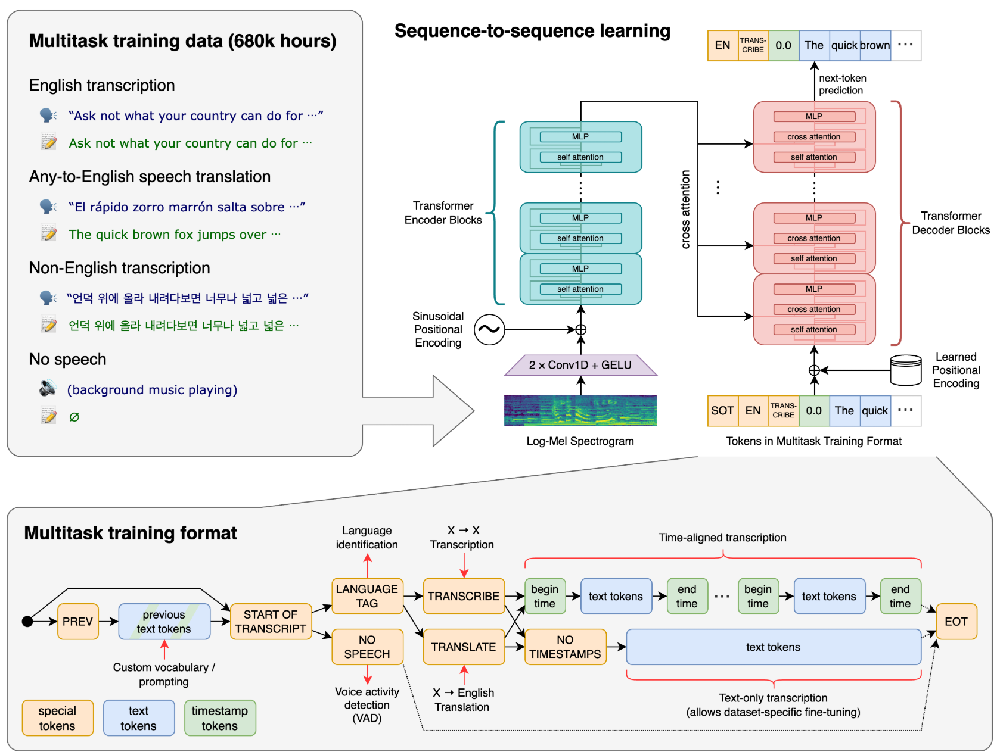

# whisper(私语)

美/ˈwɪspər/

[openai/whisper: Robust Speech Recognition via Large-Scale Weak Supervision](https://github.com/openai/whisper)

## 关于

Robust Speech Recognition via Large-Scale Weak Supervision
通过大规模弱监督实现稳健的语音识别

弱监督是什么？

## Approach 方法

A Transformer sequence-to-sequence model is trained on various speech processing tasks, including multilingual speech recognition, speech translation, spoken language identification, and voice activity detection. These tasks are jointly represented as a sequence of tokens to be predicted by the decoder, allowing a single model to replace many stages of a traditional speech-processing pipeline. The multitask training format uses a set of special tokens that serve as task specifiers or classification targets.
Transformer 序列到序列模型针对各种语音处理任务进行训练，包括多语言语音识别、语音翻译、口语识别和语音活动检测。这些任务被联合表示为解码器要预测的标记序列，从而允许单个模型取代传统语音处理管道的多个阶段。多任务训练格式使用一组特殊标记作为任务说明符或分类目标。

