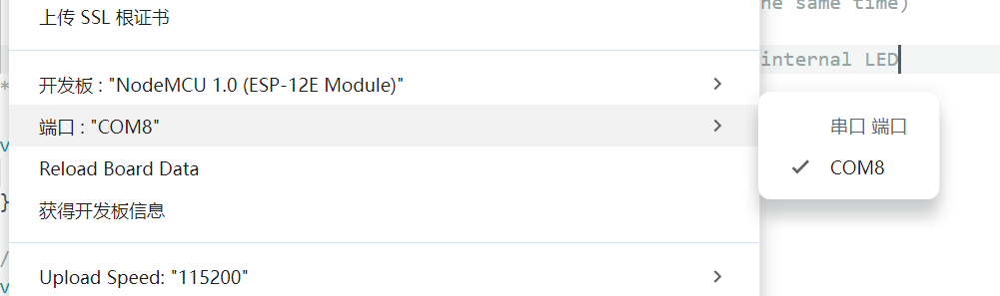

# esp8266 NodeMCU 1.0(ESP12E Module)开发板入门案例

## 开发环境准备

Arduino IDE

esp-12e（esp8266MOD）

## esp8266板子介绍

- Operating voltage 3.3V  

  工作电压 3.3V

- Memory 4Mb 

  内存 4Mb

- Clock Frequency 80Mhz 

  时钟频率 80MHz

- Interface USB to Mac or PC
  USB 到 Mac 或 PC 的接口

- WiFi 2.4GHz IEEE 802.11 b/g/n

## 入门案例

```c
/*
  ESP8266 闪烁示例 - Simon Peter
  用于控制 ESP-01 模块上的蓝色 LED 闪烁
  此示例代码属于公共领域

  ESP-01 模块上的蓝色 LED 连接到 GPIO1
  (该引脚同时也是 TXD 引脚；因此使用时无法同时进行 Serial.print() 操作)

  注意：本程序使用 LED_BUILTIN 宏定义来定位内部 LED 的引脚
*/

void setup() {
  pinMode(LED_BUILTIN, OUTPUT);  // 将 LED_BUILTIN 引脚初始化为输出模式
}

// loop 函数会无限循环执行
void loop() {
  digitalWrite(LED_BUILTIN, LOW);  // 点亮 LED（注意：低电平电压会使 LED 点亮
                                   // 这是因为 ESP-01 的 LED 是低电平有效）
  delay(1000);                     // 等待 1 秒
  digitalWrite(LED_BUILTIN, HIGH); // 通过输出高电平电压关闭 LED
  delay(2000);                     // 等待 2 秒（用于演示低电平有效的 LED 特性）
}
```


第一步：确认开发板是否正常。

工具 - >板 - > NodeMCU 1.0（ESP-12E 模块）。

Tools -> CPU Frequency  -> 80MHz。

Tools -> Upload Speed: 115200


Tools -> Port -> COM8




第二步：使用内置实例代码。


第三步：验证程序、点击“箭头” `<Upload> `，将闪烁代码刷入微控制器的内存。

## 最终结果

在微控制器上查看结果（闪烁的 LED 灯）


