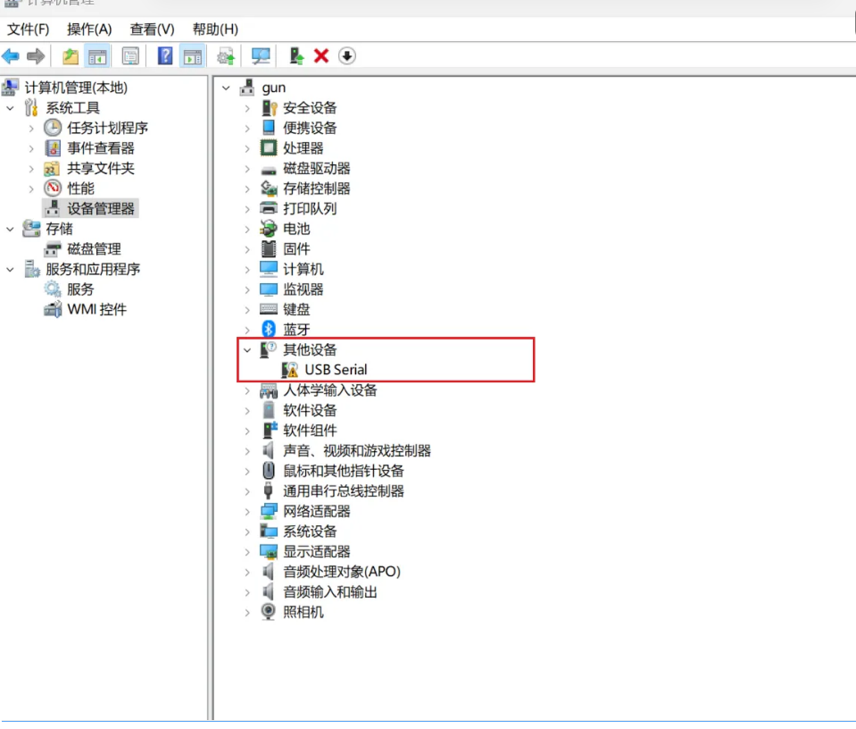
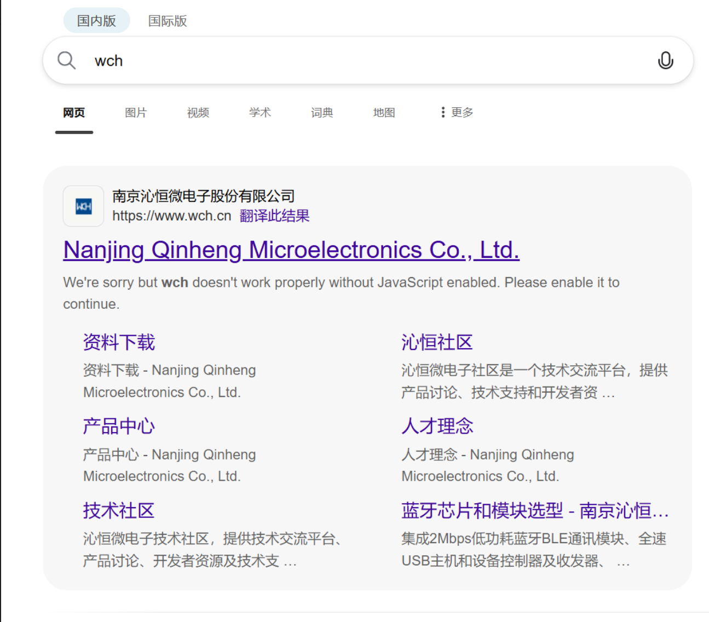

# 第1次插上esp8266开发板

## 第1次打开设备管理器检查

发现好像无效。怎么办怎么解决？好像不识别设备？

## 下载驱动

如果你的开发板使用CH240芯片。（如Nano、Mini版），windows可能无法自动识别，需要手动安装驱动：

下载驱动地址：https://www.wch.cn/

下载好驱动后解压进行安装。后面的傻瓜式的安装就行。最后会自动检查设备的接入。

## 最终验证安装

