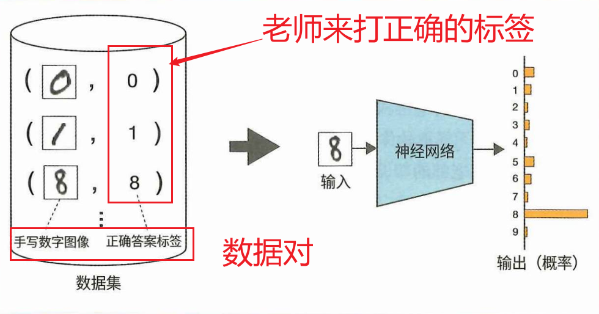
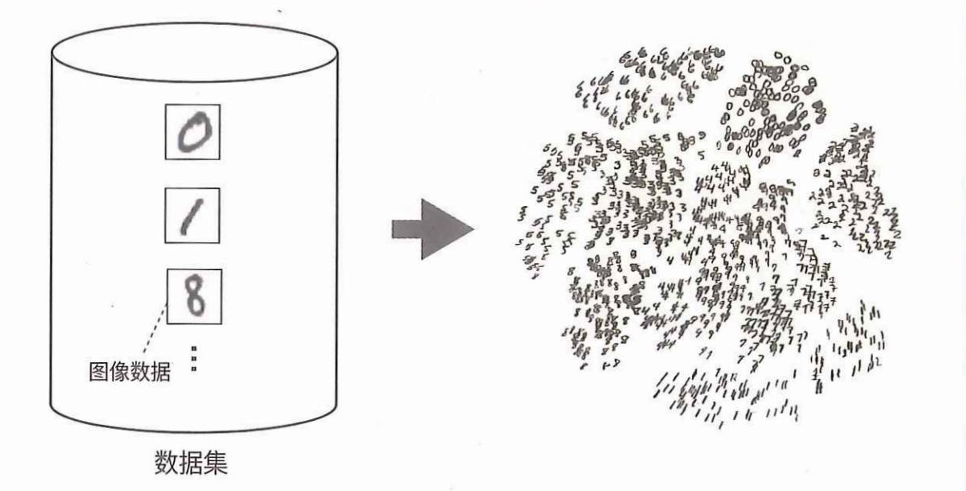
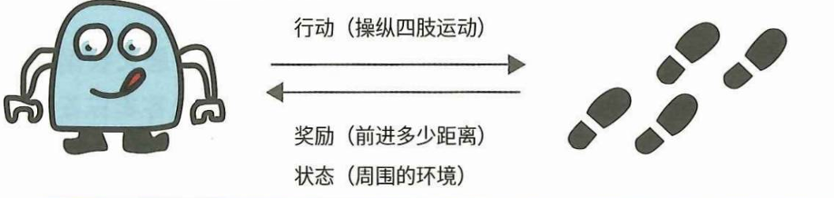

# 机器学习的分类

## 监督学习

supervised learning

简单的说就是：有老师监督情况下进行学习。

举例子说明：

手写数字识别问题。

监督学习的一个特点是“正确答案标签”的存在。输入的数据由“老  师”打标签，这个标签就是正确答案。大多数情况下，“老师”这个角色由  人来担任。

**缺点**：

监督学习的正确答案标签往往需要  由人一个个地手动附加。手动附加“正确答案标签”的过程叫作“打标签”  或“标注”。"打标签"的过程需要花费大量的时间。例如，对于ImageNet这个用  于图像识别的巨大数据集（超过1400万张图像），一个人要花费20  年左右的时间才能完成打标签的工作。

目前已知应用场景有：

小猿口算app的手写数字识别功能。

::: tip 缺点总结

- 打标签"的过程需要花费大量的时间。

:::

## 无监督学习

unsupervised learning

简单的说：在学习过程中是没有老师的存在。

无监督学习的主要目标是找到隐藏在数据中的**结构**和**模式**。

**无监督学习例子**：

- 有分组（聚类）
- 特征提取
- 降维

**无监督学习案例**

上图是通过t-SNEm算法将数据的特征减少到两个维度案例。

::: tip 优点总结

- 无监督学习不需要“正确答案标签”。

:::

## 强化学习

reinforcement learning

在机器人行走问题中，机器人不会直接学习好的行走方式（例如，当  四肢以某个角度移动时，更容易行走）。要准备一个“老师”来教这种正确  的肢体使用是非常困难的。机器人能做的是采取一些行动，得到反馈（奖  励），获得经验，并从这些经验中学习。它从经验中学习看起来好的行动，  比如当它的手移动到某个角度时，就会失去平衡，而在另一个角度，就不  会失去平衡。换句话说，它通过反复试验收集数据，并从收集到的数据中  学习良好的行为习惯。

说一千道一万：强化学习就是像去打那种通关类型的游戏。游戏的世界是未知的（我没尝试过，我不会啊。），需要我们要不断的摸索、挂掉、打怪升级、总结经验。最后才能顺利通关。

## 机器学习经典分类总结

- 监督学习：使用带有输入和输出（正确答案标签）的成对数据，学 习如何将输入转化为输出。
- 无监督学习：使用没有“正确答案标签”的数据来学习数据中的基本结构。 
- 强化学习：学习如何使用智能代理在与环境互动时收集的数据获得更高的奖励。