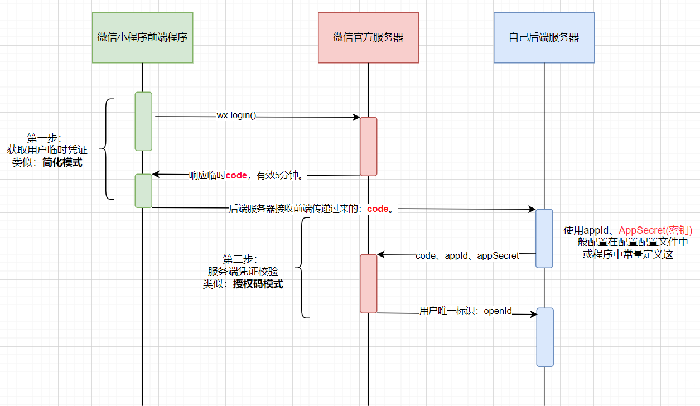

# 微信小程序登录流程架构是怎么样的？

为什么第一步先要在客户端获取code字符串？

为什么需要code给后端加上AppID（小程序唯一标识）`、`AppSecret（小程序后台生成的。不能泄露！）去微信官方获取openId？

openId作用是什么？

为什么访问微信官方的api需要access_token？

我现在也一时回答不上来上面的问题。不过其中本质也都是有记可循的。都是遵循混合了多个OAuth 2.0授权模式的复合流程。熟读OAuth 2.0协议显得更为重要。

现在来捋一捋微信小程序的登入流程逻辑是怎么样的。为什么要捋一捋？答：一方面站在平台的角度思考：微信平台有这个流程。那么飞书、钉钉、企业微信、等都有这一套流程。

## 微信小程序的登录流程解析

微信小程序的登录流程巧妙地结合了两种OAuth模式：

1. **第一阶段：获取用户临时凭证（类似“简化模式”）**
   小程序前端调用 `wx.login()`，从微信获取一个临时的登录凭证 `code`。这个过程不涉及你的服务器，是前端直接与**微信**的交互。
2. **第二阶段：服务端凭证校验（类似“授权码模式”）**
   - 你的**后端服务器**收到前端发来的 `code`。
   - 后端同时使用小程序的 `AppID`、`AppSecret` 和这个 `code`，向微信服务器发起请求。
   - 微信服务器验证通过后，返回该用户的唯一标识 `openid` 和本次会话的密钥 `session_key`。

**关键点分析**：

- 你的后端服务器在这里使用了 `AppID` 和 `AppSecret`（这**类似**客户端凭证）来向微信证明“我是哪个合法的小程序”。
- 但目的不是为自己获取一个调用API的令牌，而是为了用 `code` 去**换取特定用户的身份信息**。
- 因此，`AppID` 和 `AppSecret` 在此处的作用是验证应用合法性，而 `code` 才是代表用户授权的关键。

## `openid`的生成原理是什么？

生成原理与特性

虽然没有公开算法，但其**核心逻辑**和**特性**是清晰的：

1. **依赖参数**：系统内部生成 `openid` 至少依赖两个核心参数：**用户微信账号的唯一标识**（微信内部ID）和 **当前应用的 `AppID`**。
2. **确定性结果**：只要用户的微信账号和应用的 `AppID` 不变，生成的 `openid` 就始终固定。这意味着它不是随机生成的。

3. **不可逆与单向性**：此生成过程是单向的、不可逆的。你无法从 `openid` 反推出用户的**微信账号**或其他**个人信息**，这保障了用户身份的隐私安全。

##  重要注意事项

- **不要传输或存储 `AppSecret`**：小程序的 `AppSecret` 是最高机密，必须存储在服务器端，绝不可放在小程序前端代码中，以防泄露。
- **`openid` 不是用户登录态**：获取 `openid` 后，开发者服务器通常会据此生成一套自己的会话系统（例如自定义的 `token`），用于维持用户在小程序内的登录状态，而不是直接使用 `openid` 本身。
- **关联多应用用 `unionid`**：如果你有多个小程序、公众号等，并需要识别是否为同一用户，应该使用 `unionid` 作为跨应用的统一标识。

总结来说，`openid` 是微信为了平衡应用的用户识别需求和用户隐私安全，而设计的一套由系统生成、开发者按规则获取的标识符。

