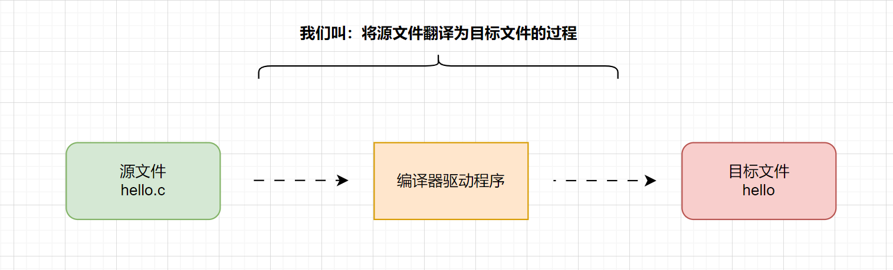
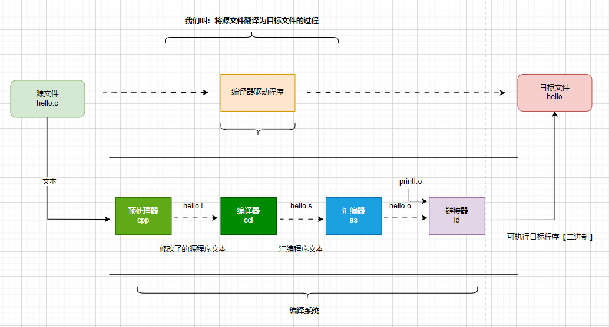

# c语言程序怎么运行

## 目标程序是什么？

答：目标程序也称为可执行目标文件。

为了在系统上运行 hello.c程序，每条 C语句都必须被其他程序转化为一系列的**低级机器语言指令**。然后这些指令按照一种称为可执行目标程序的格式打好包， 并以二进制磁盘文件的形式存放起来。 目标程序也称为**可执行目标文件**。

也就是我们常说的：可执行文件。可执行文件就是指xxx.exe文件（在windows系统上）。

## 源文件到目标文件

## 翻译过程有那几个阶段

**预处理阶段**：预处理器(cpp)根据以字符＃开头的命令， 修改原始的C程序。 比如hello .c中第1行的＃include < stdio. h> 命令告诉**预处理器**读取系统头文件 stdio .h 的内容， 并把它直接插入程序文本中。【本质就是直接文本复制】 结果就得到了另一个C程序， 通常 是以.i作为文件扩展名。

编译阶段：编译器(ccl)将文本文件 hello.i 翻译成文本文件hello.s, 它包含一个汇编语言程序。

**汇编阶段**：汇编器(as)将hello.s翻译成机器语言指令，把这些指令打包成 一种叫做**可重定位目标程序**(relocatable object program)的格式，并将结果保存在目标 文件hello.o中。 hello.o文件是一个二进制文件，它包含的17个字节是函数 main 的指令编码。如果我们在文本编辑器中打开hello.o文件，将看到一堆乱码。

**链接阶段**：hello程序调用了print函数，它是每个C编译器都提供的标准C库中的一个函数。 printf函数存在于一个名为 printf.o的单独的预编译 好了的目标文件中，而这个文件必须以某种方式合并到我们的 hello.o程序中。链接器(Id)就负责处理这种合并。结果就得到 hello 文件，它是一个可执行目标文件 （或者简称为可执行文件），可以被加载到内存中，由系统执行。

::: tip 注意术语

- hello.o是指令的打包文件。叫：可重定位目标程序。

:::

## FAQ)低级机器语言指令是指？

我们有必要在学吗？
