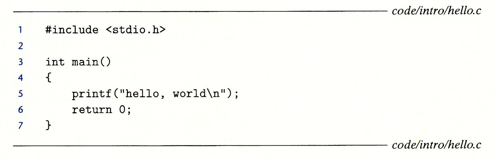
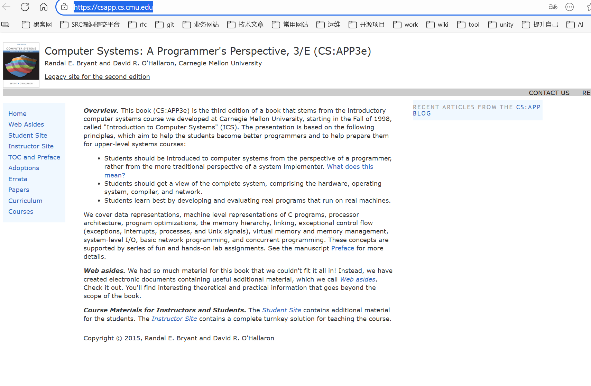

# 深入理解计算机系统（原书第3版）解析

## 源码下载地址

所有的源程序代码都可以从csapp. cs. emu. edu 上的 CS:APP 主页上获取。

在本书中，源程序的文件名列在两条水平线的右边，水平线之间是格式化的代码。 比如，下图中的程序能在 code/intro／目录下的 hello. c文件中找到。当遇到这些示例程序时，我们鼓励你在自己的系统上试着运行它们。

[CS:APP3e, Bryant and O'Hallaron](https://csapp.cs.cmu.edu/)

