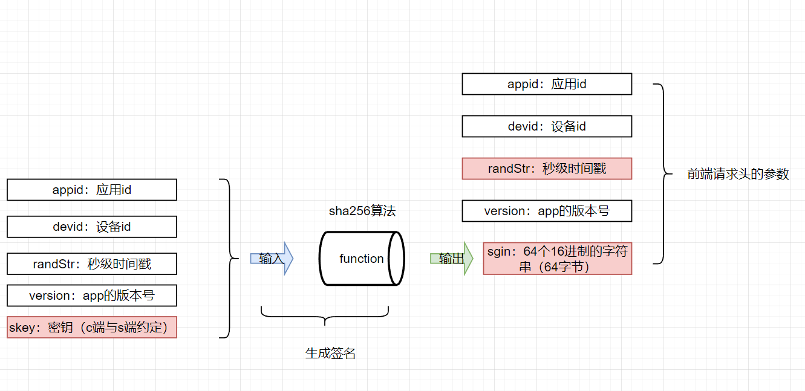
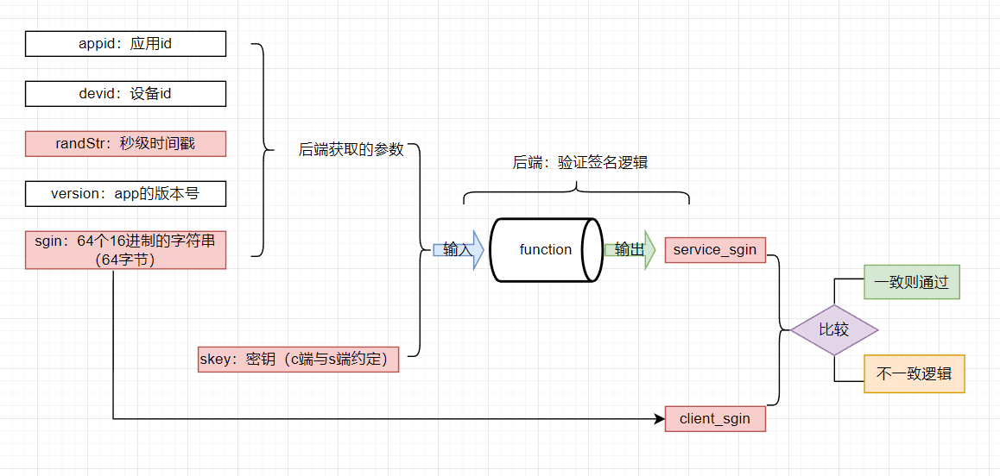
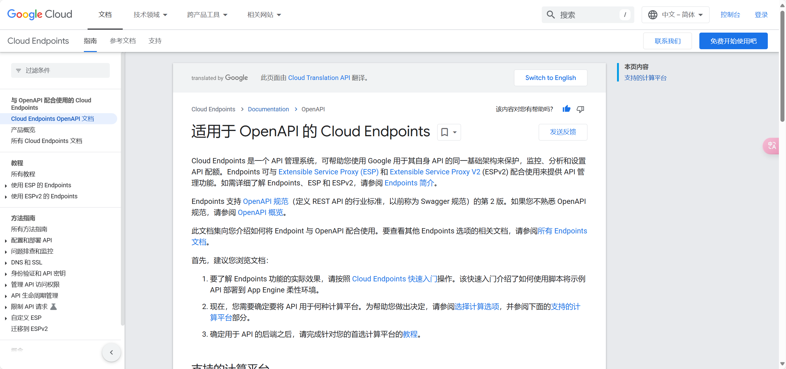

# 签名的流程

## 一百个为什么？

- 什么是**签名**？

- 为什么要有**签名**？

- **签名**的流程是怎么样的呢？
- 签名要用到哪些常见的**算法**？

## 什么是**签名**？

生活中签名的意思就是其字面的意思。如：某某偶像给粉丝进行签名、谈项目的时候在合同上签名（有法律效应的签名）。这些签名都是同一个字面意思。在计算机世界里**签名**也和现实世界的签名是同样的一个道理。但是唯一不同的是计算机中的签名可比现实世界的复杂。


## 为什么要有**签名**？

要说清楚为什么不是这么容易。这个是有历史迭代原因的。我简述其**核心作用**：

| **目的**                 | **说明**                                                     |
| ------------------------ | ------------------------------------------------------------ |
| **数据完整性验证**       | 检测数据是否被篡改（如中间人攻击、传输错误）。               |
| **身份认证**             | 确认数据来源的真实性（如API请求是否来自合法客户端）。        |
| **防抵赖（不可否认性）** | 签名者无法事后否认自己生成过该签名（常用于法律或金融场景）。 |

## 前端带签名的请求





## **后端如何验证签名**


```python
def verify_request(appid, devid, version, time01, client_sign):
    # 服务端用相同的规则重新计算签名
    server_sign = hashlib.sha256((appid + devid + version + time01 + skey).encode("utf-8")).hexdigest()
    return server_sign == client_sign  # 一致则通过
```

其逻辑就是：




## **为什么选择SHA256？**

- **抗碰撞性**：极难找到两个不同输入产生相同的哈希值。
- **固定长度输出**：无论输入多大，输出总是32字节，方便存储和传输。
- **行业标准**：被NIST、PCI DSS等权威机构推荐。

## **安全注意事项**

1. **密钥（`skey`）保护**：
   - 密钥泄露会导致签名可被伪造，必须安全存储（如使用环境变量/密钥管理服务）。
2. **签名包含时间戳**：
   - 防止重放攻击（必须代一个时间戳字符串）。
3. **避免参数拼接漏洞**：
   - 如直接拼接参数可能导致注入风险（例：`appid=123&devid=456` 和 `appid=123&devid=456` 可能生成相同签名）。建议使用分隔符或标准化编码（如JSON + Base64）。


## 相关文档

[FIPS 180-4, Secure Hash Standard (SHS) | CSRC](https://csrc.nist.gov/pubs/fips/180-4/upd1/final)

[hashlib — Secure hashes and message digests — Python 3.13.3 documentation](https://docs.python.org/3/library/hashlib.html)

[为何及何时使用 API 密钥  | Cloud Endpoints with OpenAPI  | Google Cloud](https://cloud.google.com/endpoints/docs/openapi/when-why-api-key?hl=zh-cn)

[OpenAPI-Specification/versions/2.0.md at main · OAI/OpenAPI-Specification](https://github.com/OAI/OpenAPI-Specification/blob/main/versions/2.0.md)OpenApi规范。

[快速入门：部署由 Cloud Endpoints 管理的 API  | Google Cloud](https://cloud.google.com/endpoints/docs/deploy-api?hl=zh-cn)



有时间一定要阅读。