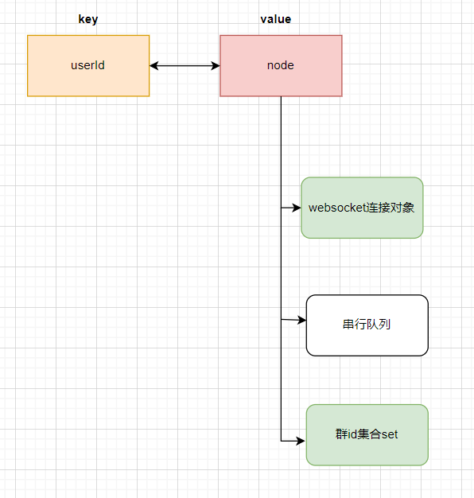
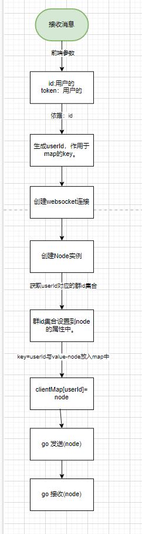
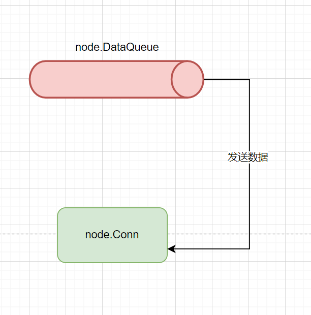
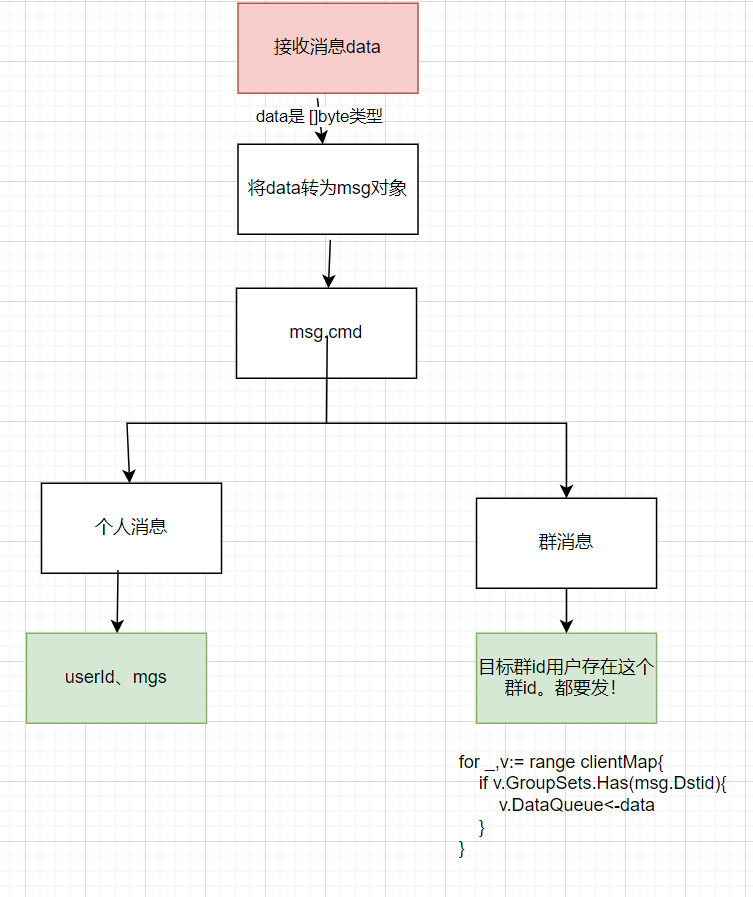

# 设计一个MI聊天系统


## 数据存储结构设计




## 接收客户端消息处理逻辑





## 发送消息处理设计




## 接收消息处理设计




## 消息体设计


```go
type Message struct {
	Id      int64  `json:"id,omitempty" form:"id"`           //消息ID
	Userid  int64  `json:"userid,omitempty" form:"userid"`   //谁发的
	Cmd     int    `json:"cmd,omitempty" form:"cmd"`         //群聊还是私聊
	Dstid   int64  `json:"dstid,omitempty" form:"dstid"`     //对端用户ID/群ID
	Media   int    `json:"media,omitempty" form:"media"`     //消息按照什么样式展示
	Content string `json:"content,omitempty" form:"content"` //消息的内容
	Pic     string `json:"pic,omitempty" form:"pic"`         //预览图片
	Url     string `json:"url,omitempty" form:"url"`         //服务的URL
	Memo    string `json:"memo,omitempty" form:"memo"`       //简单描述
	Amount  int    `json:"amount,omitempty" form:"amount"`   //其他和数字相关的
}
```


## node结构设计

```go
type Node struct {
	Conn *websocket.Conn
	//并行转串行,
	DataQueue chan []byte
	GroupSets set.Interface
}
```


