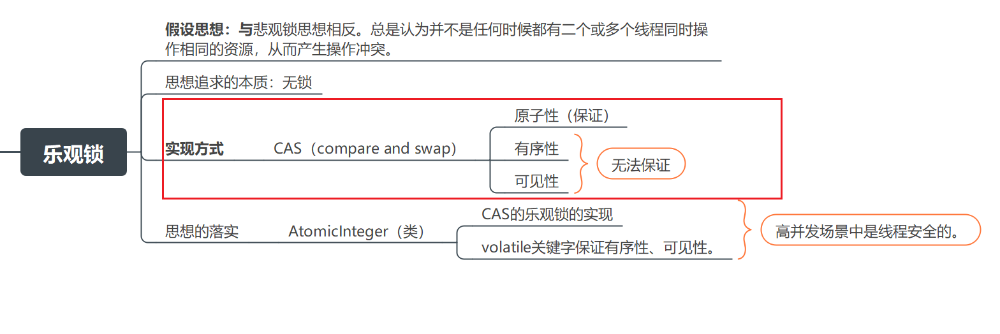
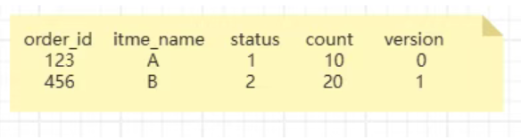
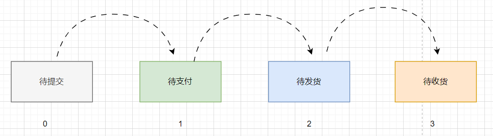

# 解决接口幂等性问题

## 什么是幂等性？

答：说白了所谓的“幂等”就是多次第意思。接口幂等性就是接口多次调用后回对系统的数据产生一定影响。

场景来说话：

- 接口超时后重试机制
- MQ的重复消费

都会带来接口幂等性的问题，下面我们介绍几种通过**锁的方式**实现接口幂等性的方案。

## 方式一)数据库唯一主键

数据库唯一主键的实现原理是<font color = 'red'>使用数据库中主键唯一约束的特性</font>，一般来说唯一主键比较适用于添加数据时的幂等性场景，唯一主键能保证一张表中只能存在一条该唯一主键的记录，方案的实现的流程如下图所示：


::: tip 数据库唯一主键实现接口幂等性时需要注意

为了保证在分布式环境下ID的全局唯一性，这里的主键一般使用分布式ID充当主键。

分布式id有哪几种解决方案呢？

::: 


## 方式二)数据库悲观锁[行锁]

实验的表数据结构：

```sql
CREATE TABLE `sun` (
  `id` int(11) NOT NULL AUTO_INCREMENT,
  `city_number` varchar(50) COLLATE utf8mb4_hungarian_ci DEFAULT NULL,
  `date` datetime DEFAULT NULL,
  `create_time` datetime DEFAULT NULL,
  PRIMARY KEY (`id`),
  UNIQUE KEY `idx_city_number_date` (`city_number`,`date`)
) ENGINE=InnoDB AUTO_INCREMENT=5 DEFAULT CHARSET=utf8mb4 COLLATE=utf8mb4_hungarian_ci;
```

数据：

```sql
INSERT INTO `sun` VALUES (1, '440300', '2025-05-30 00:00:00', '2025-04-26 10:43:50');
INSERT INTO `sun` VALUES (4, '440301', '2025-05-30 00:00:00', '2025-04-26 14:56:09');
```


假设我们在连接1中(java的处理是一个请求线程)。

第一步：使用FOR UPDATE查询添加悲观锁。

第二步：这行数据被锁住了。对其进行修改操作。如：订单修改状态、用户信息对象修改用户状态。

第三步：模拟业务处理让起进行休眠操作。

```sql
START TRANSACTION;
SELECT * FROM sun WHERE id = 1 FOR UPDATE;
-- 睡眠50秒
SELECT SLEEP(50);
COMMIT;
```


假设第二个连接：

进行查询操作，第一个线程没有执行完毕，无法在查询同一条id = 1的数据。这个时候查询进入阻塞状态。给用户的感觉好像是卡住了。

```sql
START TRANSACTION;
SELECT * FROM sun WHERE id = 1 FOR UPDATE;
COMMIT;
```


::: tip 悲观锁注意点

1. 悲观锁在同一事务操作过程中锁住了一行数据时，别的请求过来只能等待。
2. 如果当前事务耗时比较长，就很影响接口性能。
3. 对于Mysql数据库，要求存储引擎必须用innodb。为什么？答：因为innodb才支持事务。
4. where后面跟的查询条件字段一定要是<font color = 'red'>主键</font>或者<font color = 'red'>唯一索引</font>，不然会锁<font color = 'red'>整张表</font>。

::: 

**总结：**比较好性能。单体架构可以考虑试用。

## 方式三)数据库乐观锁[无锁]

- 什么是乐观锁？



答：就是无锁。实现思路：cas【比较与交换】。

数据库乐观锁方案一般适用于执行"更新操作"的过程，我们可以提前在对应的数据表中额外添加一个字段来充当数据的版本标识。这样每次对该数据表的这条数据执行更新时，都会将该版本标识作为一个条件，值为上次待更新数据中的版本标识的值，如下图所示的：



每次更新的时候，我们使用版本号来进行字段校验以及进行update更新，sql如下所示：

```sql
UPDATE order SET status=2,version=version+1 WHERE id=123 
AND version=0;
```

多添加一个条件AND version=0进行<font color = 'red'>比较</font>。

在WHERE后面的条件id=123 AND version=0 被执行后，id=123的 version被更新为1，所以如果重复执行该条sql语句将不生效，因为id=123 AND version=0的数据已经不存在，通过这样方式就能保住更新的幂等，多次更新对结果不会产生影响。

**为了解决的问题是：**

接口主要功能就是执行一条更新操作的sql语句。保证更新数据的接口多次执行后对期望结果不会产生影响。

概括：<font color = 'red'>更新接口的幂等性问题解决</font>。


## 方式四)状态机机制

 在业务表中有状态的时候，如订单表中的订单状态（待提交、待支付、待发货、待收货等等）这些状态的值是有规律的，按照业务节点一级级的流转，那么我们就能利用这个特性实现接口的幂等，如下图所示的节点状态流转过程：



假如订单id为123的订单当前状态是<font color = 'red'>待支付</font>，当用户支付后，订单的状态要变成待发货，更新的语句如下：

```sql
update order set status = 2 where order_id = 123 and status = 1 
```

线程T1请求时，该订单的状态是待支付（status = 1），所以该update语句可以正常更新数据，sql执行结果的影响行数是1，订单状态变成了2。

  线程T1请求时，该订单的状态是待支付（status = 1），所以该update语句可以正常更新数据，sql执行结果的影响行数是1，订单状态变成了2。

线程T2相同的请求过来，再执行相同的sql时，由于订单状态变成了2，再用status=1作为条件，无法查询出需要更新的数据，所以最终sql执行结果的影响行数是0，即不会真正的更新数据。数据表记录中的状态来作为条件做更新其实跟<font color = 'red'>乐观锁使用版本号类似</font>。

**总结：**

状态机机制的本质就是：跟<font color = 'red'>乐观锁使用版本号类似</font>

## 方式五)分布式锁

 唯一主键与乐观锁的本质是使用了数据库的锁，但由于数据库锁的性能不太好，所以我们可使用Redis、Zookeeper等中间件来实现分布式锁的功能。

## 总结：

每种幂等性实现方案都有各自的优缺点，我们需要根据实际的业务场景选择更合适的方案来解决幂等性问题。


