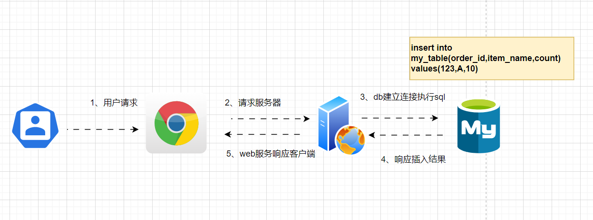
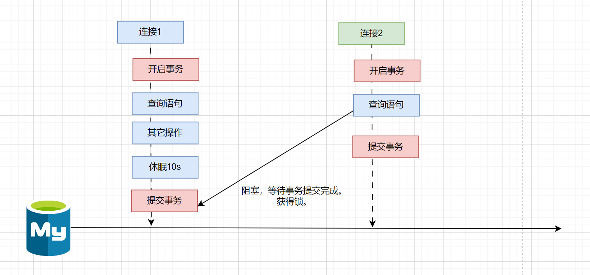

# 解决接口幂等性问题

## 什么是幂等性？

答：说白了所谓的“幂等”就是多次第意思。接口幂等性就是接口多次调用后回对系统的数据产生一定影响。

场景来说话：

- 接口超时后重试机制
- MQ的重复消费

都会带来接口幂等性的问题，下面我们介绍几种通过**锁的方式**实现接口幂等性的方案。

## 方式一)数据库唯一主键

数据库唯一主键的实现原理是<font color = 'red'>使用数据库中主键唯一约束的特性</font>，一般来说唯一主键比较适用于添加数据时的幂等性场景，唯一主键能保证一张表中只能存在一条该唯一主键的记录，方案的实现的流程如下图所示：



::: tip 数据库唯一主键实现接口幂等性时需要注意

为了保证在分布式环境下ID的全局唯一性，这里的主键一般使用分布式ID充当主键。

分布式id有哪几种解决方案呢？

::: 


## 方式二)数据库悲观锁[行锁]

实验的表数据结构：

```sql
CREATE TABLE `sun` (
  `id` int(11) NOT NULL AUTO_INCREMENT,
  `city_number` varchar(50) COLLATE utf8mb4_hungarian_ci DEFAULT NULL,
  `date` datetime DEFAULT NULL,
  `create_time` datetime DEFAULT NULL,
  PRIMARY KEY (`id`),
  UNIQUE KEY `idx_city_number_date` (`city_number`,`date`)
) ENGINE=InnoDB AUTO_INCREMENT=5 DEFAULT CHARSET=utf8mb4 COLLATE=utf8mb4_hungarian_ci;
```

数据：

```sql
INSERT INTO `sun` VALUES (1, '440300', '2025-05-30 00:00:00', '2025-04-26 10:43:50');
INSERT INTO `sun` VALUES (4, '440301', '2025-05-30 00:00:00', '2025-04-26 14:56:09');
```


假设我们在连接1中(java的处理是一个请求线程)。

第一步：使用FOR UPDATE查询添加悲观锁。

第二步：这行数据被锁住了。对其进行修改操作。如：订单修改状态、用户信息对象修改用户状态。

第三步：模拟业务处理让起进行休眠操作。

```sql
START TRANSACTION;
SELECT * FROM sun WHERE id = 1 FOR UPDATE;
-- 睡眠50秒
SELECT SLEEP(50);
COMMIT;
```





假设第二个线程：

进行查询操作，第一个线程没有执行完毕，无法在查询同一条id = 1的数据。这个时候查询进入阻塞状态。给用户的感觉好像是卡住了。

```sql
START TRANSACTION;
SELECT * FROM sun WHERE id = 1 FOR UPDATE;
COMMIT;
```


