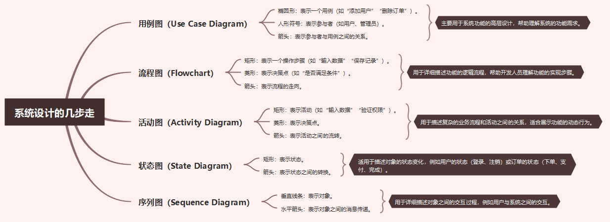

# web端系统设计技巧

古人有云：“兵马未动，粮草先行。”在软件工程行业这个道理是一样的。比如我们要开发一个某某电商系统。首先工程师们第一件事就是进行设计。而不是上来就是建表、键数据库、写代码。甚至要进行系统层面架构设计。为什么要进行设计呢？有一句是这样说的只有说的清楚，道的明白你才真的理解了。同样软件工程是一个比较抽象的工程。怎么做可以在工程上缩短开发时间。开发时间越长公司所要承担的成本越高。是一个人都不会接收这样高的的结果。

## 用例图

- 在设计数据库表时非常常用。

## 流程图

- 在对数据库表进行实现crud时用来梳理逻辑代码流程用。作用：让抽象的流程具体化。

## 活动图

- 用来分析用户的操作流程对数据的影响。作用：让抽象的流程具体化。

