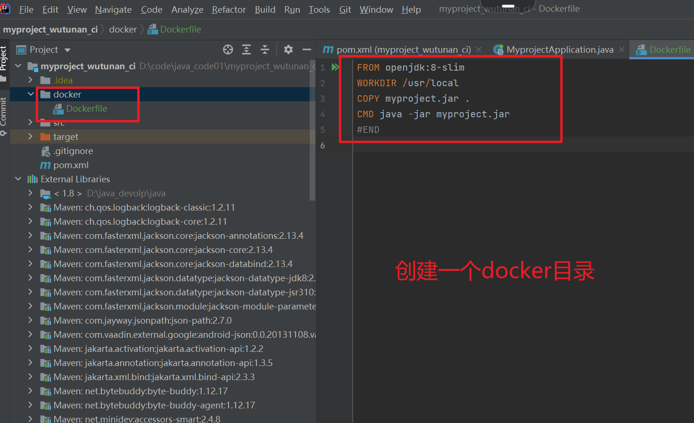
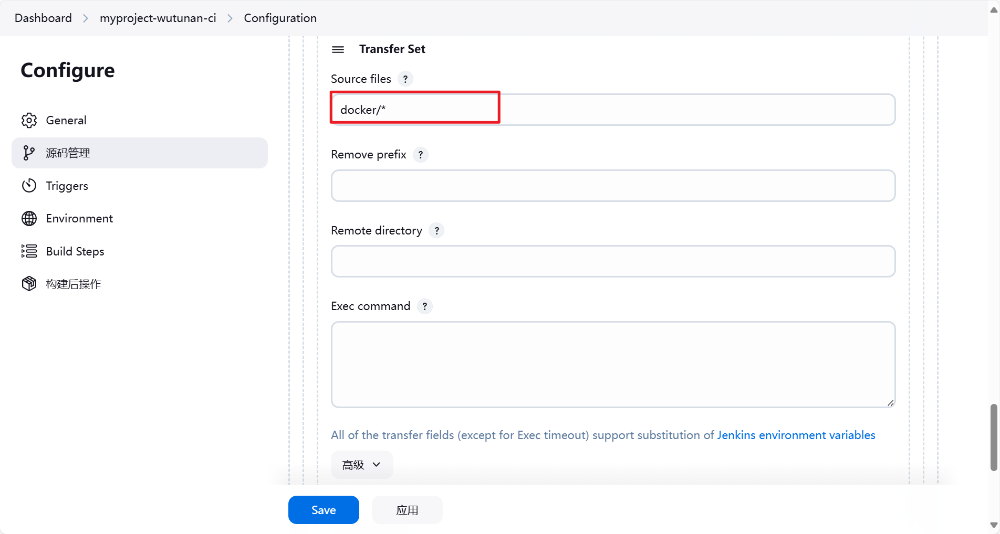
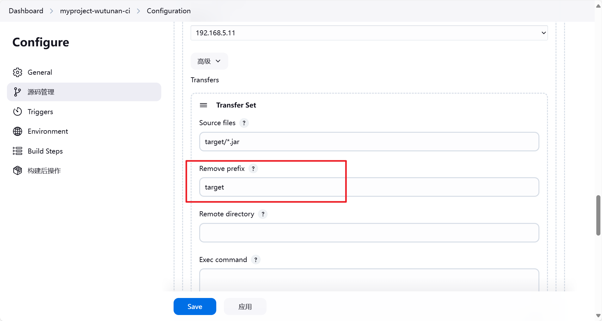
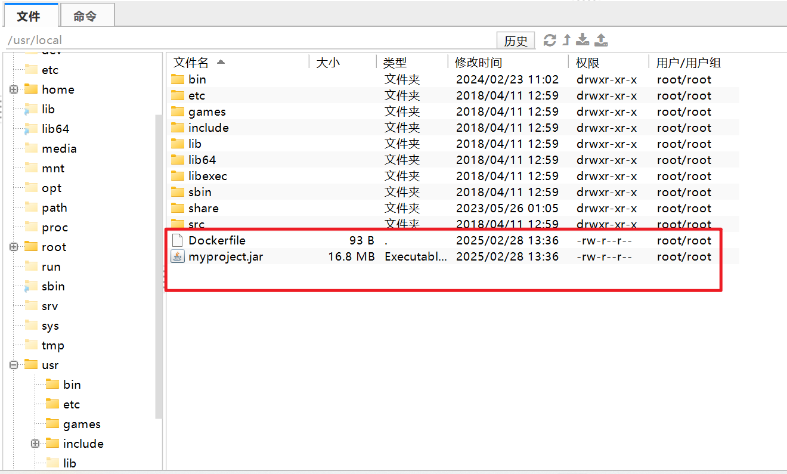

# jenkins自动构建docker镜像

## 创建dockerfile文件

作用：通知docker怎么去构建镜像。




```
FROM openjdk:8-jre-slim
WORKDIR /usr/local
# 本地产出的jar 复制到/usr/local 目录下
COPY myproject.jar .
CMD java -jar myproject.jar
#END
```


## jenkins的配置


删除原来的shell命令。


添加一个传输项。




我们再次进行构建。构建完成后。我们去目标服务器查看下。


docker与target目录不在同一个目录下。这样不好管理。

怎么样将这二个目录放在一起呢？





执行的结果：




## 配置构建镜像命令

Exec  command：

```
docker build -t wutunan/myproject:1.0 /usr/local/
docker rm -f myproject
docker run -d -p 80:80 --name=myproject wutunan/myproject:1.0
```


::: warning 目标服务器注意

- 目标服务器一定要安装了docker才可以。我们构建镜像的命令是在目标服务器上执行的。

- `pkill java`干掉之前java的jar程序。运行我们现在构建的容器。

:::

我们点击理解构建。验证构建结果：


查看容器是否存在。


