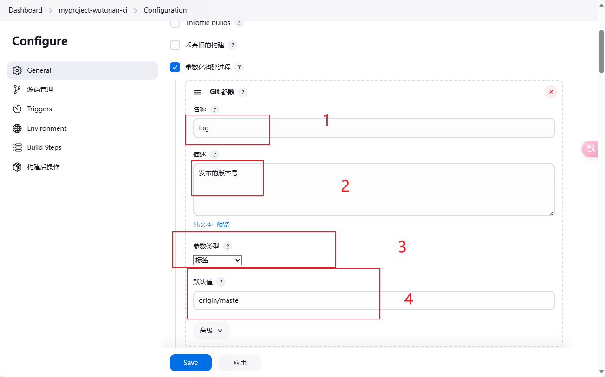
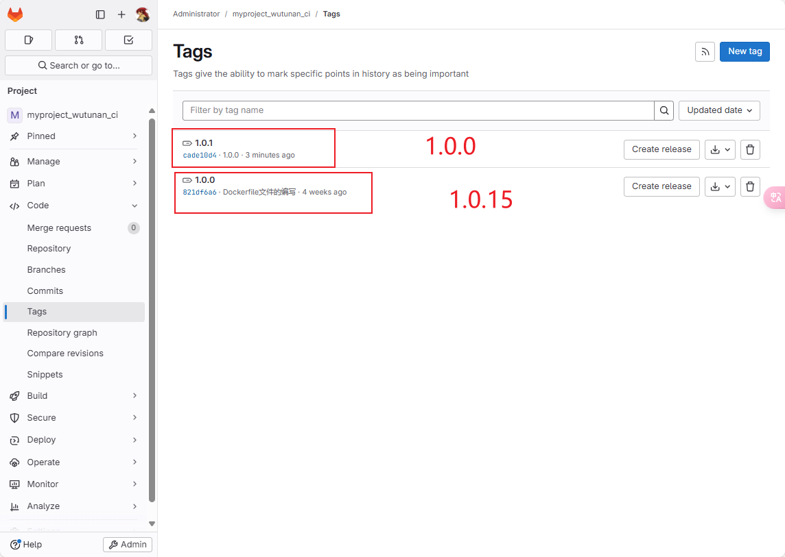
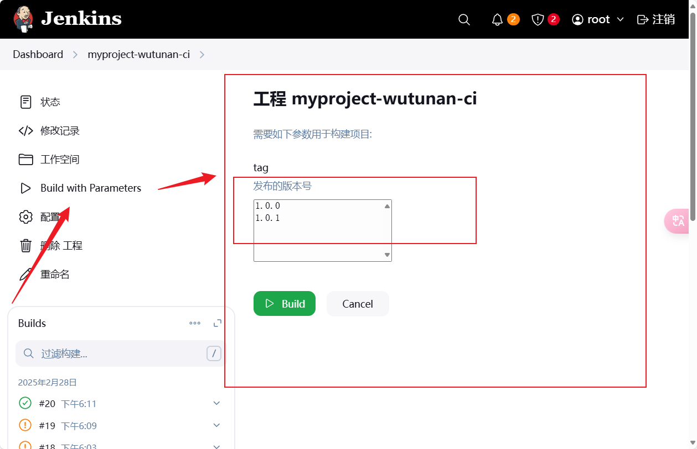

# Jenkins参数化构建过程


## 需求分析


在192.168.5.203的服务器上构建docker镜像。docker镜像的名字命名格式是    项目名:版本号 。

问题是这个版本号现在是写死在项目的命令中的。

我们期望项目在gitlab提交时取项目最新的tag标签为版本号。


## 参数化构建过程

**git参数**


勾选之后会出现一个<font color='red'> “添加参数”</font>的选项。所谓添加参数就是给我们添加一个环境的变量。依据这个变量我们进行后续的处理。


选着git参数 后。会新增4个项我们填写。

名称：环境变量名。


最终填写完的效果如下：





## 构建命令的修改

在构建部分原本的package前新增Shell，现⾏checkout指定的版本， $tag引⽤选择的版本号 。

```
git checkout $tag
```


原本192.168.5.203(<font color='red'>harbor服务器</font>) Exec  command，将所有 1.0 改为$tag进⾏引⽤ 。

```
docker build -t 192.168.5.203:80/public/myproject:$tag /usr/local/
docker login -u admin -p Harbor12345 192.168.5.203:80
docker push 192.168.5.203:80/public/myproject:$tag
```


原本192.168.5.11(<font color='red'>⽬标服务器：就是将镜像运行测试的服务器</font>)的Exec  command位置，将 1.0 改为$tag 。

```
docker rm -f myproject
docker run -d -p 80:80 --name=myproject 192.168.5.203:80/public/myproject:$tag
```


## 测试参数构建过程





jenkins上开始构建项目。





构建成功！


目标服务器也拉取运行成功了！


验证运行的结果：


下面我们构建1.0.1版本的镜像。


验证1.0.1版本的运行的结果：


## harbor验证

还没有构建前的harbor仓库里面的镜像。


我开始构建1.0.0版本的镜像。


