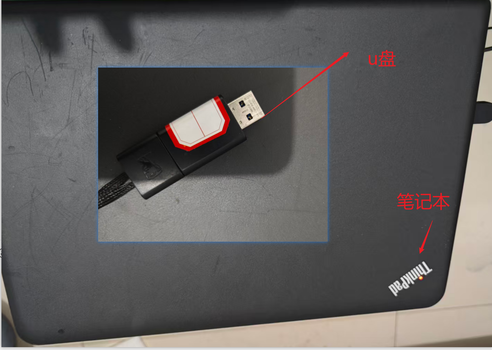
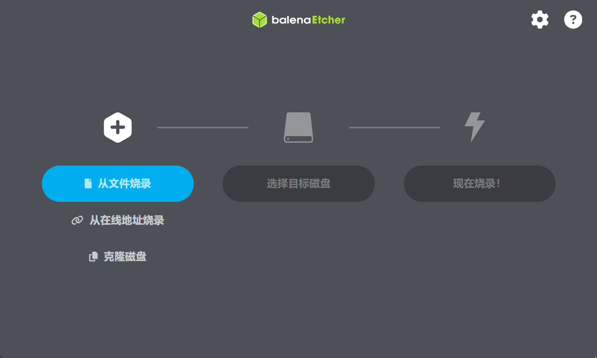

# 物理机安装ubuntu系统

对一些旧版的电脑进行安装ubantu系统。为什么？因为windows系统太卡。还可以安装一些其它服务在本地物理机上。

## 第1步)准备材料

- 一台比较古董的thinkbook笔记本电脑。8G+256G。cpu型号比较古董了。
- 一个大于8G的U盘。

## 第2步)系统镜像准备

官方地址：

[Get Ubuntu | Download | Ubuntu](https://ubuntu.com/download)

## 第3步)制作引导u盘

1. 选择从文件烧录。【其它方式可以自己尝试】
2. 选择要烧录的u盘。

有视频演示烧录的过程。这里文字描述略。

## 第4步)物理机进行烧录系统

注意：优先选择u盘驱动启动。【thinkbook是启动时狂按f12进入引导盘选项菜单。】

## 第5步)通过引导步骤安装ubantu系统

引导系统会通过交互式的步骤一步一步的告诉我们进行安装，整个安装的过程的视频步骤我录制为视频。不方便展示。【略】

