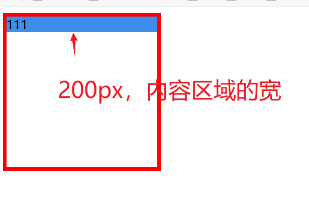
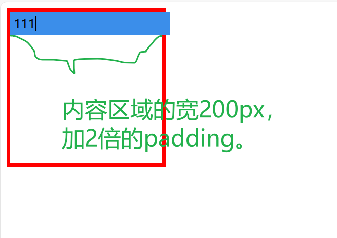
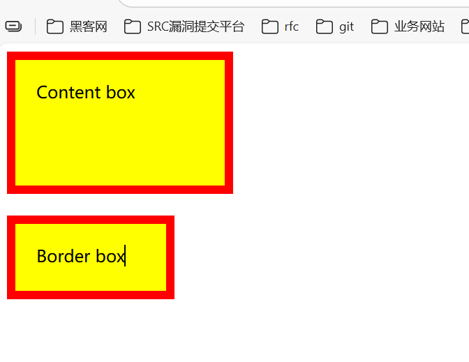

# box-sizing样式解析

## content-box属性

content-box中文翻译是内容盒子、内容框。表示什么含义呢？

[box-sizing - CSS：层叠样式表 | MDN](https://developer.mozilla.org/zh-CN/docs/Web/CSS/box-sizing)

官方文档描述有以下几点总结：

1. content-box是box-sizing样式的默认属性。
2. content-box是用来固定盒子内容区域的值。什么意思呢？如果盒子的宽度设置为100px，那么在设置box-sizing为content-box时，盒子的内容宽度就是盒子的宽度。其它边的宽度、padding宽度、margin宽度都没算。

## border-box属性

border-box中文翻译是边框盒子。

官方文档描述有以下几点总结：

1. 将一个元素的 width 设为 100px。盒子宽度（用户设置width的值） =   border值 +  padding值。
2. 盒子内容区域的宽  = 盒子宽度（用户设置width的值）- （ border值 +  padding值）。

## box-sizing小总结

设置box-sizing样式content-box、border-box值的目的就是为了可以灵活的去改变width、height样式设置的值的作用效果。

1. 情况1决定width、height是表示内容区域的宽、高。
2. 情况2决定 内容区域宽高 +  border宽高 + padding宽高。


## content-box案例

指定width设置的宽度是内容的宽度。

```html
<!DOCTYPE html>
<html lang="en">
<head>
    <meta charset="UTF-8">
    <title>Title</title>
    <style>
        .parent-container {
            border: 5px solid red;
            width: 200px;
            height: 200px;
        }
        .child-container {
            box-sizing: content-box;
            width: 100%;
            background-color: #3B8EEA;
        }

    </style>
</head>
<body>
<div class="parent-container">
    <div class="child-container">
        111
    </div>
</div>
</body>
</html>
```



```html
<!DOCTYPE html>
<html lang="en">
<head>
    <meta charset="UTF-8">
    <title>Title</title>
    <style>
        .parent-container {
            border: 5px solid red;
            width: 200px;
            height: 200px;
        }
        .child-container {
            box-sizing: content-box;
            width: 100%;
            background-color: #3B8EEA;
            padding: 5px;
        }

    </style>
</head>
<body>
<div class="parent-container">
    <div class="child-container">
        111
    </div>
</div>
</body>
</html>
```




## content-box与border-box对比案例

```html
<!DOCTYPE html>
<html lang="en">
<head>
    <meta charset="UTF-8">
    <title>Title</title>
    <style>
        div {
            width: 160px;
            height: 80px;
            padding: 20px;
            border: 8px solid red;
            background: yellow;
        }

        .content-box {
            box-sizing: content-box;
            /* Total width: 160px + (2 * 20px) + (2 * 8px) = 216px
               Total height: 80px + (2 * 20px) + (2 * 8px) = 136px
               Content box width: 160px
               Content box height: 80px */
        }

        .border-box {
            box-sizing: border-box;
            /* Total width: 160px
               Total height: 80px
               Content box width: 160px - (2 * 20px) - (2 * 8px) = 104px
               Content box height: 80px - (2 * 20px) - (2 * 8px) = 24px */
        }
    </style>
</head>
<body>
<div class="content-box">Content box</div>
<br/>
<div class="border-box">Border box</div>
</body>
</html>div {
  width: 160px;
  height: 80px;
  padding: 20px;
  border: 8px solid red;
  background: yellow;
}

.content-box {
  box-sizing: content-box;
  /* Total width: 160px + (2 * 20px) + (2 * 8px) = 216px
     Total height: 80px + (2 * 20px) + (2 * 8px) = 136px
     Content box width: 160px
     Content box height: 80px */
}

.border-box {
  box-sizing: border-box;
  /* Total width: 160px
     Total height: 80px
     Content box width: 160px - (2 * 20px) - (2 * 8px) = 104px
     Content box height: 80px - (2 * 20px) - (2 * 8px) = 24px */
}
```




**content 盒子宽高度的计算：**

content box 实际盒子的宽度（眼睛看到的盒子宽度）= width: 160px + padding: 20px * 2 + border: 8px * 2 = 216px

content box 实际盒子的高度（眼睛看到的盒子高度）= height: 80px + padding: 20px * 2 + border: 8px * 2 = 136px

**border-box盒子宽高度的计算：**

     Content box width: 160px - (2 * 20px) - (2 * 8px) = 104px
     Content box height: 80px - (2 * 20px) - (2 * 8px) = 24px 

## 语法总结

```css
box-sizing = content-box  | border-box   
```

[CSS Box Sizing Module Level 3](https://drafts.csswg.org/css-sizing-3/)


## 技巧

```css
* {
  box-sizing: border-box;
}
```

这使得处理元素大小的工作变得容易得多，并且通常消除了在布局内容时可能遇到的许多陷阱。然而，在某些情况下，你应谨慎使用这个属性。例如：你正在编写一个将由其他人使用的共享组件库，如果他们网站的其余部分没有设置此值，他们可能会发现很难使用你的组件库。


