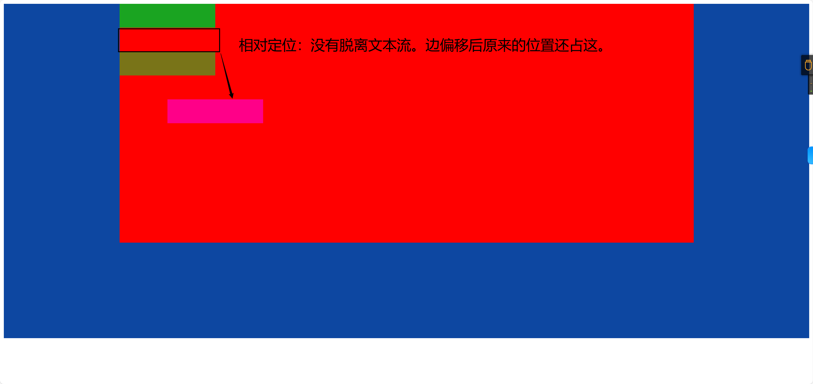
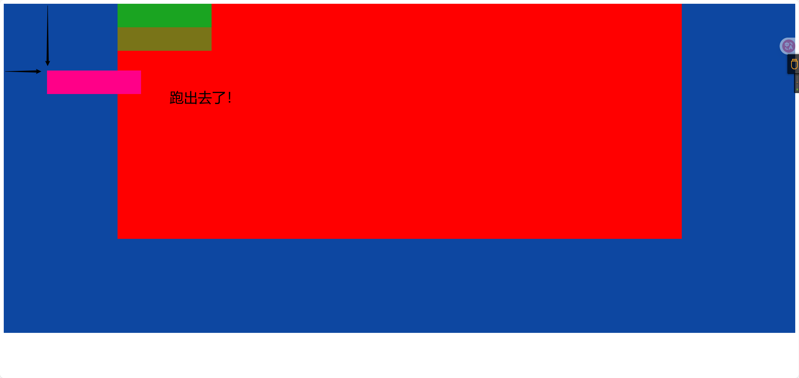
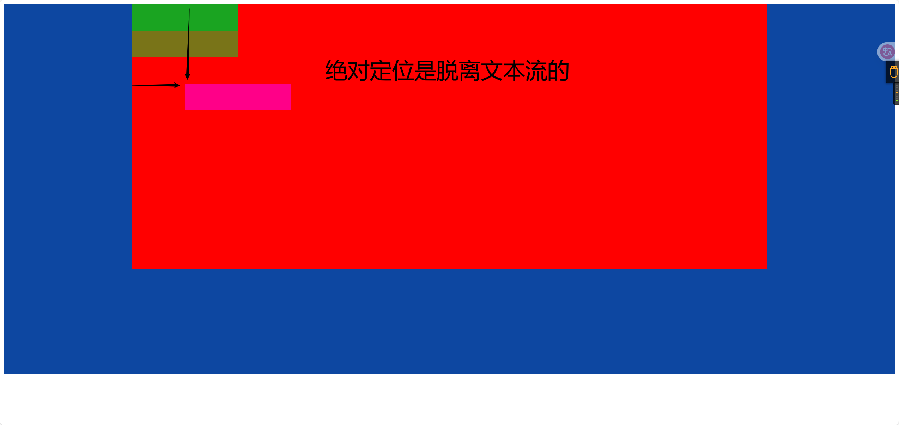
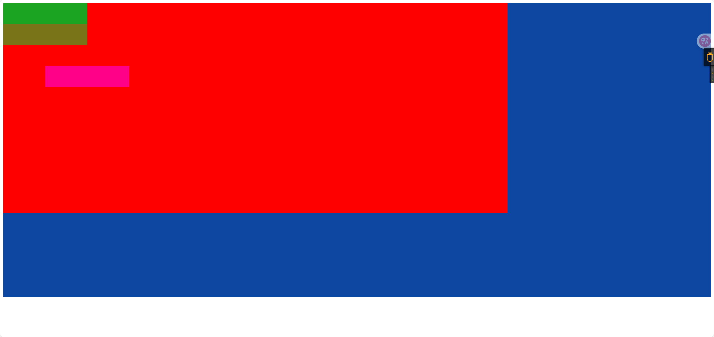
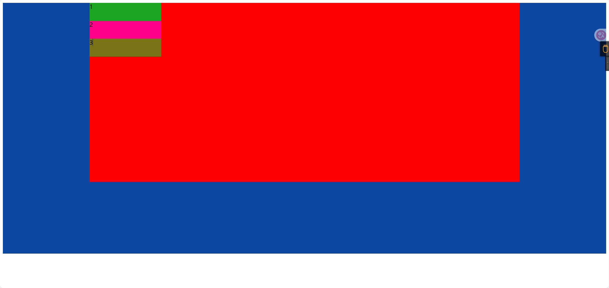
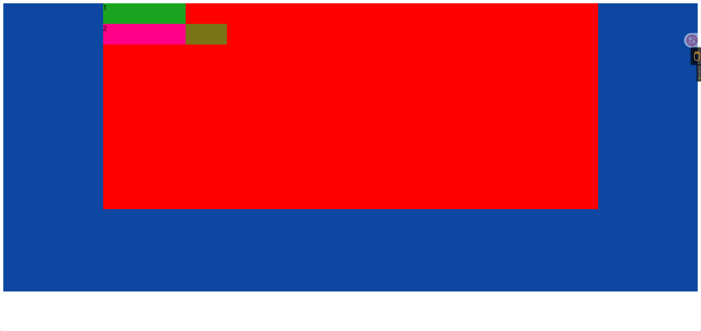

# 定位(position)

## 元素的定位属性

元素的定位属性主要包括**定位模式**和**边偏移**两部分。

1、边偏移

| 边偏移属性 | 描述                                           |
| ---------- | ---------------------------------------------- |
| top        | 顶端偏移量，定义元素相对于其父元素上边线的距离 |
| bottom     | 底部偏移量，定义元素相对于其父元素下边线的距离 |
| left       | 左侧偏移量，定义元素相对于其父元素左边线的距离 |
| right      | 右侧偏移量，定义元素相对于其父元素右边线的距离 |

也就说，以后定位要和这边偏移搭配使用了， 比如 top: 100px;  left: 30px; 等等

2、定位模式

在CSS中，position属性用于定义元素的定位模式，其基本语法格式如下：

选择器{position:属性值;}

position属性的常用值

| 值       | 描述                                             |
| -------- | ------------------------------------------------ |
| static   | 自动定位（默认定位方式）                         |
| relative | 相对定位，相对于其原文档流的位置进行定位         |
| absolute | 绝对定位，相对于其上一个已经定位的父元素进行定位 |
| fixed    | 固定定位，相对于浏览器窗口进行定位               |

## 静态定位(static)

静态定位是所有元素的默认定位方式，当position属性的取值为static时，可以将元素定位于静态位置。 **所谓静态位置就是各个元素在HTML文档流中默认的位置**。

上面的话翻译成白话：  就是网页中所有元素都默认的是静态定位哦！ 其实就是标准流的特性。

在静态定位状态下，无法通过边偏移属性（top、bottom、left或right）来改变元素的位置。

PS： 静态定位其实没啥可说的。


## 相对定位relative(自恋型)

```
小笑话： 
刚刚看到一个超级超级帅的帅哥，看得我都忍不住想和他搞基了。世间怎会有如此之完美的男人。我和他就这样一动不动的对视着，就仿佛一见钟情。时间也在这一瞬间停止了。直到我的手麻了。才恋恋不舍的放下镜子。。。。
```

相对定位是将元素相对于它在标准流中的位置进行定位，当position属性的取值为relative时，可以将元素定位于相对位置。

对元素设置相对定位后，可以通过**边偏移属性**改变元素的位置，**但是**它在文档流中的位置仍然保留。如下图所示，即是一个相对定位的效果展示：



```html
<!DOCTYPE html>
<html lang="en">
<head>
    <meta charset="UTF-8">
    <title>相对定位</title>
    <style>
        .container {
            background-color: #0d47a1;
            width: 100%;
            height: 700px;
        }

        .demo {
            margin: 0 auto;
            background-color: red;
            width: 1200px;
            height: 500px;
        }

        .item1 {
            width: 200px;
            height: 50px;
            background-color: #1aa421;

        }

        .item2 {
            width: 200px;
            height: 50px;
            background-color: #ff0088;
            position: relative;
            left: 100px;
            top: 150px;
        }

        .item3 {
            width: 200px;
            height: 50px;
            background-color: #797418;

        }

    </style>
</head>
<body>
<div class="container">
    <div class="demo">
        <div class="item1"></div>
        <div class="item2"></div>
        <div class="item3"></div>
    </div>
</div>
</body>
</html>
```


## 绝对定位absolute (拼爹型)

```
小笑话：
吃早饭时，老婆往儿子碗里放了两个煎蛋，儿子全给了我，还一本正经地说：“爸爸，多吃点，男人养家不容易。” <br/>
我一阵感动，刚想夸他两句。 
儿子接着说：“以后全靠你让我拼爹了！”
```

[注意] 如果文档可滚动，绝对定位元素会随着它滚动，因为元素最终会相对于正常流的某一部分定位。

当position属性的取值为absolute时，可以将元素的定位模式设置为绝对定位。

注意：绝对定位最重要的一点是，它可以通过边偏移移动位置，但是它完全脱标，完全不占位置。

### 情况1)父级没有定位

若所有父元素都没有定位，以浏览器为准对齐(document文档)。



```html
<!DOCTYPE html>
<html lang="en">
<head>
    <meta charset="UTF-8">
    <title>相对定位</title>
    <style>
        .container {
            background-color: #0d47a1;
            width: 100%;
            height: 700px;
        }

        .demo {
            margin: 0 auto;
            background-color: red;
            width: 1200px;
            height: 500px;
        }

        .item1 {
            width: 200px;
            height: 50px;
            background-color: #1aa421;

        }

        .item2 {
            width: 200px;
            height: 50px;
            background-color: #ff0088;
            position: absolute;
            left: 100px;
            top: 150px;
        }

        .item3 {
            width: 200px;
            height: 50px;
            background-color: #797418;

        }

    </style>
</head>
<body>
<div class="container">
    <div class="demo">
        <div class="item1"></div>
        <div class="item2"></div>
        <div class="item3"></div>
    </div>
</div>
</body>
</html>
```


### 情况2)父级有定位

**绝对定位**是将元素依据最近的已经定位（绝对、固定或相对定位）的父元素（祖先）进行定位。

父亲元素使用相对定位（relative）。

```html
<!DOCTYPE html>
<html lang="en">
<head>
    <meta charset="UTF-8">
    <title>相对定位</title>
    <style>
        .container {
            background-color: #0d47a1;
            width: 100%;
            height: 700px;
        }

        .demo {
            margin: 0 auto;
            background-color: red;
            width: 1200px;
            height: 500px;
            position: relative;
        }

        .item1 {
            width: 200px;
            height: 50px;
            background-color: #1aa421;

        }

        .item2 {
            width: 200px;
            height: 50px;
            background-color: #ff0088;
            position: absolute;
            left: 100px;
            top: 150px;
        }

        .item3 {
            width: 200px;
            height: 50px;
            background-color: #797418;

        }

    </style>
</head>
<body>
<div class="container">
    <div class="demo">
        <div class="item1"></div>
        <div class="item2"></div>
        <div class="item3"></div>
    </div>
</div>
</body>
</html>
```

父亲元素使用绝对定位（absolute）。



```html
<!DOCTYPE html>
<html lang="en">
<head>
    <meta charset="UTF-8">
    <title>相对定位</title>
    <style>
        .container {
            background-color: #0d47a1;
            width: 100%;
            height: 700px;
        }

        .demo {
            margin: 0 auto;
            background-color: red;
            width: 1200px;
            height: 500px;
            position: absolute;
        }

        .item1 {
            width: 200px;
            height: 50px;
            background-color: #1aa421;

        }

        .item2 {
            width: 200px;
            height: 50px;
            background-color: #ff0088;
            position: absolute;
            left: 100px;
            top: 150px;
        }

        .item3 {
            width: 200px;
            height: 50px;
            background-color: #797418;

        }

    </style>
</head>
<body>
<div class="container">
    <div class="demo">
        <div class="item1"></div>
        <div class="item2"></div>
        <div class="item3"></div>
    </div>
</div>
</body>
</html>
```




```html
<!DOCTYPE html>
<html lang="en">
<head>
    <meta charset="UTF-8">
    <title>相对定位</title>
    <style>
        .container {
            background-color: #0d47a1;
            width: 100%;
            height: 700px;
        }

        .demo {
            margin: 0 auto;
            background-color: red;
            width: 1200px;
            height: 500px;
            position: relative;
        }

        .item1 {
            width: 200px;
            height: 50px;
            background-color: #1aa421;

        }

        .item2 {
            width: 200px;
            height: 50px;
            background-color: #ff0088;
        }

        .item3 {
            width: 200px;
            height: 50px;
            background-color: #797418;

        }

    </style>
</head>
<body>
<div class="container">
    <div class="demo">
        <div class="item1">1</div>
        <div class="item2">2</div>
        <div class="item3">3</div>
    </div>
</div>
</body>
</html>
```


如果只是给盒子指定了定位，但是没有给边偏移值，则盒子以标准流来显示排序，和上一个盒子的底边对齐，但是**不占有位置**【说明后面盒子会顶上来，如下图就是】。

::: tip

只给2有absolute定位，其他的不给定位，效果为和1的底部对齐,3顶上来，因为2脱离了文本流不占位置。

:::



```html
<!DOCTYPE html>
<html lang="en">
<head>
    <meta charset="UTF-8">
    <title>相对定位</title>
    <style>
        .container {
            background-color: #0d47a1;
            width: 100%;
            height: 700px;
        }

        .demo {
            margin: 0 auto;
            background-color: red;
            width: 1200px;
            height: 500px;
            position: relative;
        }

        .item1 {
            width: 200px;
            height: 50px;
            background-color: #1aa421;

        }

        .item2 {
            width: 200px;
            height: 50px;
            background-color: #ff0088;
            position: absolute;
        }

        .item3 {
            width: 300px;
            height: 50px;
            background-color: #797418;

        }

    </style>
</head>
<body>
<div class="container">
    <div class="demo">
        <div class="item1">1</div>
        <div class="item2">2</div>
        <div class="item3">3</div>
    </div>
</div>
</body>
</html>
```

### 子绝父相

这个“子绝父相”太重要了，是我们学习定位的口诀，时时刻刻记住的。

这句话的意思是 子级是绝对定位的话， 父级要用相对定位。

首先， 我们说下， 绝对定位是将元素依据最近的已经定位绝对、固定或相对定位）的父元素（祖先）进行定位。

就是说， 子级是绝对定位，父亲只要是定位即可（不管父亲是绝对定位还是相对定位，甚至是固定定位都可以），就是说， 子绝父绝，子绝父相都是正确的。

所以，我们可以得出如下结论：

1. 因为子级是**绝对定位**，不会占有位置， 可以放到父盒子里面的任何一个地方。

2. 父盒子布局时，需要占有位置，因此父亲只能是**相对定位**。


这就是子绝父相的由来。

## 固定定位fixed(认死理型)

固定定位是绝对定位的一种特殊形式，它以浏览器窗口作为参照物来定义网页元素。当position属性的取值为fixed时，即可将元素的定位模式设置为固定定位。

当对元素设置固定定位后，它将**脱离标准文档流**的控制，始终依据浏览器窗口来定义自己的显示位置。不管浏览器滚动条如何滚动也不管浏览器窗口的大小如何变化，该元素都会始终显示在浏览器窗口的固定位置。

固定定位有两点：

1. 固定定位的元素跟父亲没有任何关系，只认浏览器。
2. 固定定位完全脱标，不占有位置，不随着滚动条滚动。


记忆法：  就类似于孙猴子， 无父无母，好不容易找到一个可靠的师傅（浏览器），就听的师傅的，别的都不听。