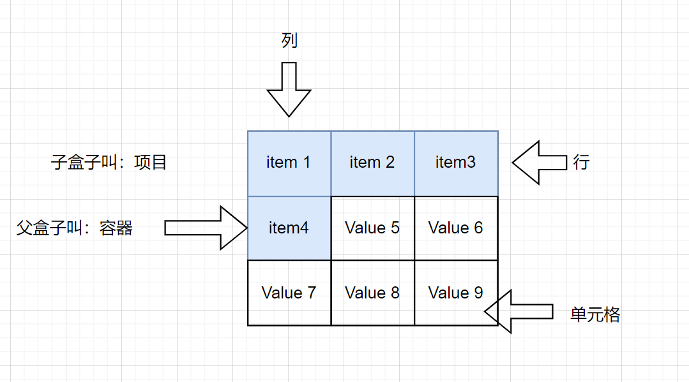
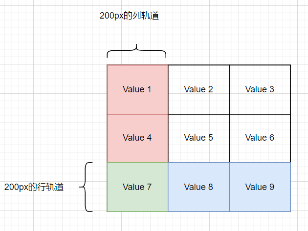
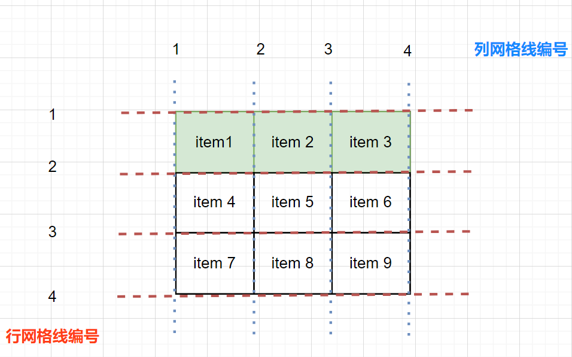
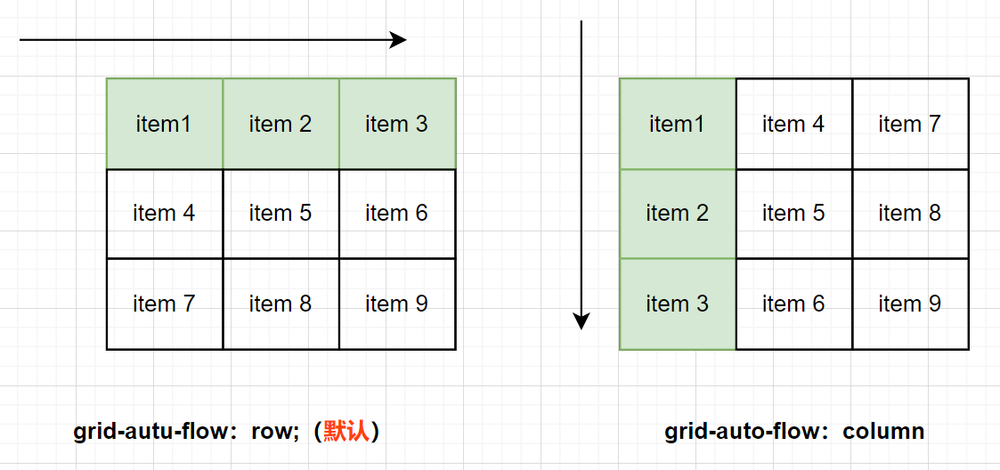
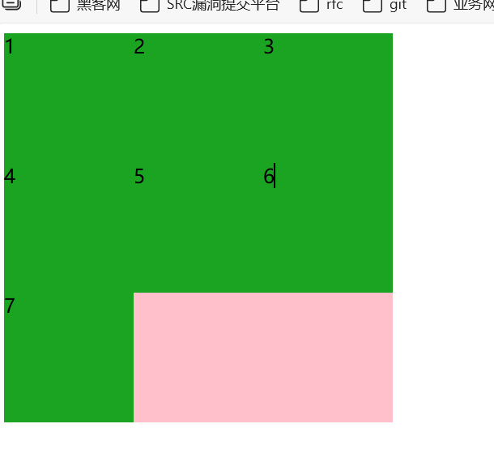

# 网格布局

css grid layout

网格布局是一种<font color = 'red'>二维布局</font>模型，允许开发者通过定义行（rows）和列（columns）来精确控制网页元素的位置和尺寸。还可以实现<font color = 'red'>响应式</font>设计。

其实网格布局和前面学的一个flex布局非常的相似。

弹性布局flex

一维布局，只能在单一方方向（水平或垂直）上排列元素，适合<font color = 'red'>线性排列</font>的场景。

二维布局，可以同时控制行和列的排列，实现真正的二维布局。


::: tip grid布局是用来淘汰flex布局吗？

实际开发大部分是<font color = 'red'>二者混用</font>的：

1. flexbox：合适快速实现一维布局、动态内容对齐。比如<font color = 'red'>单行布局</font>。
2. Grid：适合构建复杂页面框架，提供更强大的二维控制能力。比如：<font color = 'red'>多列或者响应式</font>等。

所以我们要学会扬长避短，不是谁淘汰了谁，而是什么情况下用谁更合适。

:::

## 网格布局基本概念

网格布局的核心就是如下几步：

1. 先创建好网格。
2. 在将创建好的项目放进去。




## 网格容器

容器（父盒子）设置

```css
display: grid;
```

块级（指竖着排列）。

或者

```css
display：inline-grid;
```

行内（指横着排列）。

与弹性盒子不同的是，在定义网格后，网页并不会马上发生变化。因为display:grid的声明只创建了一个<font color = 'red'>只有一列的网格</font>。flex的不同：只要给父亲添加了`display: flex`,里面的所有孩子都会一行显示。

在实际开发中大部分用的是grid。

网格容器怎么样才可以按照我们想要的方式来进行排列呢？

答：网格轨道。

## 网格轨道

grid tracks

网格轨道（grid tracks）决定了网格容器的基础布局结构，为子元素提供放置的位置。

- **绘制网格：（网格轨道）**

gird-template-columns：定义网格中的列。

gird-template-rows：定义网格中的行。

- **属性值：**

有几个属性值代表创建几列/行

长度单位 比如 100px

```css
// 定义三列,每列宽度为 200px 也叫列轨道。
gird-template-columns: 200px 200px 200px;
// 定义三行,每行宽度为 200px 也叫行轨道
gird-template-rows: 200px 200px 200px;
```



grid布局不需要换行。


## 网格轨道-对齐方式

justify-content 是控制<font color = 'red'>列轨道</font>（Column tracks）在容器内水平分布。

align-content 是控制<font color = 'red'>行轨道</font>（Row tracks）在容器内水平分布。

| 属性值          | 水平方向效果                             | 垂直方向效果                             |
| --------------- | ---------------------------------------- | ---------------------------------------- |
| start（默认值） | 左对齐                                   | 顶部对齐                                 |
| end             | 右对齐                                   | 底部对齐                                 |
| center          | 水平居中对齐                             | 垂直居中对齐                             |
| space-around    | 两侧留出相等的空白，项目周围空间均匀分布 | 上下留出相等的空白，项目周围空间均匀分布 |
| space-between   | 首尾项目贴边                             | 上下项目贴边                             |
| space-evenly    | 项目间、首尾与边界的空白相等             | 项目间、首尾与边界的空白相等             |

::: tip 开发技巧

1. 不要设置行轨道，指设置列轨道。
2. 不给父盒子高度。

:::

## 网格轨道

| 属性值       | 说明                                                         | 示例                                                      | 应用场景                   |
| ------------ | ------------------------------------------------------------ | --------------------------------------------------------- | -------------------------- |
| 固定长度     | 使用px、em等固定单位定义列宽                                 | grid-template-columns: 100px 200px;                       | 需要精确控制列宽的固定布局 |
| 百分比       | 按容器宽度百分比分配列宽                                     | grid-template-columns: 30% 70%;                           | 响应式布局中按比例划分列   |
| fr单位       | 分配轨道剩余空间的比例（1fr表示一份，总和为容器剩余空间）fr是fraction的缩写，意思为分数 | grid-template-columns: 1fr 2fr；                          | 需要自适应比例分配的布局   |
| auto         | 列宽由内容自动撑开                                           | grid-template-columns: auto 100px；                       | 内容宽度不确定时的灵活布局 |
| repeat()函数 | 简化重复的列定义                                             | grid-template-columns: repeat(3,1fr);(等效于 1fr 1fr 1fr) | 多列等宽布局               |
| minmax()函数 | 定义列宽度的最小值和最大值                                   | grid-template-columns: minmax(100px, 1fr);                | 响应式布局中限制列宽范围   |

## 网格间距

gap的简写属性用于设置行与列之间的间隙（网格间距）

**使用场景：**

1. 让元素之间保留间隙。

**语法：**

gap：20px；行和列之间保持20像素间隙。

gap：20px 30px； 行间距是20像素，列间距是30像素。

::: tip 注意：gap是简写形式也可以分开写

column-gap：30px；

row-gap：20px；

:::


## repeat()函数

语法：

repeat(固定次数，轨道尺寸) 或 repeat(自动填充，轨道尺寸)

固定次数：

```css
grid-template-columns：repeat(3,1fr);
```

自动填充：

适用于响应式布局中`列数随容器宽度变化`的场景。

auto-fill：尽可能多地创建列。

auto-fit：尽可能拉伸列填满容器（会合并空白，列宽不小于minmax的最小值）

auto-fill&auto-fit的区别

1. auto-fill：留有空白空间。
2. auto-fit：会拉伸盒子宽度占满父容器空间。


## 网格线

grid-line~

网格线会在使用网格布局时候被创建。

使用场景：

1. 实现<font color = 'red'>元素跨越</font>多个网格单元。

如何实现元素跨越多个网格单元？

**实现语法1：**

1. 跨列：grid-column：开始线编号/结束线编号；
2. 跨行：grid-row：开始线编号/结束线编号；

谁要跨行跨列占满呢？

答：子盒子。所以需要注意。

::: tip 注意

该属性要加到项目（子元素）身上。

:::

**实现语法2：**

1. 跨列：grid-column：开始线编号 / span 跨单元格数量;
2. 跨行：grid-row：开始线编号 / span 跨单元格数量;




## 网格的填充方式

grid-auto-flow决定网格容器中子元素排列填充方式。

语法：

1. grid-autu-flow：row;（默认）

   子元素按先行后列顺序填充，优先填满一行后换行。

2. grid-auto-flow：column；

   子元素按先列后行顺序填充，优先填满一列后换行。



## 网格案例1

验证 grid-template-columns属性的值效果。

```html
<!DOCTYPE html>
<html lang="en">
<head>
    <meta charset="UTF-8">
    <title>Title</title>
    <style>
        .box {
            width: 320px;
            height: 320px;
            background-color: pink;
            display: grid;
            grid-template-columns: 1fr 1fr 1fr;

        }
        .box div {
            background-color: #1aa421;
        }
    </style>
</head>
<body>
<div class="box">
    <div>1</div>
    <div>2</div>
    <div>3</div>
    <div>4</div>
    <div>5</div>
    <div>6</div>
    <div>7</div>
</div>
</body>
</html>
```

实现效果：




## 网格线案例1

案例的目的：熟悉去应用如下知识点。

1. 熟悉网格布局。
2. 熟悉网格跨行、跨列的使用。


实现代码：

```html
<!DOCTYPE html>
<html lang="en">
<head>
    <meta charset="UTF-8">
    <title>Title</title>
    <style>
        .box {
            background-color: pink;
            width: 50%;
            margin: 0 auto;
            display: grid;
            grid-template-columns: repeat(3, 1fr);
            grid-template-rows: repeat(2, 1fr);
            gap: 10px;
        }

        .box .item {
            background-color: green;
        }

        /*  1、选中第一个盒子   */
        .item:nth-child(1) {
            background-color: #3B8EEA;
            grid-row: 1/3;
        }
        /* 2、跨列 */
        .item:nth-child(4) {
            background-color: #3B8EEA;
            grid-column: 2/4;
        }

        img {
            display: block;
            width: 100%;
            height: 100%;
        }
    </style>
</head>
<body>

<div class="box">
    <!-- 3、放入对应的图片标签    -->
    <div class="item"></div>
    <div class="item"></div>
    <div class="item"></div>
    <div class="item"></div>
</div>
</body>
</html>
```

