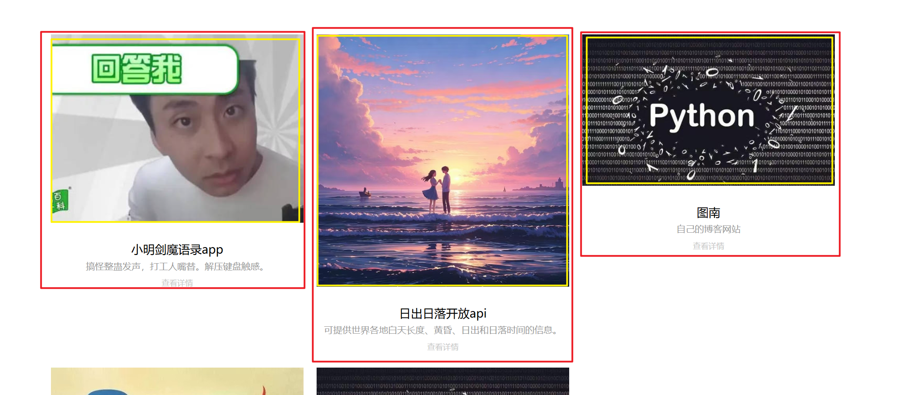
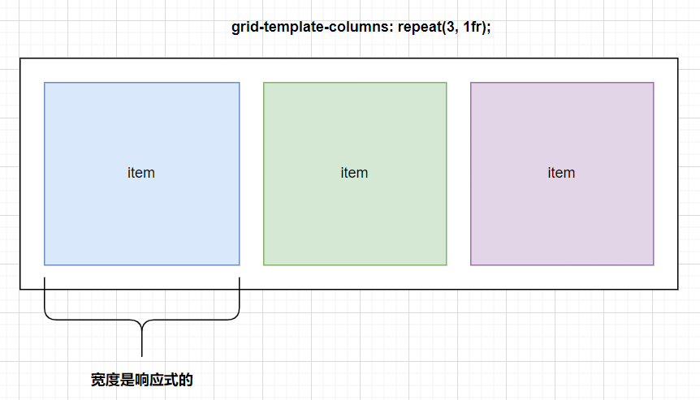
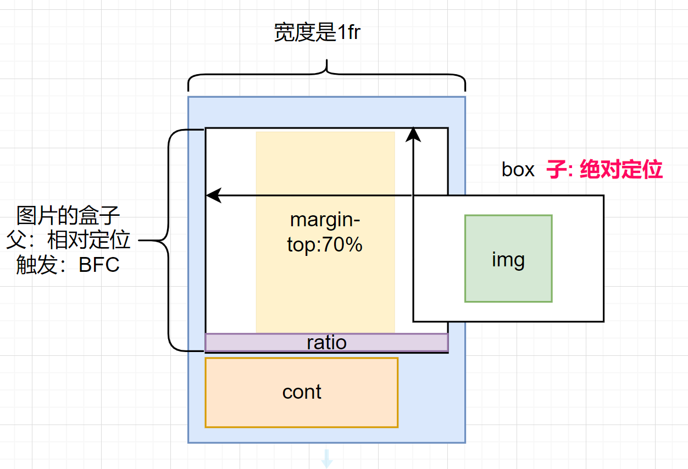
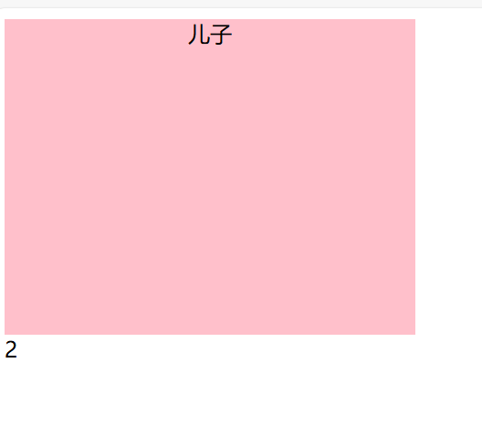

# grid布局的item布局技巧1

## 能学到什么？

- 熟练运用grid布局。
- 什么场景下触发bfc进行高度的计算。
- margin-top布局技巧的运用。
- <font color ='red'>宽响应式固定</font>，不给高度布局。

## 应用场景

在前端的<font color ='red'>grid</font>布局中。我们往往不会给item选项一个高度。也就是0高。item选项的宽是通过nfr设置进行平均分配的。目的只是为了更好的响应式的展示item项。

如果我们item项里面有图片我们的宽度是固定值（fr平均分配的，是响应式的。）那么在img标签中宽度是100%（也就是item的宽度），高度我们都是设置`height：auto`这个样会导致每一个item的选项高低不齐。为什么会出现这个样的效果呢？前面我布局我们说过：“往往不会给item选项一个高度”。高度都是由内容进行<font color ='red'>撑开</font>的。



上面就是问题效果的展示图片。高度不一样展示的太丑了！


## 期望达到的效果

浏览器最大宽度的情况下：


响应式的状态下的效果：


## 布局的实现原理

需求分析：

- item选项我们是没有高度的。
- 唯一有高度的是下面装内容的盒子。高度是里面的内容<font color ='red'>撑开</font>的。

第一步：grid布局。item项宽度是平均计算分配的。（响应式）




第二步：margin-top:70%、触发BFC技巧的运用。



::: top margin-top不是产生高

margin-top的目的不是产生高而是在里起到把cont盒子顶下去的作用。高的计算是父亲盒子触发了BFC后把box的“可视尺寸”计算进来，碰巧给了父亲盒子一个“视觉高度”。这样就巧妙的能展示图片了。

<font color ='red'>margin-top的作用不是起到高度撑开作用。但是这个是给父亲盒子触发BFC后进行计算高提供了前提条件。可以说没有margin-top：70%的可见区域，也就没有box盒子的高度（box盒子高度给的是100%，都取决父亲的高度）。</font>

:::

**小结：**

absolute盒子永远吃<font color ='red'>“爸爸已确认的高度”</font>；爸爸的高度等于 = 0是它就消失。


## 案例小结

如果上面案例描述不清楚可以给一个案例演示什么是BFC？上面是margin-top：70%？

```html
<!DOCTYPE html>
<html lang="en">
<head>
    <meta charset="UTF-8">
    <title>Title</title>
    <style>
        .parent {
            position: relative;
            width: 300px;
            background-color: pink;
            overflow: hidden;
        }
        .sum {
            text-align: center;
            vertical-align: center;
        }
        .ratio {
            margin-top: 70%;
        }
    </style>
</head>
<body>
<div class="parent">
    <div class="sum">
        儿子
    </div>
    <div class="ratio"></div>
</div>
<div>
    2
</div>
</body>
</html>
```

运行的效果：




