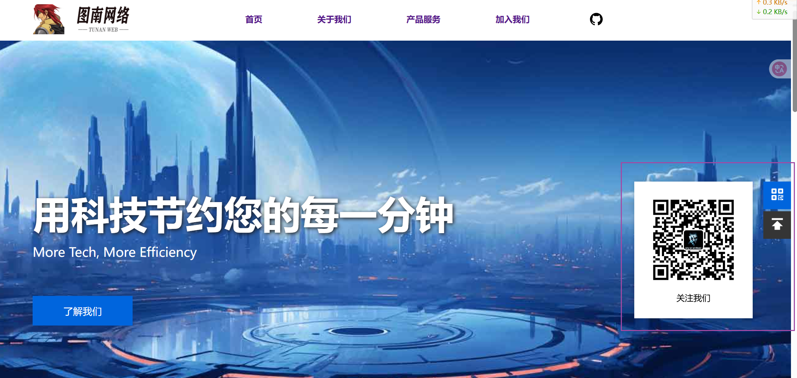
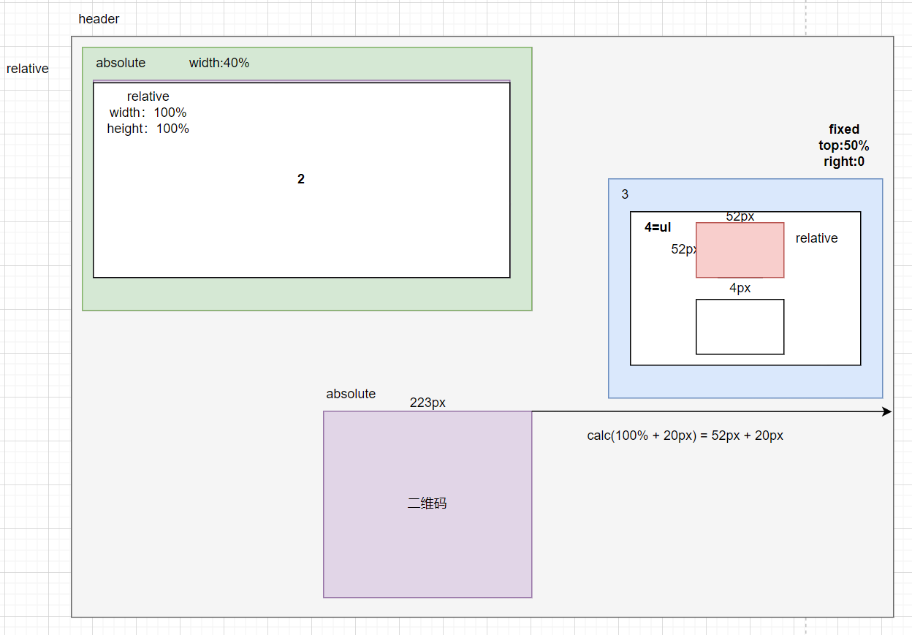
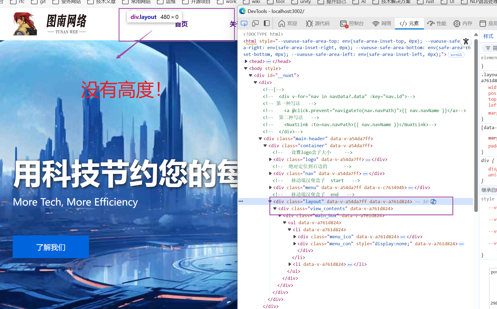

# 右侧浮动导航栏

效果展示：




## 基本实现原理

- 一般布局的情况下，header一般都是relative(相对定位)。没有脱离文档流；
- header里面的放绝对定位盒子。(目的：方便元素的布局)也是我们常说的<font color = 'red'>子相父绝</font>；
- 在absolute定位的盒子里面在套一个relative盒子；
- 在relative盒子里面再套一个fixed定位<font color = 'red'>（fiexd是脱离文档流的定位）</font>的盒子；
- fixed定位的盒子里面使用ul、li标签来实现；
- 二维码的盒子是放在li标签下的div盒子。默认情况display属性是none(不显示)；







## 骨架结构


```html
  <div class="layout">
    <div class="view_contents">
      <div class="main_box">
        <ul>
          <li>
            <div class="menu_ico">
              <div class="menu_view">
                
              </div>
            </div>
            <div class="menu_con" style="display: none">
              <div class="img_view">
                
                <div class="text">
                  <span>关注我们</span>
                </div>
              </div>
            </div>
          </li>
          <li>
            <div class="menu_ico">
              <div class="menu_view" @click="scrollToTop">
                
              </div>
            </div>
          </li>
        </ul>
      </div>
    </div>
  </div>
```


