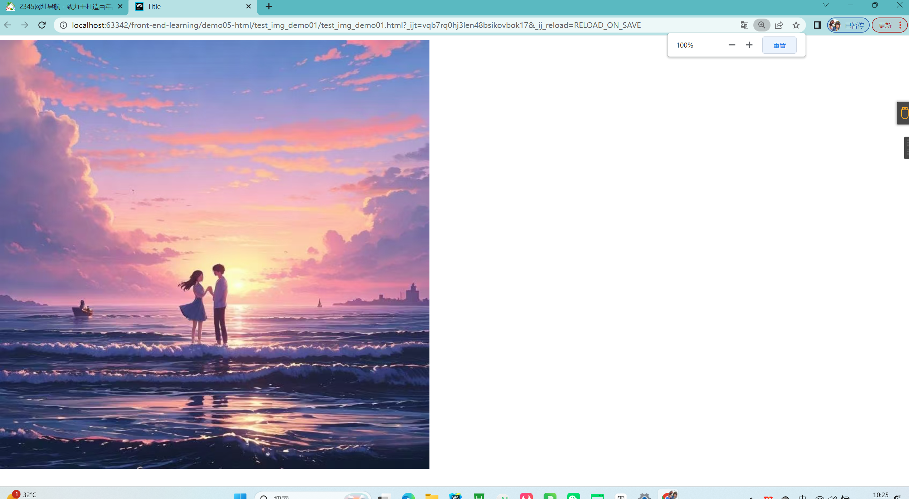
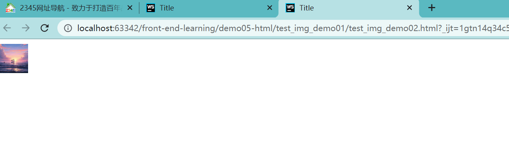
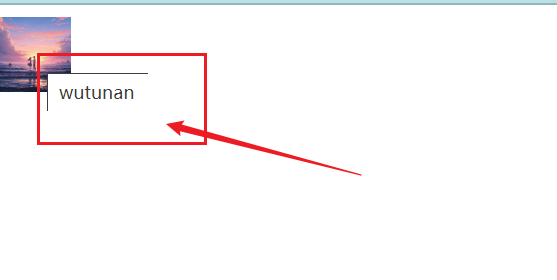

# 图像标签img (重点)

学习怎么在网页中插入一个图片时。我们还没开始就开始纠结我应该怎么在网页中显示一张图片呢？图片太大我应该怎么控制图片的尺寸呢？


该语法中src属性用于指定图像文件的路径和文件名，他是img标签的必需属性。

```html
 
```

img的属性：

| 属性   | 属性值                         | 描述                           |
| ------ | ------------------------------ | ------------------------------ |
| src    | URL                            | 图像的路径。                   |
| alt    | 文本                           | 图像不能正常显示时的替换文本。 |
| title  | 文本                           | 鼠标悬停时显示的内容。         |
| width  | 像素（XHTML不支持%页面百分比） | 设置图像的宽度。               |
| height | 像素（XHTML不支持%页面百分比） | 设置图像的高度。               |
| border | 数字                           | 设置图像边框的宽度。           |


## 测试案例01

img标签不写任何属性。

```html
<!DOCTYPE html>
<html lang="en">
<head>
    <meta charset="UTF-8">
    <title>Title</title>
</head>
<body>

</body>
</html>
```





## 测试案例02

设置img标签的width、height属性。

```html
<!DOCTYPE html>
<html lang="en">
<head>
    <meta charset="UTF-8">
    <title>Title</title>
</head>
<body>

</body>
</html>
```




## 测试案例03

```html
<!DOCTYPE html>
<html lang="en">
<head>
    <meta charset="UTF-8">
    <title>Title</title>
</head>
<body>

</body>
</html>
```





