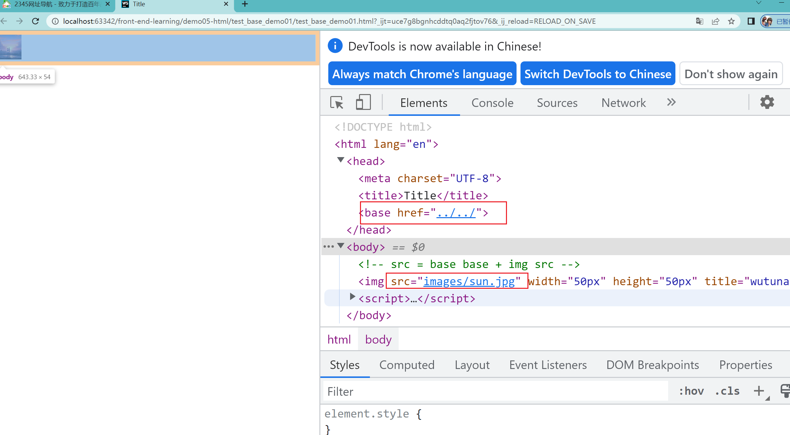

# 链接标签(重点)

单词缩写：  anchor 的缩写 。基本解释 锚, 铁锚 的

在HTML中创建超链接非常简单，只需用标签环绕需要被链接的对象即可，其基本语法格式如下：

```html
<a href="跳转目标" target="目标窗口的弹出方式">文本或图像</a>
```

href：用于指定链接目标的url地址，当为标签应用href属性时，它就具有了超链接的功能。  Hypertext Reference的缩写。意思是超文本引用

target：用于指定链接页面的打开方式，其取值有_self和_blank两种，其中_self为默认值，_blank为在新窗口中打开方式。

注意：

1.外部链接 需要添加 http:// www.baidu.com

2.内部链接 直接链接内部页面名称即可 比如 < a href="index.html"> 首页 </a >

3.如果当时没有确定链接目标时，通常将链接标签的href属性值定义为“#”(即href="#")，表示该链接暂时为一个空链接。

4.不仅可以创建文本超链接，在网页中各种网页元素，如图像、表格、音频、视频等都可以添加超链接。

## 锚点定位 （难点）

通过创建锚点链接，用户能够快速定位到目标内容。
创建锚点链接分为两步：

1. 使用“a href=”#id名>“链接文本"</a>创建链接文本。

2. 使用相应的id名标注跳转目标的位置。

## base标签

base 可以设置整体链接的打开状态   

base 写到  <head>  </head>  之间

测试base 的href属性。


```html
<!DOCTYPE html>
<html lang="en">
<head>
    <meta charset="UTF-8">
    <title>Title</title>
    <base href="../../">
</head>
<body>
<!-- src = base base + img src -->

</body>
</html>
```




测试base 的target属性。

```html
<!DOCTYPE html>
<html lang="en">
<head>
    <meta charset="UTF-8">
    <title>Title</title>
    <base href="../../" target="_blank">
</head>
<body>
<!-- src = base base + img src -->

</body>
</html>
```

- `<base target="_blank">` 只是一个"标记"，没有实际效果。

**简单说：base标签就是给所有相对路径设置一个"起点地址"！**


