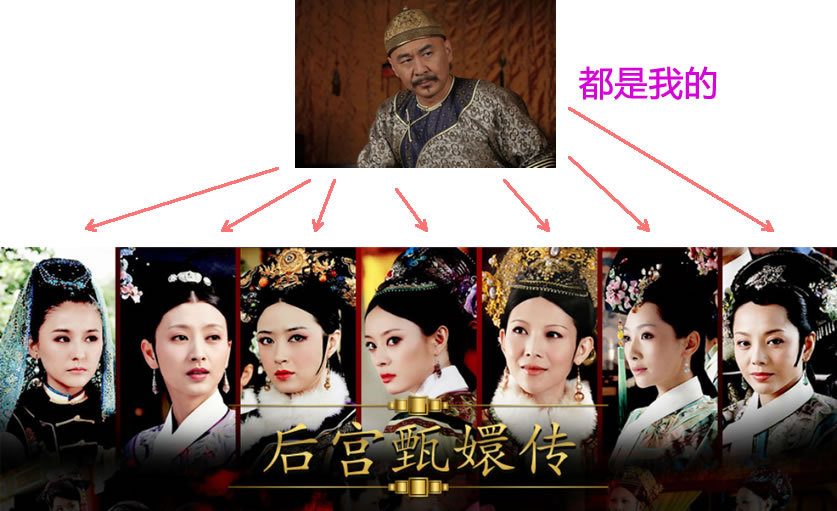

# 列表标签

什么是列表？

把…制成表,以表显示

容器里面装载着文字或图表的一种形式，叫列表。

列表最大的特点就是  整齐 、整洁、 有序


## 有序列表ol(了解）

```html
<!DOCTYPE html>
<html lang="en">
<head>
    <meta charset="UTF-8">
    <title>Title</title>
</head>
<body>
<ol>
    <li>列表项1</li>
    <li>列表项3</li>
    <li>列表项2</li>
    ......
</ol>
</body>
</html>
```

运行效果：


## 自定义列表(理解）

定义列表常用于对术语或名词进行解释和描述，定义列表的列表项前没有任何项目符号。其基本语法如下：


```html
<!DOCTYPE html>
<html lang="en">
<head>
    <meta charset="UTF-8">
    <title>Title</title>
</head>
<body>
<dl>
    <dt>名词1</dt>
    <dd>名词1解释1</dd>
    <dd>名词1解释2</dd>
    ...
    <dt>名词2</dt>
    <dd>名词2解释1</dd>
    <dd>名词2解释2</dd>
    ...
</dl>

</body>
</html>
```



应用的地方：


