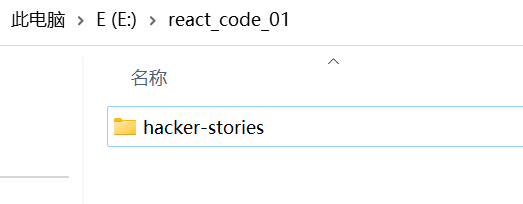
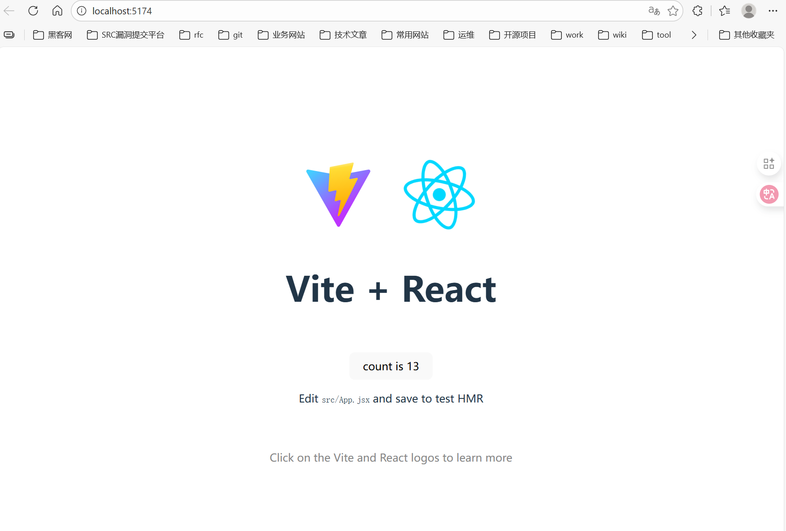

# 第一个react项目


## 创建项目

```shell
npm create vite@latest hacker-stories -- --template react
```


## 启动react项目

```shell
cd hacker-stories
```



安装项目依赖：

```shell
npm install
```

终端输出的结果：

```shell
PS E:\react_code_01\hacker-stories> npm install

up to date in 823ms

33 packages are looking for funding
  run `npm fund` for details
```


运行开发环境：

```shell
npm run dev
```

终端输出的结果：

```shell
PS E:\react_code_01\hacker-stories> npm run dev

> hacker-stories@0.0.0 dev
> vite

Port 5173 is in use, trying another one...

  VITE v7.3.1  ready in 419 ms

  ➜  Local:   http://localhost:5174/
  ➜  Network: use --host to expose
  ➜  press h + enter to show help
```


## 启动运行结果




## package.json文件

这个是2026年1月26日使用npm create vite@latest hacker-stories -- --template react这个命令创建的项目生成的package.json文件

```json
{
  "name": "hacker-stories",
  "private": true,
  "version": "0.0.0",
  "type": "module",
  "scripts": {
    "dev": "vite",
    "build": "vite build",
    "lint": "eslint .",
    "preview": "vite preview"
  },
  "dependencies": {
    "react": "^19.2.0",
    "react-dom": "^19.2.0"
  },
  "devDependencies": {
    "@eslint/js": "^9.39.1",
    "@types/react": "^19.2.5",
    "@types/react-dom": "^19.2.3",
    "@vitejs/plugin-react": "^5.1.1",
    "eslint": "^9.39.1",
    "eslint-plugin-react-hooks": "^7.0.1",
    "eslint-plugin-react-refresh": "^0.4.24",
    "globals": "^16.5.0",
    "vite": "^7.2.4"
  }
}
```

package.json文件中的依赖作用分别表示什么作用？下一边解析有。

