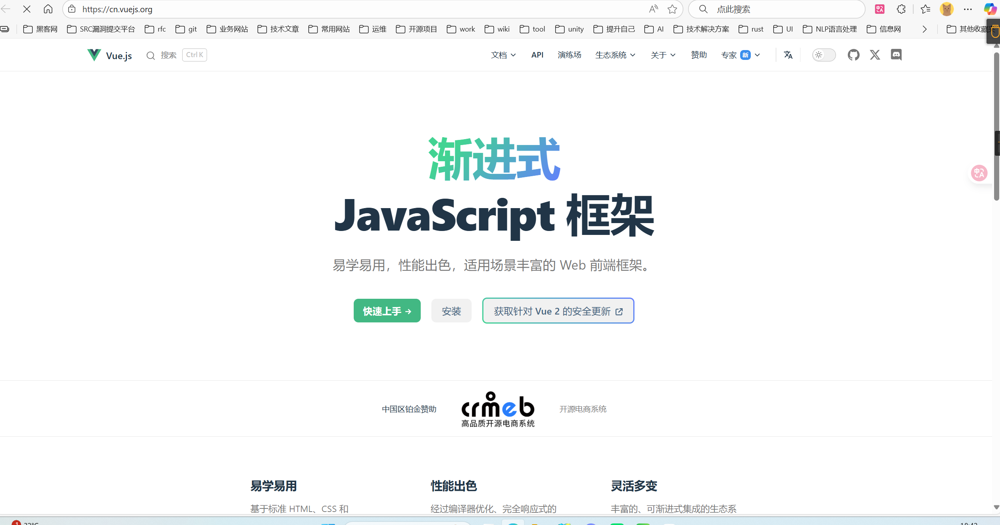
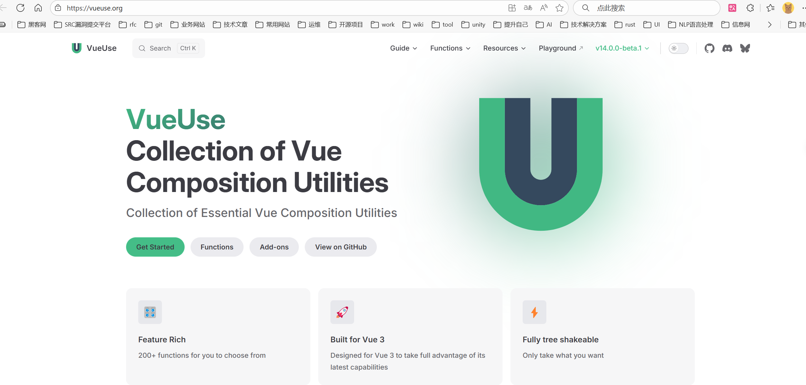
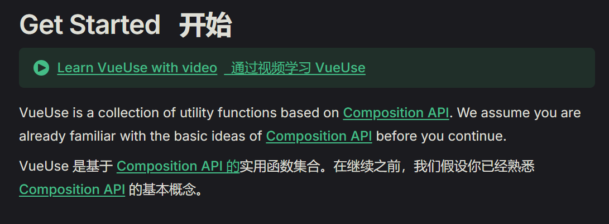
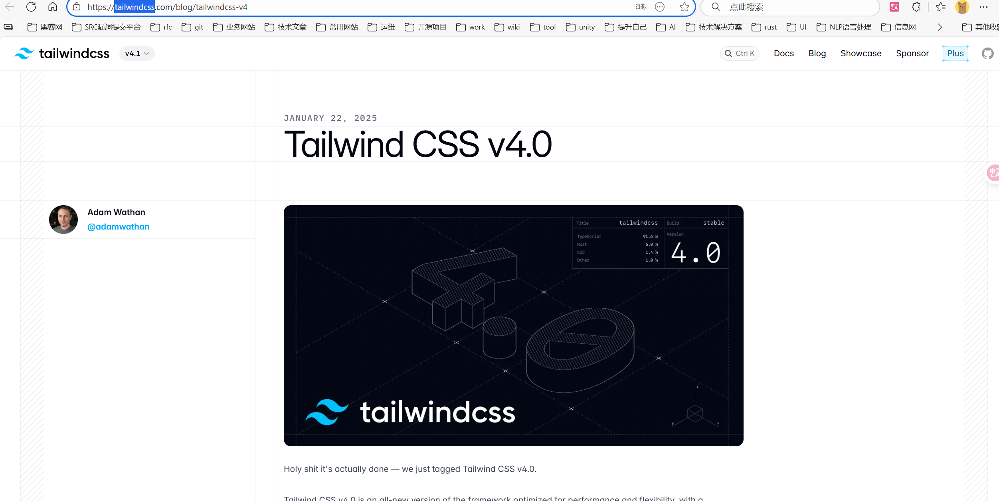
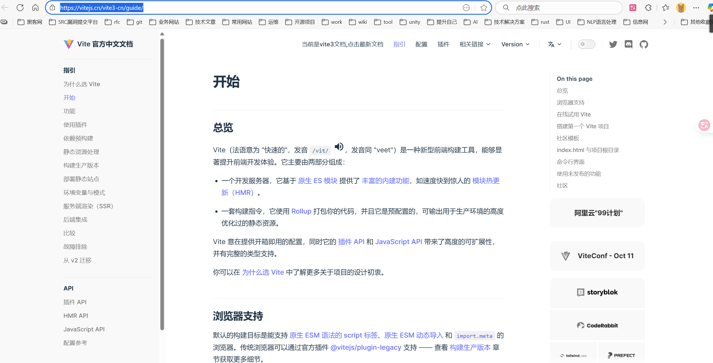

# 2025年前端Vue的学习路线

## 前端框架

vue官方地址。

[Vue.js - 渐进式 JavaScript 框架 | Vue.js](https://cn.vuejs.org/)

## vue组件库VueUse

[VueUse](https://vueuse.org/)

什么是VueUse？

VueUse is a collection of utility functions based on [Composition API](https://vuejs.org/guide/extras/composition-api-faq.html). We assume you are already familiar with the basic ideas of [Composition API](https://vuejs.org/guide/extras/composition-api-faq.html) before you continue.

答：VueUse 是基于 [Composition API 的](https://vuejs.org/guide/extras/composition-api-faq.html)实用函数集合。在继续之前，我们假设你已经熟悉 [Composition API](https://vuejs.org/guide/extras/composition-api-faq.html) 的基本概念。

官方视频学习地址：[VueUse for Everyone: Unlock Vue.js Composition Power](https://vueschool.io/courses/vueuse-for-everyone?friend=vueuse)

## css样式框架

tailwindcss，我2025年10月粘贴的网址。

[Tailwind CSS v4.0 - Tailwind CSS](https://tailwindcss.com/blog/tailwindcss-v4)

## 前端项目打包框架

vite，我2025年10月粘贴的网址。老的项目都是使用webpack。

[开始 | Vite 官方中文文档](https://vitejs.cn/vite3-cn/guide/)

