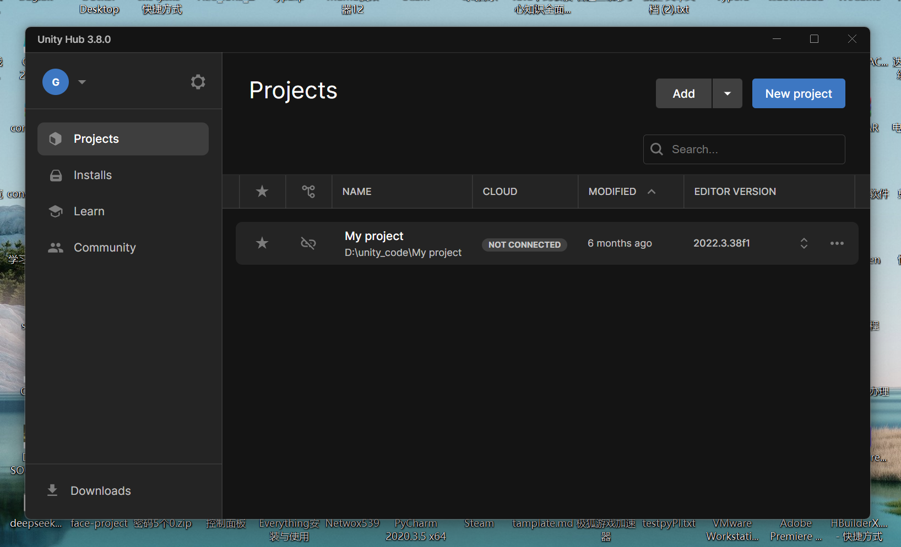
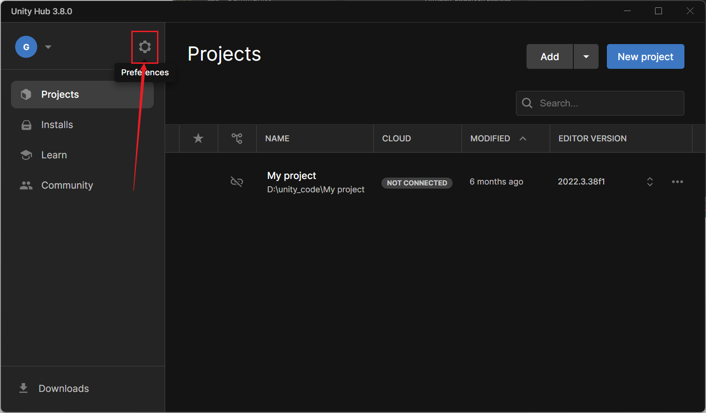
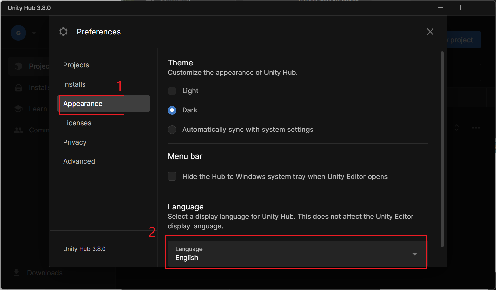
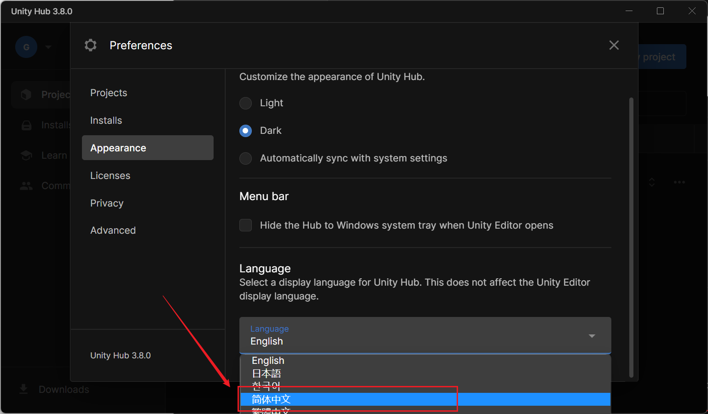
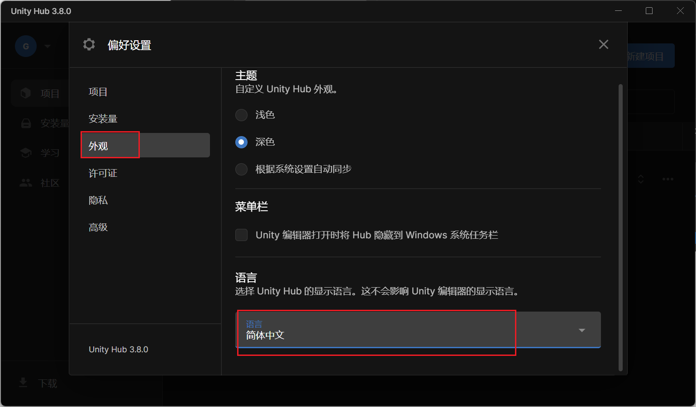
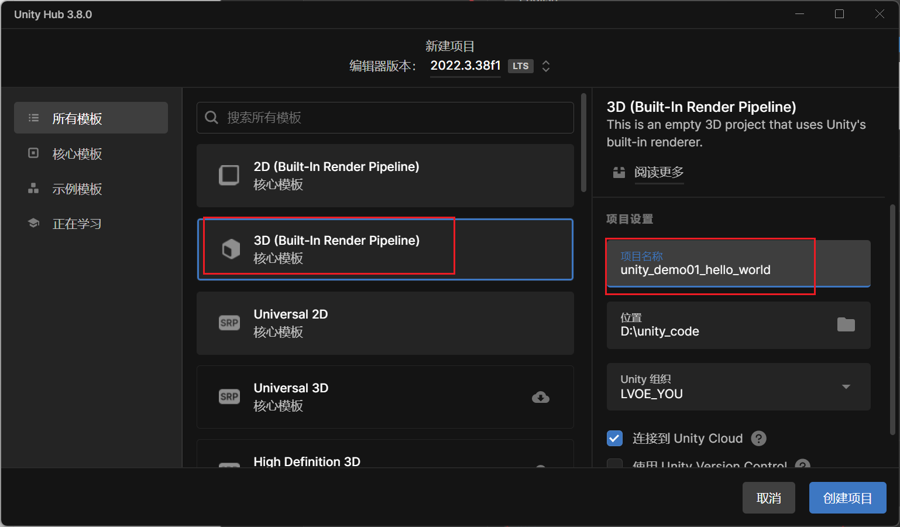
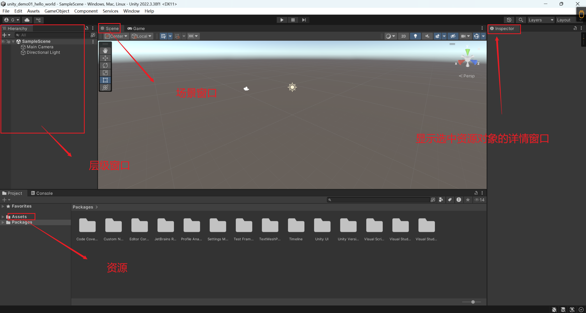
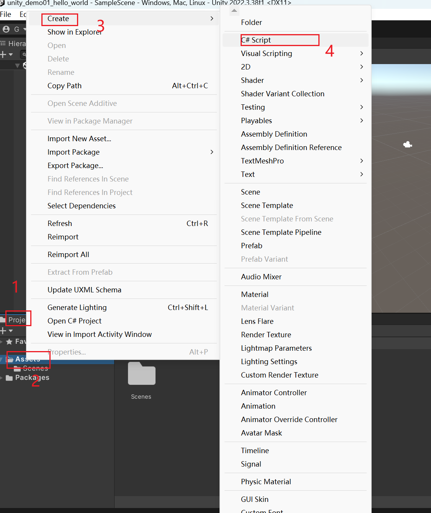
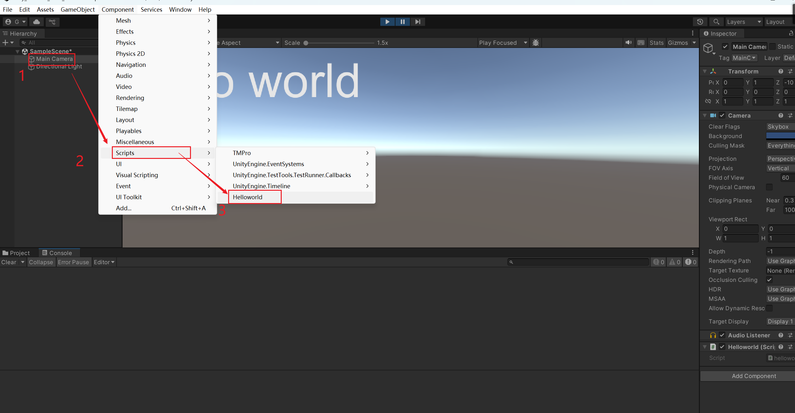
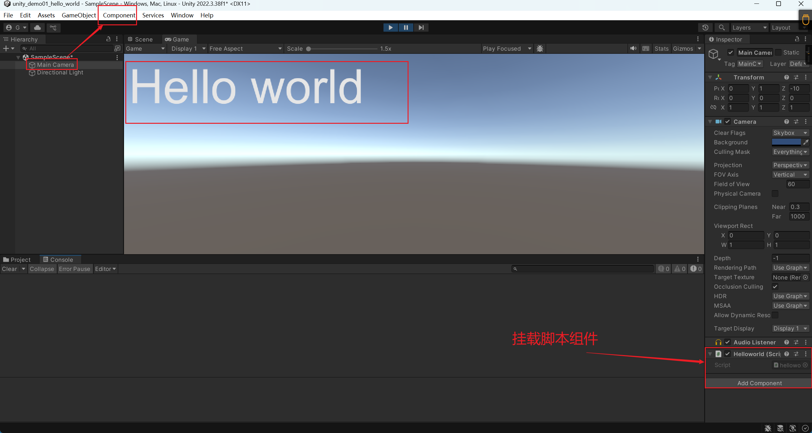

# 创建一个hello world程序

Unity 的 C#是运行在 Mono 平台上，微软的 C#则是运行在.Net 平台上。

 **Mono 平台与.Net 平台是什么区别？**

## 安装unity hub

使用自己的手机号进行登入。




## 设置unity hub

将英文改为中文：









设置后的效果如下图：





## 创建项目




## 窗口面板ui详解




**hierarchy窗口：**允许场景中游戏体对象的名字重复。


## 创建脚本文件




```c#
using System.Collections;
using System.Collections.Generic;
using UnityEngine;

// 脚本的类名 与文件名 一定 要一致。
public class helloworld : MonoBehaviour
{
    // 在第一帧更新之前调用Start
    // Start is called before the first frame update
    void Start()
    {
        
    }

    // 每帧调用一次更新
    // Update is called once per frame
    void Update()
    {
        
    }

    void OnGUI() 
    {
        // 改变 字符的大小
        GUI.skin.label.fontSize = 100;
        GUI.Label(new Rect(10, 10, Screen.width, Screen.height), "Hello world");
    }
}

```


## 项目运行操作步骤



回到Unity的编辑器中，在Hirerarchy窗口中选择Main Camera，选中摄像机，在菜单栏中选择：【Component】——》【Script】——》【Hello World】。这样做是为了将脚本指定给摄像机的对象实体。

<font color='red'>快捷操作：</font>直接将自己编写的helloworld的脚本拖动到摄像机的Inspector的窗口空白处。

## 运行效果





