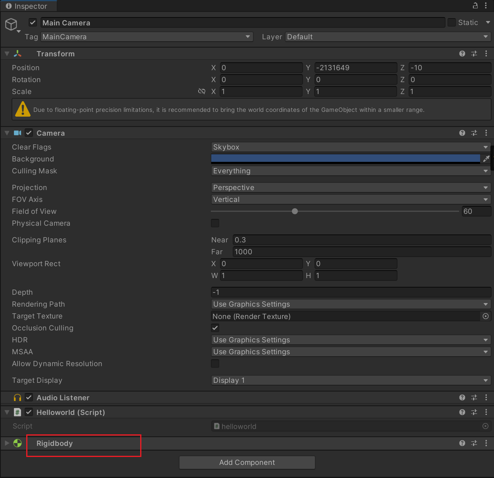

# unity的组件式编程

不同的功能看成不同的组件。

通过组合的方式实现功能的扩展和变化。

举例子：比如我们有一个脚本执行任务A，另外一个脚本执行任务b，同时将二个脚本加载到通一个游戏对象上，那么该游戏对象即可以<font color='red'>同时执行</font>A和B任务。如果我们还要新扩展一个C任务呢？我们只需要添加一个执行C任务的脚本就可以。


## 组件的获取

```c#
        Rigidbody rigid = this.gameObject.GetComponent<Rigidbody>();
        if (rigid == null) 
        {
            rigid = this.gameObject.AddComponent<Rigidbody>();
        }
```

代码执行后可以在inspector的面板看到添加了一个Rigidbody组件。


