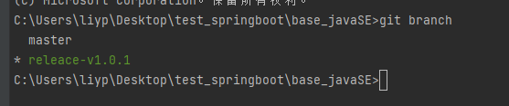
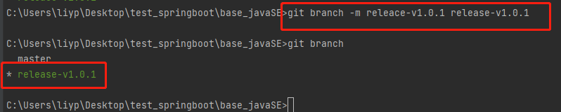
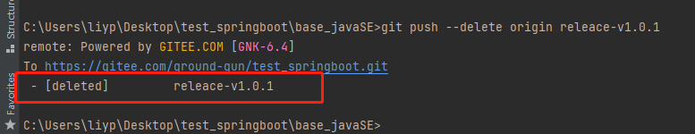
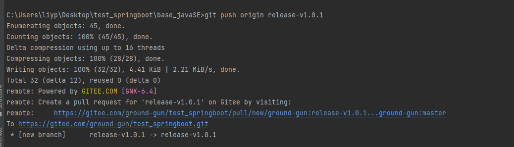

# 04修改远程分支名称

## 01）查看本地分支



```cmd
$ git branch
```


## 02）修改本地分支

```cmd
$ git branch -m 旧分支名 新分支名
```




再次查看已经修改了。

## 03）删除远程分支

```cmd
git push --delete origin 旧分支名
```



## 04）将新分支名推上去 

```cmd
git push origin 新分支名
```



## 05）将新本地分支和远程相连 

```cmd
$ git branch --set-upstream-to origin/新分支名
```

```cmd
C:\Users\liyp\Desktop\test_springboot\base_javaSE>git branch --set-upstream-to origin/release-v1.0.1
Branch 'release-v1.0.1' set up to track remote branch 'release-v1.0.1' from 'origin'.
```

执行结果说：也就是说，本地的xxx分支会与远程的xxxx进行跟踪，或者关联。

