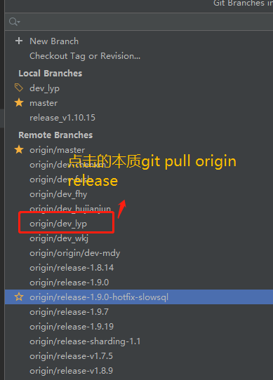

# 05合并开发分支

## 合并开发分支代码

合并需求：在开发中，我在自己的dev分支，其他人都在release分支开发将代码推到release分支上，我要在dev分支上要拉取release分支到我本地。怎么拉取

在你的开发分支（`dev` 分支）上，要拉取最新的 `release` 分支的代码，你可以按照以下步骤进行：

1. **提交或保存当前的更改**：在拉取之前，确保你的开发分支没有未提交的更改或本地修改。你可以使用 `git status` 命令来查看当前分支的状态，并确保工作区是干净的。

2. **切换到 `dev` 分支**：如果你还没有在 `dev` 分支上，使用以下命令切换到你的开发分支：

   ```
   git checkout dev
   ```

3. **拉取 `release` 分支的代码**：使用以下命令从远程仓库拉取最新的 `release` 分支的代码：

   ```
   git pull origin release
   ```

   

   

   这会将远程 `release` 分支的代码合并到你的 `dev` 分支中。

4. **解决可能的冲突**：如果在拉取代码时发生冲突，Git 会提示你进行解决。你需要打开相应的文件，手动解决冲突，并提交合并后的结果。详细的冲突解决步骤会在命令行中指导你。

5. **推送你的更改（可选）**：如果你已经解决了所有冲突，并且代码正常运行，你可以将你的开发分支推送到远程仓库，以便其他人看到你的更改。

   ```
   git push origin dev
   ```

请确保你理解这些操作可能对你的分支和代码库造成的影响。在进行任何重要的分支操作之前，最好先备份你的代码或者与团队讨论清楚。