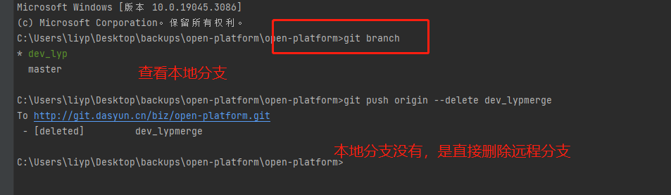
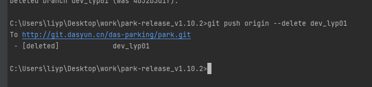
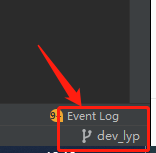

# 06)怎么删除远程分支


要删除远程分支，你可以使用 `git push` 命令，并在命令中指定要删除的远程分支名称。以下是删除远程分支的步骤：

1. **查看远程分支**：首先，你可以使用 `git branch -r` 命令来查看所有的远程分支。这将列出远程仓库中存在的所有分支。

2. **删除远程分支**：假设你要删除名为 `feature-branch` 的远程分支，可以使用以下命令：

   ```
   git push origin --delete feature-branch
   ```

   这会从远程仓库中删除 `feature-branch` 分支。

   

3. **确认删除**：删除远程分支后，Git 会显示确认消息，确认你是否要删除该分支。你可以输入 `y` 或 `yes` 来确认删除。

4. **查看远程分支**：再次运行 `git branch -r` 命令，确认远程分支是否已经被删除。

请注意，删除远程分支可能会影响其他开发人员，因此在删除之前最好先与团队讨论。如果你只是想删除本地分支，可以使用 `git branch -d` 命令（小写的 `-d`）来删除本地分支。删除本地分支不会影响远程仓库。

在进行任何分支操作之前，请确保你了解操作的影响，并在必要时备份代码。


操作结果：






我在dev_lyp分支操作删除了dev_lyp01的远程分支。