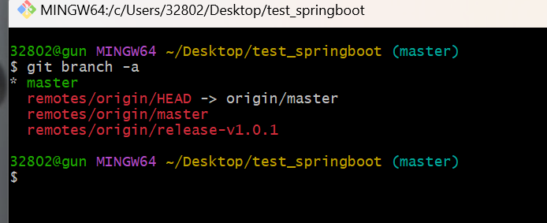
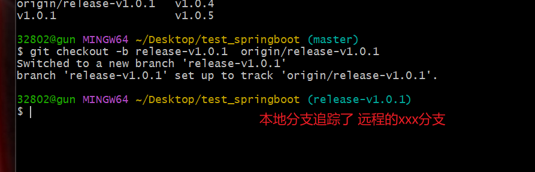

# 本地切换远程分支

我们在使用git进行开发的时候经常会遇到需要切换远程分支并且提交到远程指定分支的情况，现在记录下操作步骤。

- 查看下远程分支有哪些？

```cmd
$ git branch -a
```

【不带参数】git branch不带参数,列出本地已经存在的分支，并且在当前分支的前面用*标记。

【带参数】加上-a参数可以查看所有分支列表，包括本地和远程，远程分支一般会用红色字体标记出来。



- 新建一个分支切换到指定分支

```cmd
git checkout -b 新本地分支名字 origin/release/caigou_v1.0
```

-b 后面是新建分支的名字，最好的做法就是有远程分支都名了相同，为了区分。

