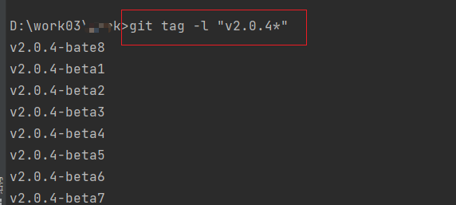
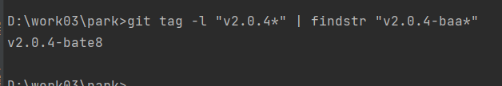
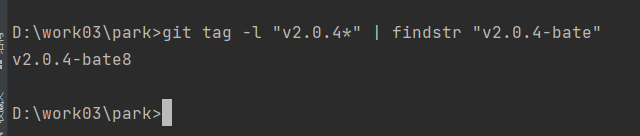

# tag太多怎么过滤

## 通配符过滤

```shell
git tag -l "v1.*"
```



## 按照名称排序

```shell
git tag --sort=-v:refname
```

## 使用通配符过滤

```shell
git tag -l "v1.*" | grep "v1.1.*"
```

- 注意这个命令要在linux上使用。

window怎么使用管道过滤呢？windows的管道过滤命令和linux管道过滤一样吗？

::: tip 

windows与linux是不一样的。

:::

- 按照标签名过滤：

```
git tag | findstr "v1."
```

管道加通配符




::: tip v2.0.4-baa*为什么能匹配v2.0.4-bate8?

在正则表达式中，`*` 是一个特殊字符，表示匹<font color="red">配前一个字符零次或多次</font>>。在你提供的示例中，`v2.0.4-baa*` 中的 `aa*` 实际上匹配的是一个 `a` 后跟零次或多次的 `a`。

因此，它会匹配 `v2.0.4-bate8` 中的 `baa` 部分，因为在这个字符串中，`aa` 后面跟着一个额外的 `e` 字符，而 `*` 表示前面的字符 `a` 可以出现零次或多次。区间:[0-n]

如果你希望确切匹配 `v2.0.4-baa`，你可以使用 `\` 转义字符来表示 `*` 不是特殊字符，而是字面的字符。例如：

```shell
v2.0.4-baa\*
```

这样就会确切匹配 `v2.0.4-baa*`，而不会匹配 `v2.0.4-bate8`。

:::

前缀匹配



