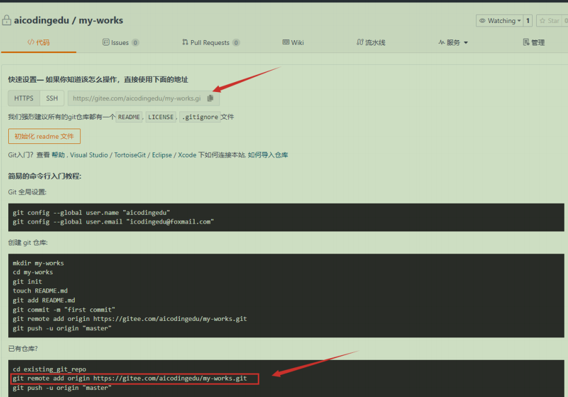
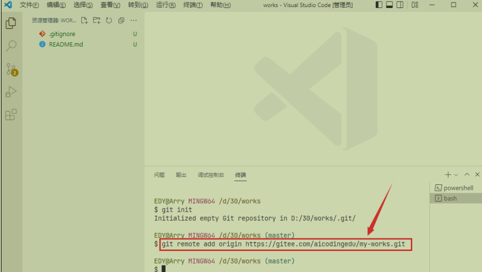

# 初始化项目

## 1)在vscode新建 `.gitignore` 文件

.gitignore 文件用于过滤需要上传的文件

## 2)创建`README`文件

用于编写项目说明文档

## 3)新建远程仓库，使用`Gitee`


创建远程仓库，成功后:




## 4)添加远程仓库提交地址

命令行：运行以下命令即可

```
git remote add origin https://gitee.com/aicodingedu/my-works.git
```



1. **`git`**

- Git版本控制系统的命令行工具

2. **`remote`**

- Git的子命令，用于管理远程仓库
- 可以执行添加、删除、重命名、查看远程仓库等操作

3. **`add`**

- `remote` 子命令的操作选项，表示要添加一个新的远程仓库

4. **`origin`** (重要！)

- 远程仓库的**本地别名**（可自定义）
- 这是远程仓库在你的本地仓库中的引用名称
- 通常使用 `origin` 作为默认主远程仓库的名称（约定俗成）
- 你可以用其他名字，如 `upstream`、`myremote` 等
- 之后操作这个远程仓库时就用这个别名，比如：`git push origin`

5. **`https://gitee.com/aicodingedu/my-works.git`**

- 远程仓库的**实际URL地址**
- 这里是Gitee（码云）的HTTPS协议地址
- 也可以是SSH地址，如：`git@gitee.com:aicodingedu/my-works.git`

**命令执行结果**

执行后会在你的本地Git配置中添加：

```
[remote "origin"]
    url = https://gitee.com/aicodingedu/my-works.git
    fetch = +refs/heads/*:refs/remotes/origin/*
```


