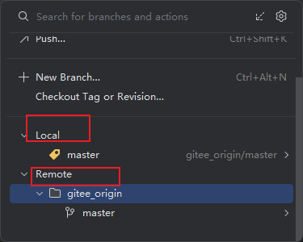
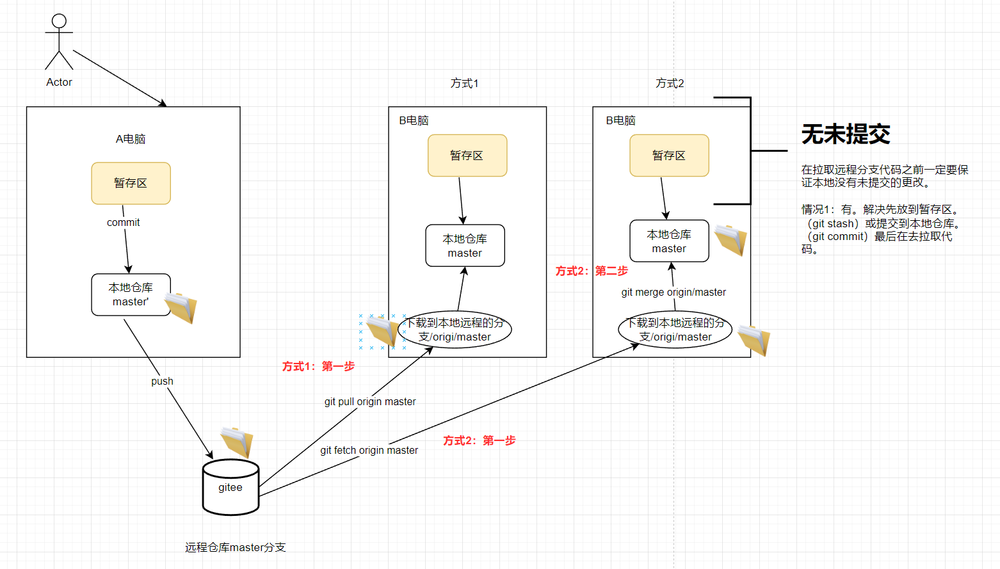
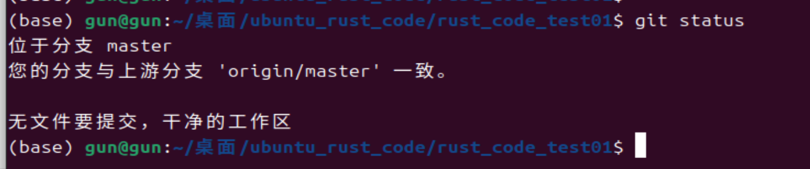

# git拉取远程分支源码

## 场景描述

A电脑在本地更新了本地仓库master分支上的源码。并且将本地仓库master源码推送到了远程仓库的master上。遇到是B用户在自己本地的电脑怎么获取远程仓库master分支上更新的代码呢？


现在的场景如下图：




上图说明本地源码已经推送到远程仓库。





## 方式1解决

**检查当前本地仓库状态（可选）**

```shell
git status
```

- **效果**：查看本地仓库是否有未提交的更改，避免后续操作冲突。



```shell
git pull origin master
```

- **效果**：
  1. **自动合并**：
     - Git 会从远程仓库的 `master` 分支下载最新代码（`git fetch`）。
     - 然后尝试将远程 `master` 的更新**合并到本地当前分支**（通常是 `master`，相当于 `git merge`）。
  2. **冲突处理**：
     - 如果本地有未提交的更改且与远程代码冲突，Git 会提示冲突，需手动解决后提交。


执行上面命令的日志：

```shell
(base) gun@gun:~/桌面/ubuntu_rust_code/rust_code_test01$ git pull origin master
Username for 'https://gitee.com': ground-gun
Password for 'https://ground-gun@gitee.com': 
remote: Enumerating objects: 9, done.
remote: Counting objects: 100% (9/9), done.
remote: Compressing objects: 100% (8/8), done.
remote: Total 8 (delta 0), reused 0 (delta 0), pack-reused 0 (from 0)
展开对象中: 100% (8/8), 430.01 KiB | 543.00 KiB/s, 完成.
来自 https://gitee.com/ground-gun/rust_code_test01
 * branch            master     -> FETCH_HEAD
   ddbba04..955d8bc  master     -> origin/master
更新 ddbba04..955d8bc
Fast-forward
 readme.assets/image-20250409213002086.png | Bin 0 -> 140348 bytes
 readme.assets/image-20250409213055097.png | Bin 0 -> 117123 bytes
 readme.assets/image-20250409213244229.png | Bin 0 -> 92852 bytes
 readme.assets/image-20250409213500390.png | Bin 0 -> 110255 bytes
 readme.md                                 |  50 ++++++++++++++++++++++++++++++
 5 files changed, 50 insertions(+)
 create mode 100644 readme.assets/image-20250409213002086.png
 create mode 100644 readme.assets/image-20250409213055097.png
 create mode 100644 readme.assets/image-20250409213244229.png
 create mode 100644 readme.assets/image-20250409213500390.png
 create mode 100644 readme.md
```


拉取远程代码之前还要输入用户名字与密码进行认证。那么要怎么可以不输入密码呢？

```shell
Username for 'https://gitee.com': ground-gun
Password for 'https://ground-gun@gitee.com': 
```


