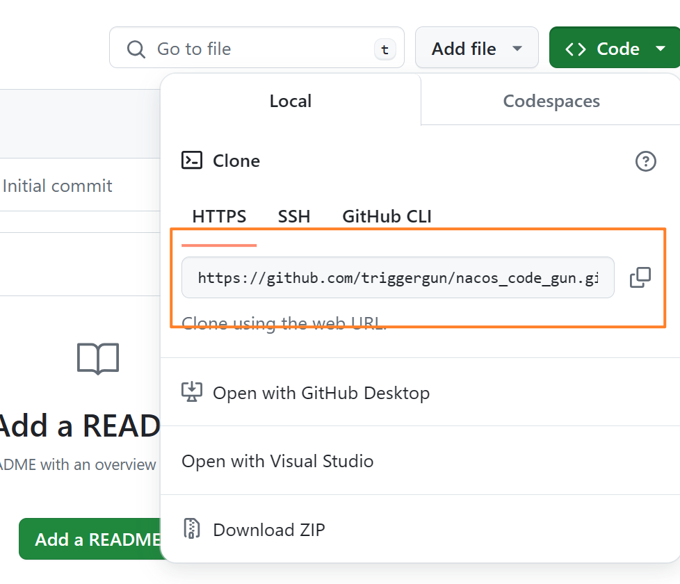

# github常见问题


## pull失败问题

### 问题描述

第一步：github复制https的地址进行本地clone下来。




结果：报错

```
32802@gun MINGW64 /e/java_code
$ git clone https://github.com/triggergun/nacos_code_gun.git
Cloning into 'nacos_code_gun'...
fatal: unable to access 'https://github.com/triggergun/nacos_code_gun.git/': Failed to connect to github.com port 443 after 21169 ms: Couldn't connect to server

```

### 问题分析

```
致命：无法访问'https://github.com/triggergun/nacos_code_gun.git/'：21169毫秒后无法连接到github.com端口443：无法连接到服务器
```

### 问题原因

未知..

### 问题解决

你第一步可以采取的方法就是通过以下Git命令取消proxy代理，然后再回到你前面要执行的步骤
解决：通过git取消代理：

```
git config --global --unset http.proxy
git config --global --unset https.proxy
```

参考文章：

[【Github问题解决】解决Github：fatal:unable to access ‘https://github.com/.../.git‘:Could not resolve host:git_unable to access github-CSDN博客](https://blog.csdn.net/m0_72594605/article/details/132559545)


