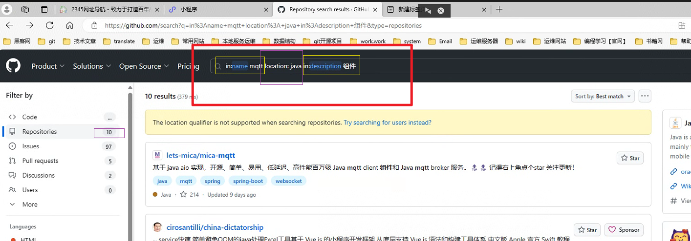
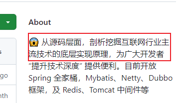
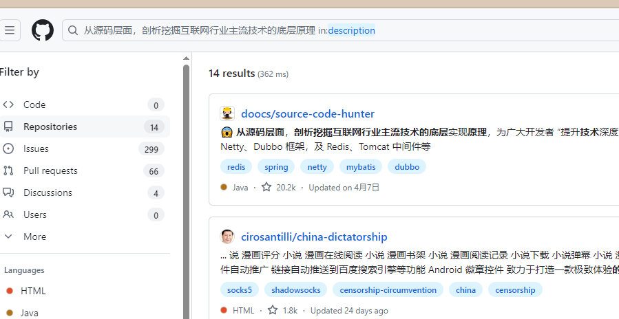

# github搜索怎么用

通过 **`Github`** ，你可以很方便的下载自己需要的项目，了解实时热点的项目，通过对优秀的开源项目的学习，更好的进行学习与提高


## 仓库分几种？

- **本地仓库**：建立在本地的文件夹。
- **远程仓库**：建立在互联网的服务器内的文件夹。


## GitHub的高级搜索

### 01)in关键词限制搜索范围

| 搜索关键字         | 备注                  |
| ------------------ | --------------------- |
| in:name xxx        | 项目名包含xxx         |
| in:description xxx | 项目描述包含xxx       |
| in:readme xxx      | 项目介绍文档里含有xxx |


案例：

比如我搜索**项目名里含有 Spring Boot 的** **`in:name Spring Boot`**。会发现项目数量由17W变成了11W


### 02)stars或fork数量去查找

- **`stars:>xxx`** **stars数大于xxx**
- **`stars:xx..xx`** **stars数在xx…xx之间**
- **`forks:>xxx`** **forks数大于xxx**
- **`forks:xx..xx`** **forks数在xx…xx之间**

```
 查找star数大于等于5000的springboot项目
     spring boot stars:>=5000
 查找fork数大于500的springcloud项目
     spring cloud forks:>500
 查找fork在100到200之间并且stars数在80到100之间的springboot项目
     spring boot forks:100..200 stars:80..100
```

**我们进一步缩小范围，Star数量过滤，要求Star数量大于3000**
**`in:name spring boot starts :> 3000`**


### 03)按照地区和语言进行搜索

- location：地区
- language：**语言**


### 04)联合搜索




## 01)查询关键字在about的仓库


```
从源码层面，剖析挖掘互联网行业主流技术的底层原理 in:description
```




**查询结果**





