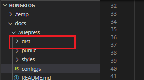
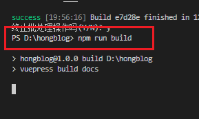
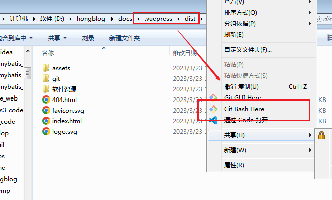
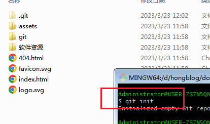
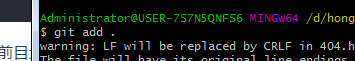
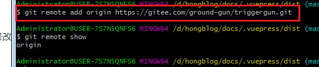
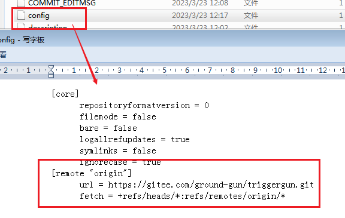
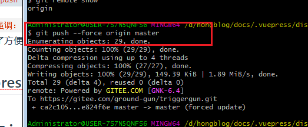

## git推送到远程的仓库

基本语法如下:

`git push <远程主机名> <本地分支名>`

如果:本地版本与远程版本有差异，但又要强制推送，使用 --force 参数：

`$ git push --force origin master`

`再一次强调：`除非只有自己一个人用，不然不建议使用`git push --force`。个人博客文档可以。也是为了方便快捷的方法。

## vuepress更新文章并推送到git

### **步骤一：**

本地构建自己的项目，项目构建完成后会自动生成在dist目录下。



执行构建命令：`npm run build`就会生成如上面的dist目录。接下来就是开始上传了。



### **步骤二：**上传到git上。



在dist目录下执行git init命令初始化目录，然后add . 临时空间。在提交到本地仓库中去；




①、首先，我们需要有一套自己可以新增项目权限的git地址；

②、进入我们的windows系统的，在需要提交到文件夹目录的地址栏输入cmd，然后点击回车；然后我们就会进入windows系统，并且进入当前文件目录路径下； 【如上图。】

③、初始化git信息

```
git init
```

④、添加当前目录文件到git本地`(注意命令中的那个黑点)` . 表示：提交当前目录下全部文件与文件夹。

```
git add
```



⑤、提交当前目录文件

```
git commit -m "初始化"
```

-m 是添加提交注释的意思；

⑥、查看git状态

```
git status
```

### **步骤三：**关联远程的仓库。

**方式一：**命令的方式关联：

**如果本地已经关联了就先删除本地关联的仓库地址，然后关联新的仓库地址**

```git
git remote rm origin
git remote add origin url
```

- rm：表示remove：删除
- add：表示：添加
- remote：远程，远。
- origin：表示：给远程仓库起的别名。【别名的作用：方便关联与记忆。】



**方式二：**修改配置文件关联：



总之：怎么方便怎么来，凭自己的个人习惯选择。

### **步骤四：**强制推送到git。



问题：我是提交到github上去，之后我就报了：     `$ git push --force origin master                                                                            fatal: unable to access 'https://github.com/triggergun/triggergun.git/': OpenSSL SSL_read: SSL_ERRO  R_SYSCALL, errno 10054                                                                                     `    

解决：既然是：SSL，那必然和https有关系的。那就换成SSH关联远程仓库，那么一试试问题就解决。

```git

Administrator@USER-7S7N5QNFS6 MINGW64 /d/hongblog/docs/.vuepress/dist (master)
$ git remote rm origin

Administrator@USER-7S7N5QNFS6 MINGW64 /d/hongblog/docs/.vuepress/dist (master)
$ git remote add origin git@github.com:triggergun/triggergun.git

```


