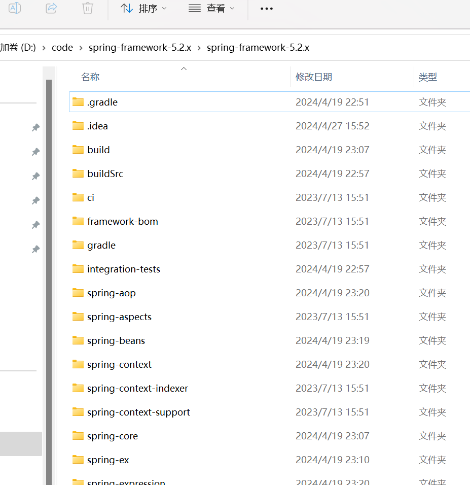
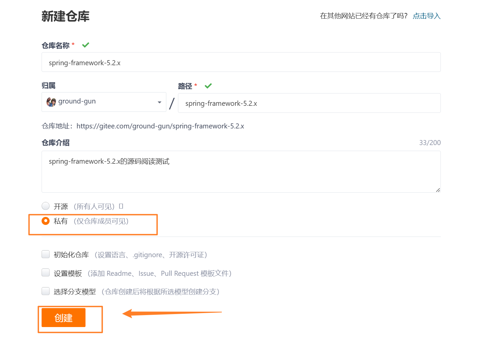
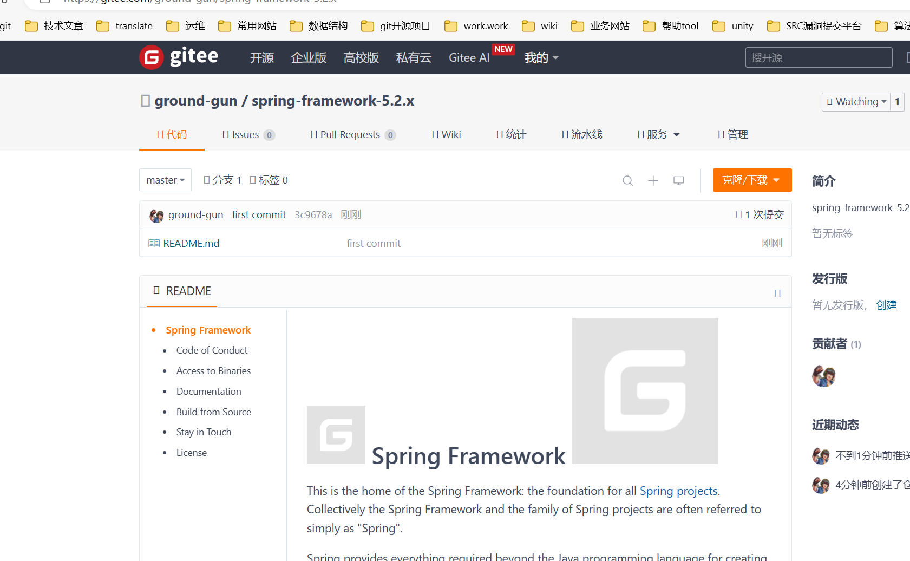
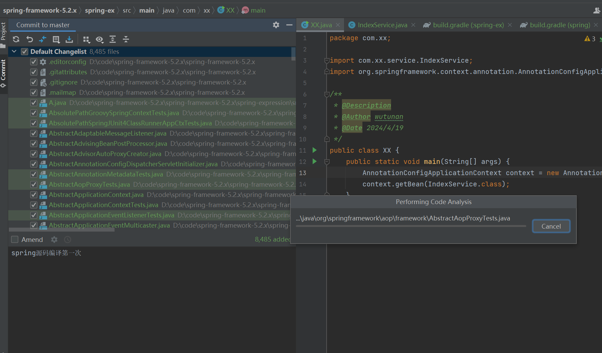

# 将本地项目上传至gitee

本地项目的目录。将这些文件上传到gitee上。




## 01)创建远程的仓库

- 本地文件夹的名字与仓库名字相同。【比较上图】




## 02)初始化仓库


```
git init 
touch README.md
git add README.md
git commit -m "first commit"
```


## 03)关联远程仓库

```
git remote add origin https://gitee.com/ground-gun/spring-framework-5.2.x.git

# 提交到远程仓库
git push -u origin "master"
```




## 04)提交全部文件



