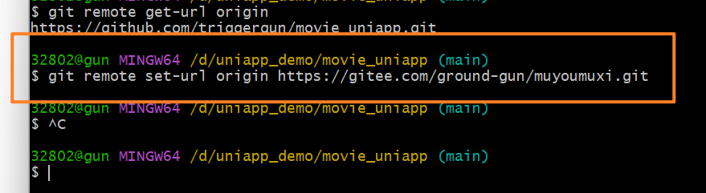

# 本地仓库修改远程仓库的url


## 01)查看远程仓库的源

```shell
git remote
```

- 执行结果如下：

```shell
32802@gun MINGW64 /d/uniapp_demo/movie_uniapp (main)
$ git remote
origin
```

## 02)查看源的url地址

```shell
git remote get-url 远程仓库的别名
```

- 执行结果如下：

```shell
32802@gun MINGW64 /d/uniapp_demo/movie_uniapp (main)
$ git remote get-url origin
https://github.com/triggergun/movie_uniapp.git
```


## 03)设置远程仓库的url

```shell
git remote set-url origin【别名】  远程仓库的url
```

注意：( 如果未设置ssh-key，此处仓库地址为 http://... 开头)

- 执行结果如下：

```shell
32802@gun MINGW64 /d/uniapp_demo/movie_uniapp (main)
$ git remote set-url origin https://gitee.com/ground-gun/muyoumuxi.git
```




## 04)直接使用命令push


