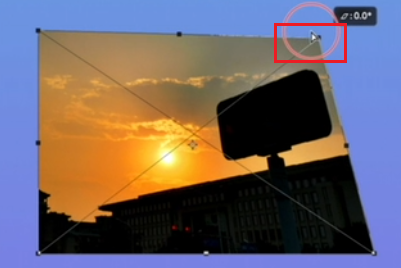

# 自由变换

## 作用描述

作用：可以对图片进行缩放、旋转、斜切、透视、扭曲、变形。

## 快捷键

ctrl + t打开自由变换。

## 缩放

不按住任何键：随意的缩放图片大小。

按住shift键：等比例的缩放图片。

按住alt键：默认图片的中心点进行随意缩放。【注意：可以改变中心点的位置】

按住shift + alt键：默认图片为中心进行等比例的缩放。【注意：可以改变中心点的位置】

## 旋转

1. ctrl + t打开自由变换。
2. 鼠标移动到图片外围，图标样式变为有弧度的双向箭头。

按住shift键：默认是15度角的旋转。【注意可以自己定义】

## 斜切

按住ctrl键把鼠标移动到图片的边缘：可以对图片斜切变换。

按住ctrl键+shift键：是沿x轴的水平斜切。

## 扭曲

按住ctrl键+shift键：进行斜切平移。

## 透视

按住ctrl键+shift键+alt键：可以改变图片的透视，做到进大远小。

## 变形

