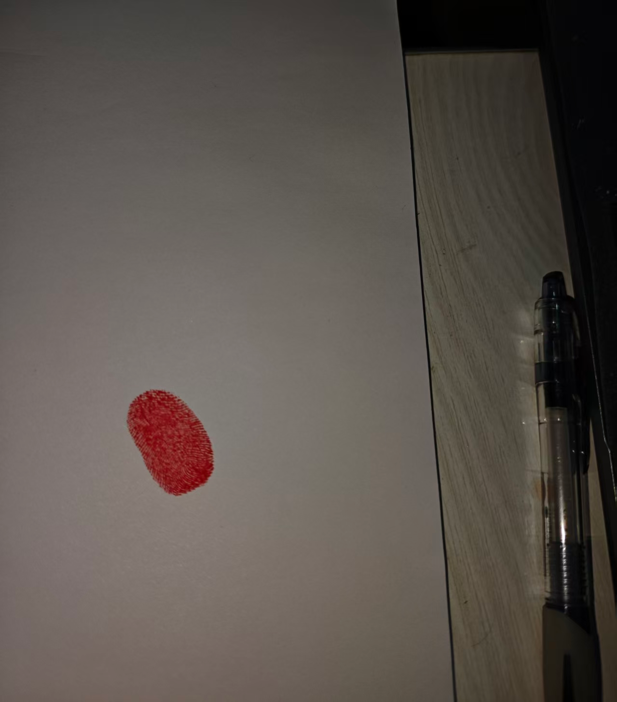
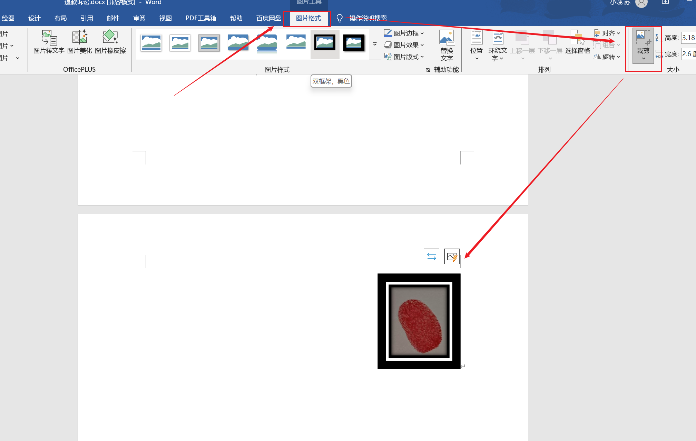
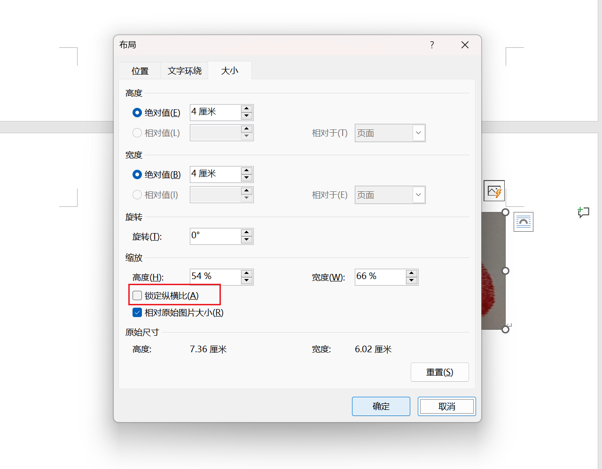
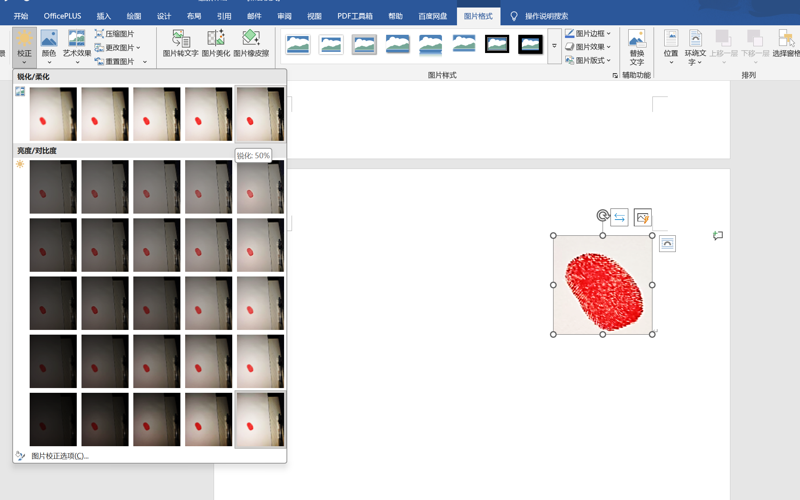
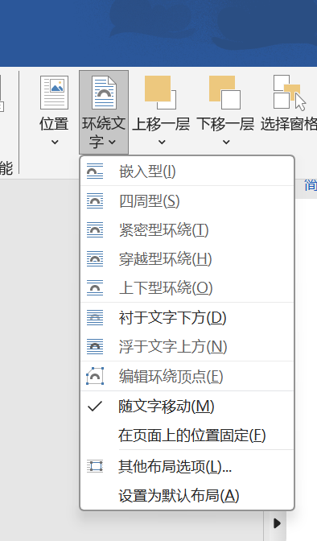

# 红色手印放到word任意位置

## 1)图片插入到word中

**插入**-> 图片 -> 此设备

## 2)对插入图片裁剪

1. 点击 图片格式。
2. 点击 裁剪。
3. 然后进入对图片的裁剪。

把手印多余的部分全部都给裁剪掉。

## 3)对图片宽高进行限定

## 4)图片格式中的校正

## 5)图片格式中的`颜色`

## 6)图片格式中的`坏绕文字`

我们一般选择：衬于文字之下。

