# Mybaits配置

## springboot整合mybaits

初始化的工程目录结构。

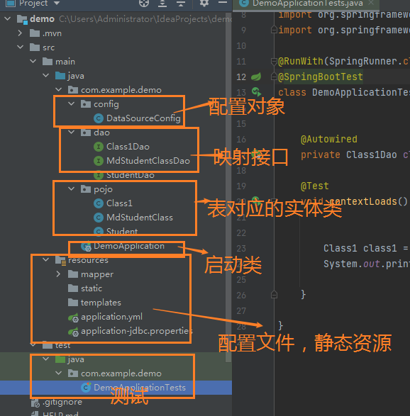

### **第1步：导入maven坐标**

```xml
	<parent>
        <groupId>org.springframework.boot</groupId>
        <artifactId>spring-boot-starter-parent</artifactId>
        <version>2.5.4</version>
        <relativePath/> <!-- lookup parent from repository -->
    </parent>

<dependencies>

        <dependency>
            <groupId>org.springframework.boot</groupId>
            <artifactId>spring-boot-starter-web</artifactId>
        </dependency>

        <dependency>
            <groupId>mysql</groupId>
            <artifactId>mysql-connector-java</artifactId>
            <scope>runtime</scope>
        </dependency>

        <dependency>
            <!-- MyBatis jar包-->
            <groupId>org.mybatis</groupId>
            <artifactId>mybatis</artifactId>
            <version>3.4.2</version>
        </dependency>
        <!-- 阿里巴巴的Druid数据源依赖启动器 -->
        <dependency>
            <groupId>com.alibaba</groupId>
            <artifactId>druid-spring-boot-starter</artifactId>
            <version>1.1.10</version>
        </dependency>

        <!-- MyBatis依赖启动器 -->
        <dependency>
            <groupId>org.mybatis.spring.boot</groupId>
            <artifactId>mybatis-spring-boot-starter</artifactId>
            <version>2.0.0</version>
        </dependency>

        <dependency>
            <groupId>org.springframework.boot</groupId>
            <artifactId>spring-boot-starter-test</artifactId>
            <scope>test</scope>
        </dependency>
        <dependency>
            <groupId>junit</groupId>
            <artifactId>junit</artifactId>
            <scope>test</scope>
        </dependency>
</dependencies>

```


### **第2步：springboot配置文件**

> - 创建springboot的核心配置文件application.yml。
> - 创建mybatis的jdbc配置文件：application-jdbc.properties

**application.yml**

```yaml

server:
  port: 80

spring:
  profiles:
    # 外置jdbc、配置文件
    active: jdbc

# MyBatis配置
mybatis:
  configuration:
    #开启驼峰命名匹配映射
      map-underscore-to-camel-case: true
  #配置MyBatis的xml映射文件路径
  mapper-locations: classpath:mapper/*.xml
  #配置XML映射文件中指定的实体类别名路径
  type-aliases-package: com.example.demo.pojo
#浏览器cookie相关设置
COOKIE:
  # 设置cookie默认时长为30分钟
  VALIDITY: 1800


```

**application-jdbc.properties**

```properties

# 数据连接池
spring.datasource.type = com.alibaba.druid.pool.DruidDataSource
# 连接池大小初始化为20
spring.datasource.initialSize=20
spring.datasource.minIdle=10
spring.datasource.maxActive=100

# 连接数据库
spring.datasource.url=jdbc:mysql://localhost:3306/schoolserverTimezone=UTC&useSSL=false
spring.datasource.username=root
spring.datasource.password=root


```

### **第3步：注入数据源对象给spring**

> - 创建包：com.example.demo.config
> - 创建类：DataSourceConfig
> - 使用spring注解：@Configuration；扫描配置类对象
> - 使用spring注解： @Autowired；为属性变量注入引用对象。【大白话：注入依赖对象】

```java
package com.example.demo.config;

/**
 * @Authar: 吾图南
 * @Data: 2022/12/13 21:30
 * @Package: com.gun.blog_system.config
 * @ClassName: SecurityConfig
 * @Description: TODO
 */

import org.springframework.beans.factory.annotation.Autowired;
import org.springframework.context.annotation.Configuration;

import javax.sql.DataSource;

@Configuration
public class DataSourceConfig {

    @Autowired
    private DataSource dataSource;

}

```

配置到这里！基本环境就搭建起来了！

## idea连接数据库

### 数据库sql文件

```sql
/*
 Navicat Premium Data Transfer
 Source Server         : root
 Source Server Type    : MySQL
 Source Server Version : 50719
 Source Host           : localhost:3306
 Source Schema         : school

 Target Server Type    : MySQL
 Target Server Version : 50719
 File Encoding         : 65001

 Date: 21/04/2023 17:43:06
*/
SET NAMES utf8mb4;
SET FOREIGN_KEY_CHECKS = 0;

-- ----------------------------
-- Table structure for class1
-- ----------------------------
DROP TABLE IF EXISTS `class1`;
CREATE TABLE `class1`  (
  `id` int(11) NOT NULL AUTO_INCREMENT,
  `class_name` varchar(100) CHARACTER SET utf8 COLLATE utf8_general_ci NULL DEFAULT NULL,
  PRIMARY KEY (`id`) USING BTREE
) ENGINE = InnoDB AUTO_INCREMENT = 30 CHARACTER SET = utf8 COLLATE = utf8_general_ci ROW_FORMAT = Dynamic;

-- ----------------------------
-- Records of class1   记录
-- ----------------------------
INSERT INTO `class1` VALUES (1, '计算机基础');
INSERT INTO `class1` VALUES (2, 'java');
INSERT INTO `class1` VALUES (3, '计算机网络');
INSERT INTO `class1` VALUES (4, 'c程序设计');
INSERT INTO `class1` VALUES (5, 'python');
INSERT INTO `class1` VALUES (6, '大数据');

-- ----------------------------
-- Table structure for md_student_class  表结构
-- ----------------------------
DROP TABLE IF EXISTS `md_student_class`;
CREATE TABLE `md_student_class`  (
  `id` int(11) NOT NULL AUTO_INCREMENT,
  `student_id` int(11) NOT NULL,
  `class_id` int(11) NOT NULL,
  `score` int(11) NULL DEFAULT NULL,
  PRIMARY KEY (`id`) USING BTREE,
  INDEX `class_id`(`class_id`) USING BTREE,
  INDEX `student_id`(`student_id`) USING BTREE,
  CONSTRAINT `class_id` FOREIGN KEY (`class_id`) REFERENCES `class1` (`id`) ON DELETE CASCADE ON UPDATE CASCADE,
  CONSTRAINT `student_id` FOREIGN KEY (`student_id`) REFERENCES `student` (`id`) ON DELETE CASCADE ON UPDATE CASCADE
) ENGINE = InnoDB AUTO_INCREMENT = 25 CHARACTER SET = utf8 COLLATE = utf8_general_ci ROW_FORMAT = Dynamic;

-- ----------------------------
-- Records of md_student_class  记录属于 某表。
-- ----------------------------
INSERT INTO `md_student_class` VALUES (1, 2, 4, 90);
INSERT INTO `md_student_class` VALUES (2, 2, 3, 60);
INSERT INTO `md_student_class` VALUES (3, 4, 5, 80);
INSERT INTO `md_student_class` VALUES (4, 4, 1, 71);
INSERT INTO `md_student_class` VALUES (7, 11, 12, 80);
INSERT INTO `md_student_class` VALUES (8, 12, 13, 27);
INSERT INTO `md_student_class` VALUES (9, 13, 14, 27);
INSERT INTO `md_student_class` VALUES (10, 14, 15, 27);
INSERT INTO `md_student_class` VALUES (11, 15, 16, 27);
INSERT INTO `md_student_class` VALUES (12, 16, 17, 27);
INSERT INTO `md_student_class` VALUES (13, 17, 18, 27);
INSERT INTO `md_student_class` VALUES (14, 18, 19, 27);
INSERT INTO `md_student_class` VALUES (15, 19, 20, 27);
INSERT INTO `md_student_class` VALUES (16, 20, 21, 45);
INSERT INTO `md_student_class` VALUES (17, 21, 22, 45);
INSERT INTO `md_student_class` VALUES (18, 22, 23, 45);
INSERT INTO `md_student_class` VALUES (19, 23, 24, 45);
INSERT INTO `md_student_class` VALUES (20, 24, 25, 100);
INSERT INTO `md_student_class` VALUES (21, 25, 26, 45);
INSERT INTO `md_student_class` VALUES (22, 26, 27, 85);
INSERT INTO `md_student_class` VALUES (23, 27, 28, 66);
INSERT INTO `md_student_class` VALUES (24, 28, 29, 66);

-- ----------------------------
-- Table structure for student
-- ----------------------------
DROP TABLE IF EXISTS `student`;
CREATE TABLE `student`  (
  `id` int(11) NOT NULL AUTO_INCREMENT,
  `stu_num` varchar(200) CHARACTER SET utf8 COLLATE utf8_general_ci NOT NULL,
  `stu_name` varchar(30) CHARACTER SET utf8 COLLATE utf8_general_ci NULL DEFAULT NULL,
  PRIMARY KEY (`id`) USING BTREE
) ENGINE = InnoDB AUTO_INCREMENT = 29 CHARACTER SET = utf8 COLLATE = utf8_general_ci ROW_FORMAT = Dynamic;

-- ----------------------------
-- Records of student
-- ----------------------------
INSERT INTO `student` VALUES (1, '200101', '高启强');
INSERT INTO `student` VALUES (2, '200102', '杨过');
INSERT INTO `student` VALUES (3, '200103', '杨康');
INSERT INTO `student` VALUES (4, '200104', '黄蓉');
INSERT INTO `student` VALUES (5, '200105', '小鹏');
INSERT INTO `student` VALUES (6, '200106', 'qq小兵');


SET FOREIGN_KEY_CHECKS = 1;

```

点击database =》Data source =》选择你要连接的数据库mysql

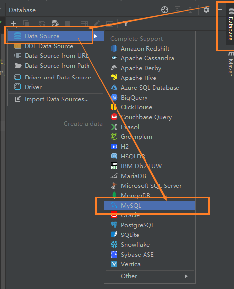

添加连接数据库的jar包驱动。

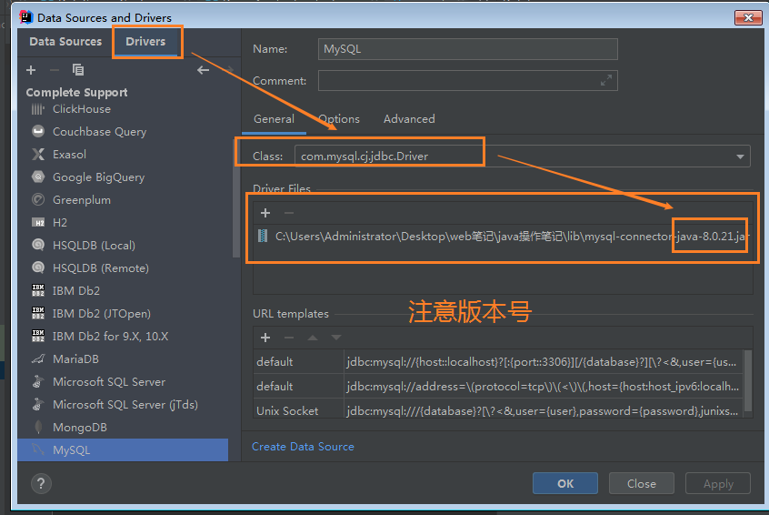

填写连接的参数：

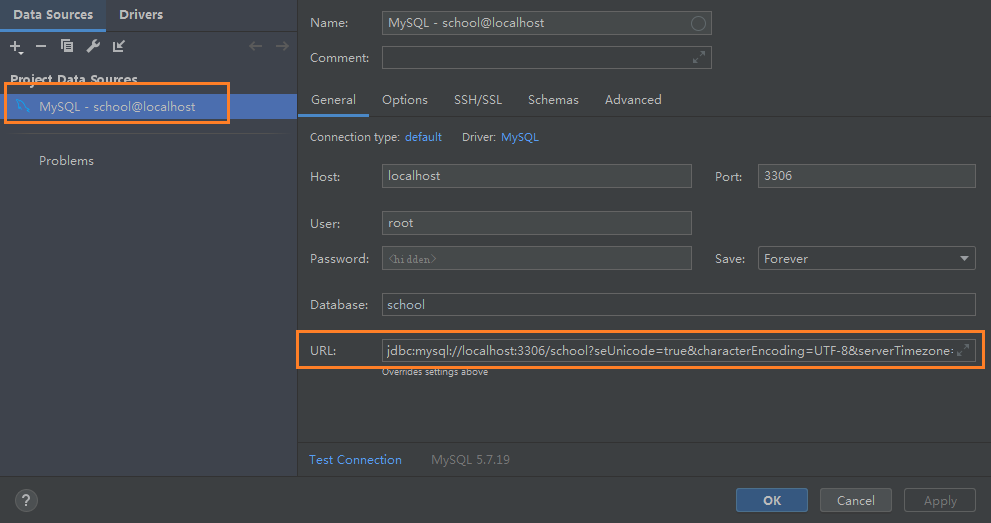

```xquery
jdbc:mysql://localhost:3306/school?seUnicode=true&characterEncoding=UTF-8&serverTimezone=UTC
```

连接成功！

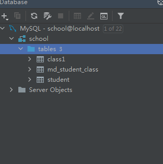


## 生成MyBatis各种文件

使用：Mybatis Generator 生成代码。

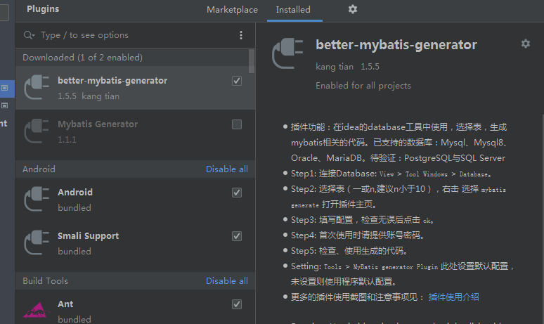

https://github.com/kmaster/better-mybatis-generator/blob/master/README.md

1. 创建dao包和pojo包

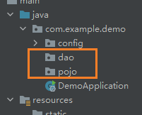

2. 选中这些数据表，然后点击右键，选择mybatis-generator

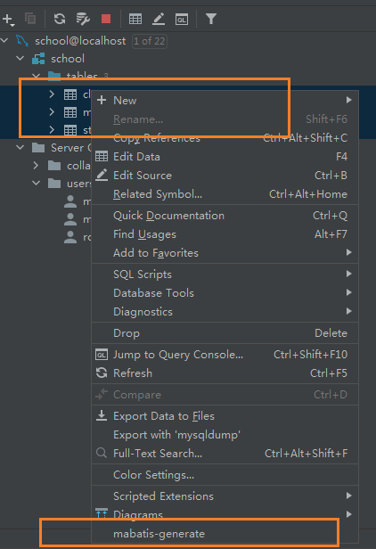


配置窗口！

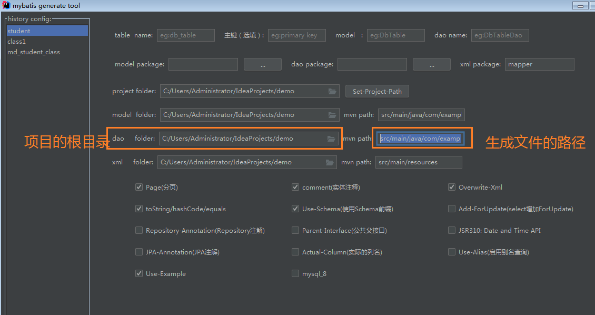


生成文件的目录。

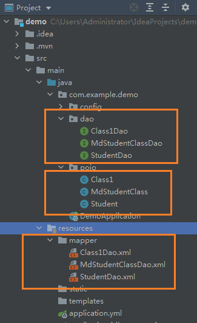


## 测试

```java
package com.example.demo;

import com.example.demo.dao.Class1Dao;
import com.example.demo.pojo.Class1;
import org.junit.jupiter.api.Test;
import org.junit.runner.RunWith;
import org.springframework.beans.factory.annotation.Autowired;
import org.springframework.boot.test.context.SpringBootTest;
import org.springframework.test.context.junit4.SpringRunner;

@RunWith(SpringRunner.class)
@SpringBootTest
class DemoApplicationTests {

    @Autowired
    private Class1Dao class1Dao;
    @Test
    void contextLoads() {

        Class1 class1 = class1Dao.selectByPrimaryKey(1);
        System.out.println(class1);

    }

}
```

结果：

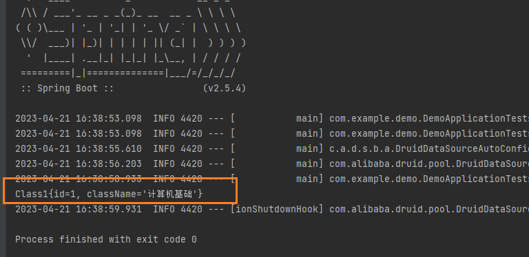


## 生成代码是什么

```java
package com.example.demo.dao;

import com.example.demo.pojo.Class1;
import org.apache.ibatis.annotations.Mapper;

@Mapper
public interface Class1Dao {
    
    /**
     * 
     * @param id
     * @return 通过班级的id进行删除
     */
    int deleteByPrimaryKey(Integer id);

    /**
     * 
     * @param record
     * @return 添加一个班级对象
     */
    int insert(Class1 record);

    /**
     * 
     * @param record
     * @return 
     */
    int insertSelective(Class1 record);

    /**
     * 通过id查询 班级
     * @param id
     * @return
     */
    Class1 selectByPrimaryKey(Integer id);

    /**
     * 
     * @param record
     * @return  通过 id进行修改  Selective
     */ 
    int updateByPrimaryKeySelective(Class1 record);

    /**
     * 
     * @param record
     * @return 通过 id进行修改
     */
    int updateByPrimaryKey(Class1 record);

}
```

对应的xml文件的sql语句是什么？

```xml
<?xml version="1.0" encoding="UTF-8"?>
<!DOCTYPE mapper PUBLIC "-//mybatis.org//DTD Mapper 3.0//EN" "http://mybatis.org/dtd/mybatis-3-mapper.dtd">
<mapper namespace="com.example.demo.dao.Class1Dao">

  <resultMap id="BaseResultMap" type="com.example.demo.pojo.Class1">
    <id column="id" jdbcType="INTEGER" property="id" />
    <result column="class_name" jdbcType="VARCHAR" property="className" />
  </resultMap>

  <sql id="Base_Column_List">
    id, class_name
  </sql>

    
  <select id="selectByPrimaryKey" parameterType="java.lang.Integer" resultMap="BaseResultMap">
    select
    <include refid="Base_Column_List" />
    from class1
    where id = #{id,jdbcType=INTEGER}
  </select>

    
  <delete id="deleteByPrimaryKey" parameterType="java.lang.Integer">
    delete from class1
    where id = #{id,jdbcType=INTEGER}
  </delete>


    
  <insert id="insert" keyColumn="id" keyProperty="id" parameterType="com.example.demo.pojo.Class1" useGeneratedKeys="true">
    insert into class1 (class_name)
    values (#{className,jdbcType=VARCHAR})
  </insert>


    
  <insert id="insertSelective" keyColumn="id" keyProperty="id" parameterType="com.example.demo.pojo.Class1" useGeneratedKeys="true">
    insert into class1
    <trim prefix="(" suffix=")" suffixOverrides=",">
      <if test="className != null">
        class_name,
      </if>
    </trim>
    <trim prefix="values (" suffix=")" suffixOverrides=",">
      <if test="className != null">
        #{className,jdbcType=VARCHAR},
      </if>
    </trim>
  </insert>

    

  <update id="updateByPrimaryKeySelective" parameterType="com.example.demo.pojo.Class1">
    update class1
    <set>
      <if test="className != null">
        class_name = #{className,jdbcType=VARCHAR},
      </if>
    </set>
    where id = #{id,jdbcType=INTEGER}
  </update>


    
  <update id="updateByPrimaryKey" parameterType="com.example.demo.pojo.Class1">
    update class1
    set class_name = #{className,jdbcType=VARCHAR}
    where id = #{id,jdbcType=INTEGER}
  </update>

   
</mapper>
```


### 添加班级信息

```xml
<insert id="insertSelective" keyColumn="id" keyProperty="id" parameterType="com.example.demo.pojo.Class1" useGeneratedKeys="true">
    insert into class1
    <trim prefix="(" suffix=")" suffixOverrides=",">
      <if test="className != null">
        class_name,
      </if>
    </trim>
    <trim prefix="values (" suffix=")" suffixOverrides=",">
      <if test="className != null">
        #{className,jdbcType=VARCHAR},
      </if>
    </trim>
  </insert>


```

#### `<insert> </insert>标签`

>-  keyColumn="id":表的字段名
>- keyProperty="id"：实体类的属性名
>- parameterType="com.example.demo.pojo.Class1"：insertSelective方法的参数
>- useGeneratedKeys="true"：是否使用主键生成策略。

#### `<trim></trim>标签`

:::tip
- prefix="("：前缀
- suffix=")" ：后缀
- suffixOverrides=","分割符
:::
```xml
    
//表的字段

	<if test="className != null">
        class_name,
      </if>
// 取出实体类的属性
      <if test="className != null">
        #{className,jdbcType=VARCHAR},
      </if>
```

上面拼接后的字符串如下；`#className,jdbcType=VARCHAR}取出对象的属性值`。

```sql
insert into class1 (class_name) values (#{className,jdbcType=VARCHAR})
```

## 总结

- 上面是快速的使用springboot整合mybatis和与使用dao成的代码生成器mybati-generator工具！
- 


