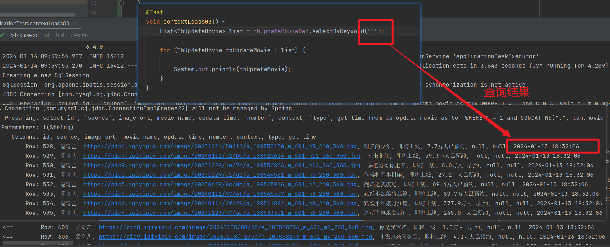
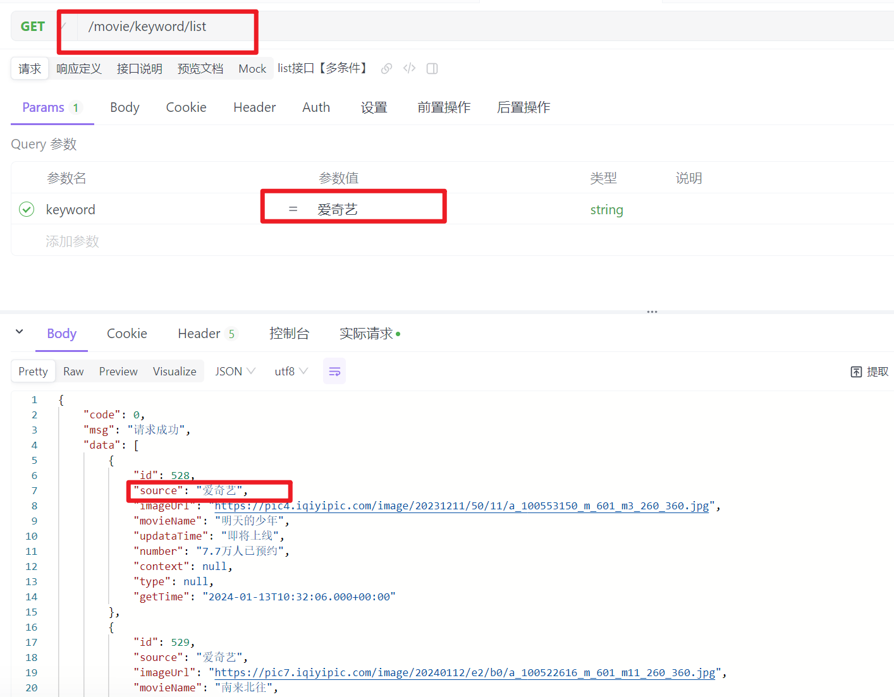

# 案例三：电视剧crud

## 01)LIST查询

需求说明：

- 查询可以通过电视剧的名字查询出电视剧集合。
- 也可以通过获取的时间进行查询。
- 通过电视剧来源的平台进行查询。

**第一步：**

编写dao层的接口。

```java
@Mapper
public interface TbUpdataMovieDao extends BaseMapper<TbUpdataMovie> {

    //  list查询的接口
    List<TbUpdataMovie> selectByKeyword(String keyword);

```

**第二步：**

```xml
 
//  接口包地址
<mapper namespace="top.wutunan.moviecore.dao.TbUpdataMovieDao">
    <resultMap id="BaseResultMap" type="top.wutunan.moviecore.pojo.TbUpdataMovie">
        <id column="id" jdbcType="INTEGER" property="id"/>
        <result column="source" jdbcType="VARCHAR" property="source"/>
        <result column="image_url" jdbcType="VARCHAR" property="imageUrl"/>
        <result column="movie_name" jdbcType="VARCHAR" property="movieName"/>
        <result column="updata_time" jdbcType="VARCHAR" property="updataTime"/>
        <result column="number" jdbcType="VARCHAR" property="number"/>
        <result column="context" jdbcType="VARCHAR" property="context"/>
        <result column="type" jdbcType="VARCHAR" property="type"/>
        <result column="get_time" jdbcType="TIMESTAMP" property="getTime"/>
    </resultMap>
    
    // 表的字段集合
    <sql id="Base_Column_List">
        id
        , `source`, image_url, movie_name, updata_time, `number`, context, `type`, get_time
    </sql>

    // 接口包地址 +  接口的方法名字
    // 接口的方法名字
    <select id="selectByKeyword" parameterType="java.lang.String" resultMap="BaseResultMap">
        select
        <include refid="Base_Column_List"/>
        from tb_updata_movie as tum
        <where>
            1 = 1
            <if test="keyword != null and keyword != ''">
                and CONCAT_WS(",", tum.movie_name,tum.source, tum.get_time) like concat("%", #{keyword}, "%")
            </if>
        </where>
        order by get_time desc
    </select>
```


## 02)DAO层测试




## 03)编写Controller层

```java
    

// 类名
@RestController
@RequestMapping("/movie")
public class MovieInfoController {

    
    // 方法名
	@GetMapping("/keyword/list")
    public ApiResult getMovieByKeywordList(String keyword){

        // 关键字查询。
        ApiResult movieList = movieInfoService.selectByKeyword(keyword);
        return movieList;
    }
```

接口的测试结果。

