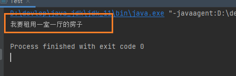
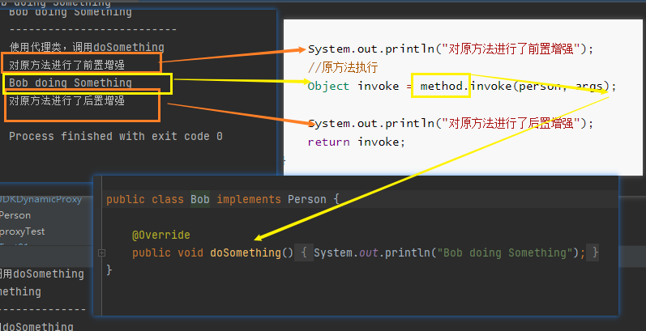

# 代理（proxy）

什么是代理？

这个问题？有点抽象，没有经历的难以理解代理是什么玩意呢？

举一个例子：在我们的生活中，处处有代理的身影案例，就如：我想去租一个房子，我可自己去app上找房源。这中亲力亲为的事情就不是代理了。

我自己去找房子有点麻烦，不知道自己找的房源靠不靠谱哦！那就的去找个代理人（你信赖的人）去帮你找房源，帮你确定可靠的房子。这就是代理。

::: tip 重要概念

- 我【被代理对象】

- 代理人【我找的代理，帮我去干事情的人】

:::

## 静态代理（static proxy）

在java中看看自己找房的代码实现。定义一个上层的接口！【开闭原则】

```java
/**
 * 接口：租房
 */
public interface IRentingHouse {
    /**
     * 找房行为方法
     */
    void rentHosue();
}
```

代理人、我。都有一个共同的行为，那就是找房。接口【interface】的定义就是：接口主要对行为进行抽象，没有具体的存在啊！

接下来实现这个接口的类，重写了具体的rentHosue（）方法。

实现找房子的接口。

```java
public class RentingHouseImpl implements IRentingHouse {

    @Override
    public void rentHosue() {
        System.out.println("我要租用一室一厅的房子");
    }
}
```

client端测试！

1. 自己找房子，创建一个找房子的对象
2. 找房子的对象调用方法，执行去找房子（怎么找我们不具体实现，打印输出就行......）

```java
public class Test {
    public static void main(String[] args) {
        IRentingHouse rentingHouse = new RentingHouseImpl();
        // 自己要租用一个一室一厅的房子
        rentingHouse.rentHosue();

    }
}
```

**结果：**




## JDk动态代理

loader – the class loader to define the proxy class

定义代理类的类加载器

interfaces – the list of interfaces for the proxy class to implement

代理类要实现的接口列表

h – the invocation handler to dispatch method invocations to

将方法调用分派到的调用处理程序


### 1）创建代理人接口

接口：是抽象的开始。

我要找什么样的代理人呢？是性感的秘书小姐姐还是......

所有要定义接口进行抽象化，具体找什么样的，接口我我一顿操作猛如虎定义如下类型：

1. 帅小伙
2. 性感秘书小姐姐
3. 中年小伙
4. 等....

以上类型都定义在接口里面....,类实现可以选择一个实现。

下面就不定义这么多类型了，直接全部统称为person吧，行为统一一个方法！doSomething（）

创建代理人接口：

```java
package com.gun.dynamicproxy;

public interface Person {
    // 统一行为做什么....事情
    public void doSomething();
}
```

### 2）创建实现代理人接口的类

```java
package com.gun.dynamicproxy;

public class Bob implements Person {
    @Override
    public void doSomething() {
        System.out.println("Bob doing Something");
    }
}
```

### 3）创建代理类


```java
package com.gun.dynamicproxy;

import java.lang.reflect.Proxy;

public class JDKDynamicProxy {

    // 声明 被代理的对象
    private Person person;

    //构造函数
    public JDKDynamicProxy(Person person) {
        this.person = person;
    }

    //获取代理对象，俗话说：就是找个秘书帮你去干活。
    public Object getTarget(){
        //  person 是属性，要有初始化的一个过程
        //  1、构造方法
        //  2、set方法
        //  3、反射
        
        
        //帮谁代理：person.getClass().getClassLoader()
        // new Handler(person) 处理器类,要实现接口 InvocationHandler
        // 写this ，这个类要实现InvocationHandler 接口，重写方法 invoke
        // JDk 动态代理是帮我们创建一个代理对象
        // 1、类加载器sun.misc.Launcher$AppClassLoader@18b4aac2
        // 2、 person.getClass().getInterfaces()  [Ljava.lang.Class;@1540e19d
        Object proxyInstance = Proxy.newProxyInstance(
            person.getClass().getClassLoader(),
            person.getClass().getInterfaces(),
            new Handler(person)
        );// 初始化代理对象实例化。

        return proxyInstance;
    }

//  如果：将这个方法写到一个类中去了
//  当前代理类就不要实现：InvocationHandler   这个接口
//    @Override
//    public Object invoke(Object proxy, Method method, Object[] args) throws Throwable {
//        System.out.println("对原方法进行了前置增强");
//        //原方法执行
//        Object invoke = method.invoke(person, args);
//        System.out.println("对原方法进行了后置增强");
//        return invoke;
//    }
}
```

InvocationHandler接口是什么：有什么作用？为什么要实现它呢？

```java
package java.lang.reflect;

/**
 * {@code InvocationHandler} is the interface implemented by
 * the <i>invocation handler</i> of a proxy instance.
 是代理实例的   调用处理程序  实现的接口。
 *
 * <p>Each proxy instance has an associated invocation handler.
 每个代理实例都有一个关联的   调用处理程序【要增强的逻辑代码】。
 * When a method is invoked on a proxy instance, the method
 * invocation is encoded and dispatched to the {@code invoke}
 * method of its invocation handler.
当在代理实例上  调用方法时，方法调用将  被  编码并调度到     其调用处理程序的{@code invoke}方法。
 *
 * @author      Peter Jones
 * @see         Proxy
 * @since       1.3
 */
public interface InvocationHandler {

    /**
Processes a method invocation on a proxy instance and returns the result.  
处理代理实例上  的方法调用并  返回结果。
This method will be invoked on an invocation handlerwhen a method is invoked on a proxy instance that it isassociated with.
     
      @param   
      # 参数1
      proxy the proxy instance that the method was invoked on
     proxy方法调用的    代理实例【我们创建的代理对象Bob 是person类型】
      @param   
      # 参数2
      method the {@code Method} instance corresponding to
      the interface method invoked on the proxy instance.  
      方法对应于在  代理实例上  调用的   接口方法的｛@code method｝实例。
      The declaring class of the {@code Method} object will be the interface that
      the method was declared in, which may be a superinterface of the
      proxy interface that the proxy class inherits the method through.
｛@code Method｝对象的声明类将是在其中声明该方法的接口，该接口可能是代理类通过其继承该方法的代理接口的超接口。
      @param   
      # 参数3
      args an array of objects containing the values of the
      arguments passed in the method invocation on the proxy instance,
      or {@code null} if interface method takes no arguments.
args一个对象数组，包含在  代理实例上的方法   调用   中传递的  参数的值[the values of the
      arguments]；如果接口方法不带参数，则为{@code-null}。
      
      
      Arguments of primitive types[基本类型] are wrapped in instances of the
      appropriate primitive wrapper class, 
      
      such as例如：
      {@code java.lang.Integer} or {@code java.lang.Boolean}.
基元类型的参数被包装在适当的基元包装类的实例中，例如{@codejava.lang.Integer}或{@code java.lang.Boolean}。
      @return  
      
      the value to return from the method invocation on the proxy instance.  
      从代理实例上的方法调用  返回的值。
      
      If the declared return type of the interface method is a primitive type, then the value returned by this method must be an instance of the corresponding primitive
wrapper class; otherwise, it must be a type assignable to the declared return type.  
   如果接口方法声明的返回类型是基元类型，则此方法返回的值必须是相应基元包装类的实例；否则，它必须是可分配给声明的返回类型的类型。
   
   
      If the value returned by this method is {@code null} and the interface method's return type is primitive, then a {@code NullPointerException} will be thrown by the method invocation on the proxy instance.  
      
and 表示并列关系
如果此方法返回的值为｛@code null｝，并且接口方法的返回类型为基本类型，则代理实例上的方法调用将抛出｛@codeNullPointerException｝。      
      If the value returned by this method is otherwise not compatible with the interface method's declared return type as described above,a {@code ClassCastException} will be thrown by the method invocation on the proxy instance.
     如果此方法返回的值与如上所述接口方法声明的返回类型不兼容，则代理实例上的方法调用将抛出｛@code ClassCastException｝。
      @see     UndeclaredThrowableException
     */
    public Object invoke(Object proxy, Method method, Object[] args)
        throws Throwable;
}
```


@throws  Throwable the exception to throw from the method invocation on the proxy instance.  The exception's type must be assignable either to any of the exception types declared in the {@code throws} clause of the interface method or to theunchecked exception types {@code java.lang.RuntimeException} or {@code java.lang.Error}.  If a checked exception is thrown by this method that is not assignable to any of the exception types declared in the {@code throws} clause of the interface method, then an  {@link UndeclaredThrowableException} containing the exception that was thrown by this method will be thrown by the method invocation on the proxy instance.

@throws可抛出要从代理实例上的方法调用中  抛出的异常。

异常的类型必须可分配给接口方法的｛@code throws｝子句中声明的任何异常类型，或分配给未选中的异常类型｛@codejava.lang.RuntimeException｝或｛@cODEjava.lang.Error｝方法，

则包含此方法引发的异常的{@linkUndeclaredThrowableException}将由代理实例上的方法调用引发。

### 4）实现InvocationHandler接口

```java
package com.gun.dynamicproxy;

import java.lang.reflect.InvocationHandler;
import java.lang.reflect.Method;

/**
 * @author liyupeng
 * @date 2023/7/13&11:13
 * @packageName com.gun.dynamicproxy
 */
public class Handler implements InvocationHandler {

    // 声明 被代理的对象
    private Person person;

    public Handler(Person person) {
        this.person = person;
    }

    // 增强的逻辑是写在这个方法里面的。
    // Object proxy  proxy方法调用的    代理实例
    // Object[] args  原方法的  参数列表
    @Override
    public Object invoke(Object proxy, Method method, Object[] args) throws Throwable {
        System.out.println("对原方法进行了前置增强");
        //原方法执行
        Object invoke = method.invoke(person, args);
        
        System.out.println("对原方法进行了后置增强");
        return invoke;
    }
}
```

### 编写测试类

```java
package com.gun.dynamicproxy;

public class proxyTest {
    public static void main(String[] args) {
        System.out.println("不使用代理类，调用doSomething");
        Person person = new Bob();
        person.doSomething();

        System.out.println("--------------------------");

        System.out.println("使用代理类，调用doSomething");
        // 获取代理对象
        Person proxy = (Person) new JDKDynamicProxy(new Bob()).getTarget();

        // 代理对象可以调用如何方法。
        proxy.doSomething();
    }
}
```

这里proxy对象是动态生成的一个叫Bob的人【动态生成的】，这个人有各种行为【方法】，这里我们就是用了一个接口进行了统一规范。这个就是只有一个行为。那就是doSomething()。

当然也可以定义多个行为方法。


