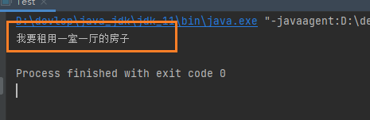

# 代理（proxy）

什么是代理？

这个问题？有点抽象，没有经历的难以理解代理是什么玩意呢？

举一个例子：在我们的生活中，处处有代理的身影案例，就如：我想去租一个房子，我可自己去app上找房源。这中亲力亲为的事情就不是代理了。

我自己去找房子有点麻烦，不知道自己找的房源靠不靠谱哦！那就的去找个代理人（你信赖的人）去帮你找房源，帮你确定可靠的房子。这就是代理。

::: tip 重要概念

- 我【被代理对象】

- 代理人【我找的代理，帮我去干事情的人】

:::

## 静态代理（static proxy）

在java中看看自己找房的代码实现。定义一个上层的接口！【开闭原则】

```java
/**
 * 接口：租房
 */
public interface IRentingHouse {
    /**
     * 找房行为方法
     */
    void rentHosue();
}
```

代理人、我。都有一个共同的行为，那就是找房。接口【interface】的定义就是：接口主要对行为进行抽象，没有具体的存在啊！

接下来实现这个接口的类，重写了具体的rentHosue（）方法。

实现找房子的接口。

```java
public class RentingHouseImpl implements IRentingHouse {

    @Override
    public void rentHosue() {
        System.out.println("我要租用一室一厅的房子");
    }
}
```

client端测试！

1. 自己找房子，创建一个找房子的对象
2. 找房子的对象调用方法，执行去找房子（怎么找我们不具体实现，打印输出就行......）

```java
public class Test {
    public static void main(String[] args) {
        IRentingHouse rentingHouse = new RentingHouseImpl();
        // 自己要租用一个一室一厅的房子
        rentingHouse.rentHosue();

    }
}
```

**结果：**




