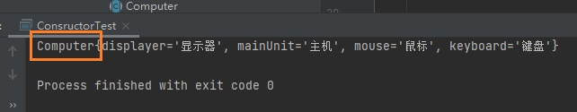
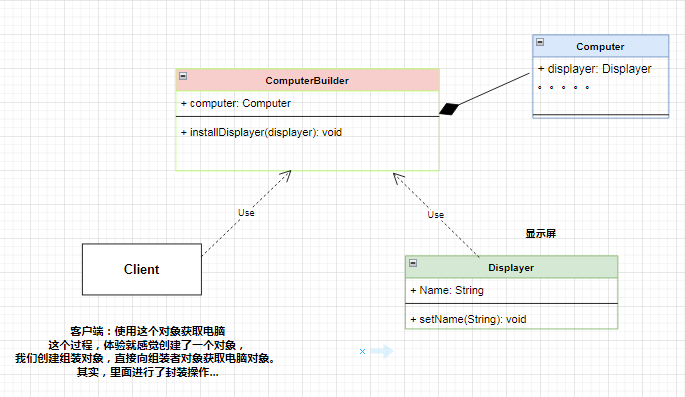

# 组装者设计模式

在买电脑前我买了一大堆台式电脑配件，要组装电脑，自己不会的情况下就要去找个组装者帮我去组装电脑。

## 需求：组装电脑

现在有： 显示器（displayer）、主机（mainUnit）、鼠标（mouse）、键盘（keyboard）

我们怎么去组装电脑呢？

代码怎么去写，现实中，我们找个会的人就可以了，叫它帮我去组装一台电脑出来。

1. 找一个组装者，将电脑配件给他。
2. 他帮我组装了一台电脑给我。

下面是代码实现。

## 第一步：创建电脑类

<font color='red'>Computer</font>

想要有台电脑，就必须想要一个设计电脑的图，这个图在面向对象的程序语言中，它是用类进行抽象化的。

有了组装电脑的设计图。

```java
package com.gun.constructor;
/**
 * 电脑类
 */
public class Computer {
    // 显示器
    private String displayer;
    // 主机
    private String mainUnit;
    // 鼠标
    private String mouse;
    // 键盘
    private String keyboard;
//  略 get 与 set 方法
}
```

可以理解，类就是一设计图纸。

<b>定义：</b>类就是一个设计图纸

其实、显示器、主机....都可以进行抽象为一个类。

<b>定义：</b>对象就是通过设计的图纸进行了实例化的一个对象。

## 第二步：创建组装者类

<font color='red'>ComputerBuilder</font>

```java
package com.gun.constructor;
/**
 * 电脑组装者
 */
public class ComputerBuilder {
    // 组合原则
    private Computer computer = new Computer();

    // 初始化 显示屏幕对象
    public void installDisplayer(String displayer){
        computer.setDisplayer(displayer);
    }
    public void installMainUnit(String mainUnit){
        computer.setMainUnit(mainUnit);
    }
    public void installmouse(String mouse){
        computer.setMouse(mouse);
    }
    public void installkeyboard(String keyboard){
        computer.setKeyboard(keyboard);
    }

    // 这个获取电脑对象方法。
    public Computer getComputer(){
        return computer;
    }
}

```


## 第三步：编写测试实例

1. 获取一个组装对象。
2. 将电脑的配件全部给组装者对象。
3. 向组装者get组装好的电脑。

```java
package com.gun.constructor;
public class ConsructorTest {
    public static void main(String[] args) {
        // 1、获取一个组装对象。
        ComputerBuilder computerBuilder = new ComputerBuilder();
        // 2、初始化电脑，组装自己的一台电脑
        computerBuilder.installDisplayer("显示器");
        computerBuilder.installMainUnit("主机");
        computerBuilder.installmouse("鼠标");
        computerBuilder.installkeyboard("键盘");
        // 3、向组装者 要一台电脑
        Computer computer = computerBuilder.getComputer();
        // 获取电脑对象打印
        System.out.println(computer);
    }

}
```

核心设计模式思想就在这个测试用例：



## UML类图





::: tip  小结

- 客户端只要获取组装者对象，这【一个对象】就能调用get方法获取电脑对象
- 其实的其实就是、组装者对象的类模版使用了《设计原则》进行的封装。

以至于：只要获取这个对象就ok了。【核心思想】

```java
        // 1、获取一个组装对象。
        ComputerBuilder computerBuilder = new ComputerBuilder();
```

设计模式是一门哲学，哲学来源生活的每一个处细节。注重生活的细节更能写出质量更好的代码！使你代码strong

:::


